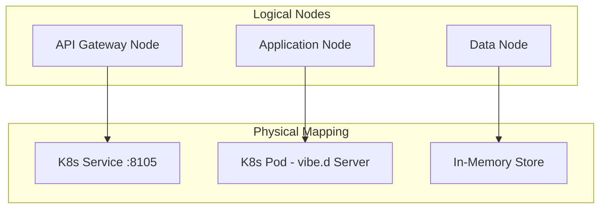
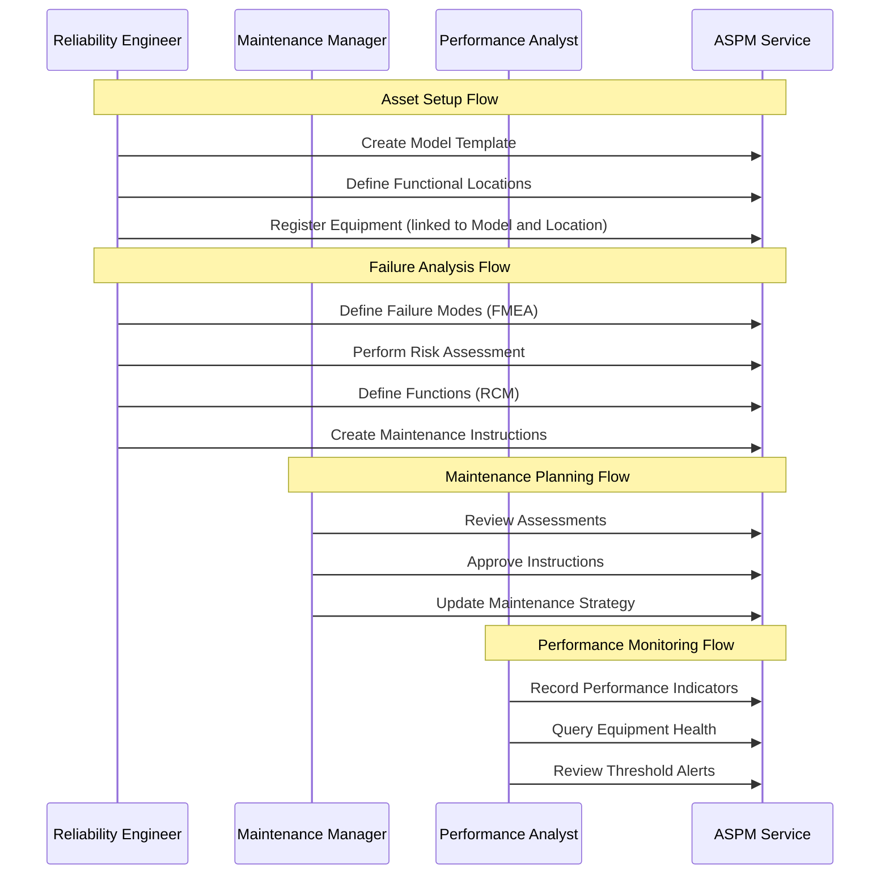
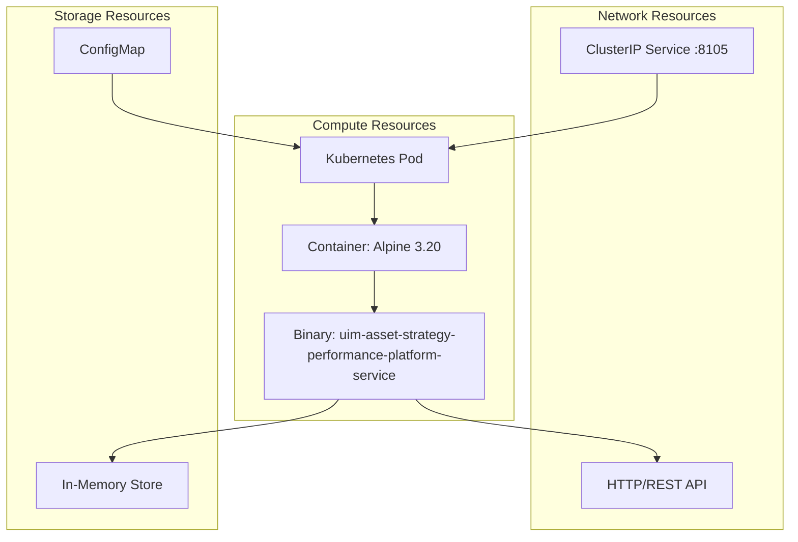
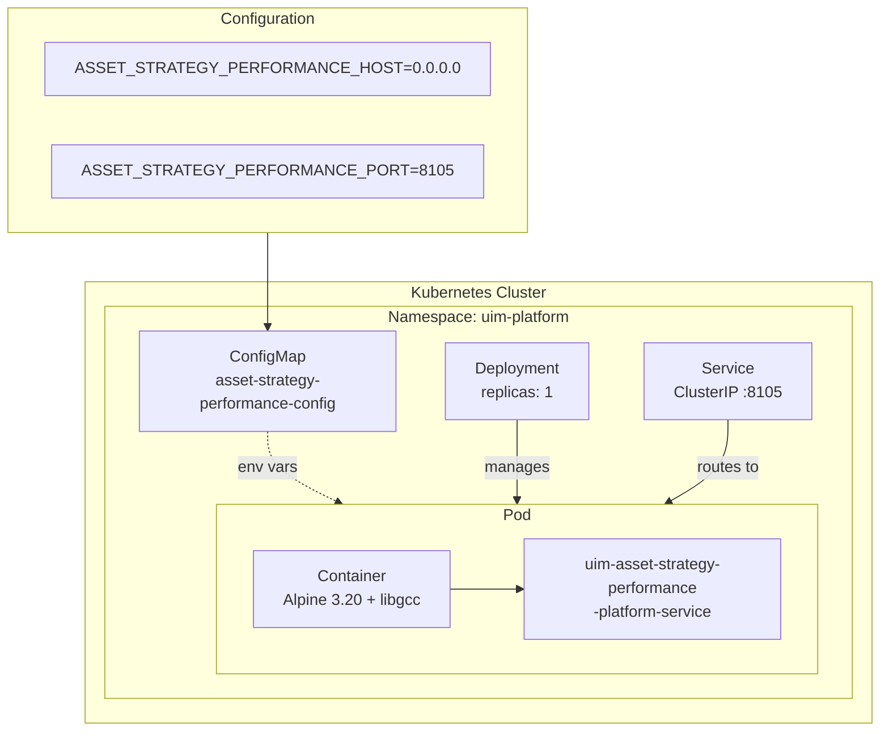

# NAF v4 Architecture Views - Asset Strategy and Performance Management Service

NATO Architecture Framework v4 (NAFv4) views for the Asset Strategy and Performance Management Service, modeled after SAP Asset Strategy and Performance Management (SAP ASPM).

## C1 - Capability Taxonomy

```mermaid
graph TB
    ASPM[Asset Strategy and Performance Management]
    ASPM --> EQM[Equipment Management]
    ASPM --> MDM[Model Management]
    ASPM --> LCM[Location Management]
    ASPM --> FMA[Failure Mode Analysis]
    ASPM --> ASM[Assessment Management]
    ASPM --> INM[Instruction Management]
    ASPM --> FNM[Function Management]
    ASPM --> PIM[Performance Indicator Management]

    EQM --> EQM1[Register Equipment]
    EQM --> EQM2[Track Equipment Lifecycle]
    EQM --> EQM3[Manage Maintenance Strategy]
    EQM --> EQM4[Monitor Criticality]

    MDM --> MDM1[Define Model Templates]
    MDM --> MDM2[Categorize Models]
    MDM --> MDM3[Manage ISO Standards]
    MDM --> MDM4[Publish Models]

    LCM --> LCM1[Define Functional Locations]
    LCM --> LCM2[Hierarchical Location Structure]
    LCM --> LCM3[Geospatial Tracking]

    FMA --> FMA1[Define Failure Modes]
    FMA --> FMA2[Assess Risk Priority Number]
    FMA --> FMA3[Document Cause and Effect]
    FMA --> FMA4[Detectability Scoring]

    ASM --> ASM1[Risk Assessments]
    ASM --> ASM2[Criticality Assessments]
    ASM --> ASM3[RCM Analysis]
    ASM --> ASM4[Checklists]
    ASM --> ASM5[Review Scheduling]

    INM --> INM1[Maintenance Task Lists]
    INM --> INM2[Safety Notes]
    INM --> INM3[Required Tools]
    INM --> INM4[Duration Estimates]

    FNM --> FNM1[Operating Context Definition]
    FNM --> FNM2[Performance Standards]
    FNM --> FNM3[Failure Definitions]
    FNM --> FNM4[Redundancy Analysis]

    PIM --> PIM1[Collect Measurements]
    PIM --> PIM2[Threshold Monitoring]
    PIM --> PIM3[Status Assessment]
```

## C2 - Enterprise Vision

The Asset Strategy and Performance Management Service provides a comprehensive platform for managing asset maintenance strategies, failure analysis, and performance monitoring. It enables:

1. **Risk-Based Maintenance Strategy** through failure mode analysis (FMEA) and risk/criticality assessments
2. **Reliability-Centered Maintenance (RCM)** through functional analysis and performance standards
3. **Proactive Maintenance Planning** through instructions, task lists, and scheduled reviews
4. **Asset Performance Monitoring** through indicators with threshold-based alerting
5. **Hierarchical Asset Organization** through models, equipment, and functional locations

## L1 - Node Types

## L2 - Logical Scenario

## L4 - Logical Activities

| Activity | Input | Process | Output |
|----------|-------|---------|--------|
| Register Equipment | Equipment details, Model ID, Location ID | Validate, assign ID, set maintenance strategy, persist | Equipment record |
| Create Model Template | Model specs, ISO standard, category | Validate, categorize, persist | Model record |
| Define Location | Name, type, parent location, coordinates | Validate hierarchy, persist | Location record |
| Define Failure Mode | Model/Equipment ID, cause, effect, severity | FMEA analysis, RPN scoring | FailureMode record |
| Perform Assessment | Equipment ID, type, scores | Validate, calculate risk, persist | Assessment record |
| Create Instruction | Model/Equipment ID, steps, tools | Validate, version, persist | Instruction record |
| Define Function | Equipment ID, operating context, standard | Validate, persist | Function record |
| Record Indicator | Equipment ID, measurement, unit | Validate thresholds, assess | Indicator record |

## P1 - Resource Types

## P2 - Resource Structure

## S1 - Service Taxonomy

```mermaid
graph TB
    ASPM[Asset Strategy and Performance Management Service]

    ASPM --> ES[Equipment Service]
    ASPM --> MS[Model Service]
    ASPM --> LS[Location Service]
    ASPM --> FMS[Failure Mode Service]
    ASPM --> AS[Assessment Service]
    ASPM --> IS[Instruction Service]
    ASPM --> FS[Function Service]
    ASPM --> INS[Indicator Service]
    ASPM --> HS[Health Service]

    ES --> ES1["GET /equipment"]
    ES --> ES2["POST /equipment"]
    ES --> ES3["GET /equipment/:id"]
    ES --> ES4["PUT /equipment/:id"]
    ES --> ES5["DELETE /equipment/:id"]

    MS --> MS1["GET /models"]
    MS --> MS2["POST /models"]
    MS --> MS3["GET /models/:id"]
    MS --> MS4["PUT /models/:id"]
    MS --> MS5["DELETE /models/:id"]

    LS --> LS1["GET /locations"]
    LS --> LS2["POST /locations"]
    LS --> LS3["GET /locations/:id"]
    LS --> LS4["PUT /locations/:id"]
    LS --> LS5["DELETE /locations/:id"]

    HS --> HS1["GET /health"]
```

## S4 - Service Functions

| Service | Function | HTTP Method | Path | Description |
|---------|----------|-------------|------|-------------|
| Equipment | List | GET | /equipment | List all equipment |
| Equipment | Create | POST | /equipment | Register new equipment |
| Equipment | Get | GET | /equipment/:id | Get equipment details |
| Equipment | Update | PUT | /equipment/:id | Update equipment |
| Equipment | Delete | DELETE | /equipment/:id | Remove equipment |
| Model | List | GET | /models | List model templates |
| Model | Create | POST | /models | Create model template |
| Model | Get | GET | /models/:id | Get model details |
| Model | Update | PUT | /models/:id | Update model |
| Model | Delete | DELETE | /models/:id | Remove model |
| Location | List | GET | /locations | List functional locations |
| Location | Create | POST | /locations | Create location |
| Location | Get | GET | /locations/:id | Get location details |
| Location | Update | PUT | /locations/:id | Update location |
| Location | Delete | DELETE | /locations/:id | Remove location |
| Failure Mode | List | GET | /failure-modes | List failure modes |
| Failure Mode | Create | POST | /failure-modes | Define failure mode |
| Failure Mode | Get | GET | /failure-modes/:id | Get failure mode details |
| Failure Mode | Update | PUT | /failure-modes/:id | Update failure mode |
| Failure Mode | Delete | DELETE | /failure-modes/:id | Remove failure mode |
| Assessment | List | GET | /assessments | List assessments |
| Assessment | Create | POST | /assessments | Create assessment |
| Assessment | Get | GET | /assessments/:id | Get assessment details |
| Assessment | Update | PUT | /assessments/:id | Update assessment |
| Assessment | Delete | DELETE | /assessments/:id | Remove assessment |
| Instruction | List | GET | /instructions | List instructions |
| Instruction | Create | POST | /instructions | Create instruction |
| Instruction | Get | GET | /instructions/:id | Get instruction details |
| Instruction | Update | PUT | /instructions/:id | Update instruction |
| Instruction | Delete | DELETE | /instructions/:id | Remove instruction |
| Function | List | GET | /functions | List functions |
| Function | Create | POST | /functions | Define function |
| Function | Get | GET | /functions/:id | Get function details |
| Function | Update | PUT | /functions/:id | Update function |
| Function | Delete | DELETE | /functions/:id | Remove function |
| Indicator | List | GET | /indicators | List indicators |
| Indicator | Create | POST | /indicators | Record indicator measurement |
| Indicator | Get | GET | /indicators/:id | Get indicator details |
| Indicator | Delete | DELETE | /indicators/:id | Remove indicator |
| Health | Check | GET | /health | Service health status |

## S8 - Service Policy

| Policy | Description |
|--------|-------------|
| Authentication | X-Tenant-Id header required for tenant isolation |
| Content Type | application/json for all request and response bodies |
| Error Handling | Standardized error responses with HTTP status codes |
| Validation | Domain-level validation via StrategyValidator before persistence |
| Idempotency | Equipment, model, and assessment IDs provided by client |
| Health Check | Liveness probe at /health, readiness probe at /health |
