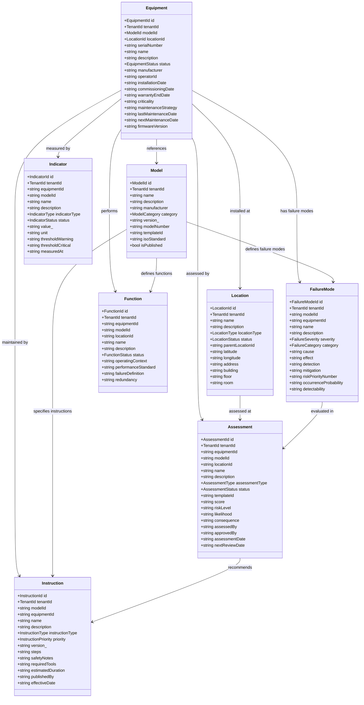
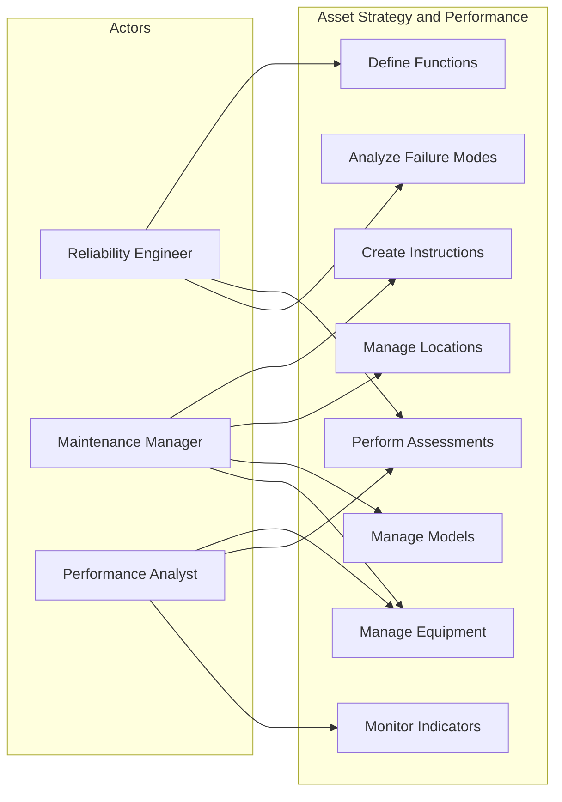

# UML Diagrams - Asset Strategy and Performance Management Service

## Domain Model

```mermaid
classDiagram
    class Equipment {
        +EquipmentId id
        +TenantId tenantId
        +ModelId modelId
        +LocationId locationId
        +string serialNumber
        +string name
        +string description
        +EquipmentStatus status
        +string manufacturer
        +string operatorId
        +string installationDate
        +string commissioningDate
        +string warrantyEndDate
        +string criticality
        +string maintenanceStrategy
        +string lastMaintenanceDate
        +string nextMaintenanceDate
        +string firmwareVersion
    }

    class Model {
        +ModelId id
        +TenantId tenantId
        +string name
        +string description
        +string manufacturer
        +ModelCategory category
        +string version_
        +string modelNumber
        +string templateId
        +string isoStandard
        +bool isPublished
    }

    class Location {
        +LocationId id
        +TenantId tenantId
        +string name
        +string description
        +LocationType locationType
        +LocationStatus status
        +string parentLocationId
        +string latitude
        +string longitude
        +string address
        +string building
        +string floor
        +string room
    }

    class FailureMode {
        +FailureModeId id
        +TenantId tenantId
        +string modelId
        +string equipmentId
        +string name
        +string description
        +FailureSeverity severity
        +FailureCategory category
        +string cause
        +string effect
        +string detection
        +string mitigation
        +string riskPriorityNumber
        +string occurrenceProbability
        +string detectability
    }

    class Assessment {
        +AssessmentId id
        +TenantId tenantId
        +string equipmentId
        +string modelId
        +string locationId
        +string name
        +string description
        +AssessmentType assessmentType
        +AssessmentStatus status
        +string templateId
        +string score
        +string riskLevel
        +string likelihood
        +string consequence
        +string assessedBy
        +string approvedBy
        +string assessmentDate
        +string nextReviewDate
    }

    class Instruction {
        +InstructionId id
        +TenantId tenantId
        +string modelId
        +string equipmentId
        +string name
        +string description
        +InstructionType instructionType
        +InstructionPriority priority
        +string version_
        +string steps
        +string safetyNotes
        +string requiredTools
        +string estimatedDuration
        +string publishedBy
        +string effectiveDate
    }

    class Function {
        +FunctionId id
        +TenantId tenantId
        +string equipmentId
        +string modelId
        +string locationId
        +string name
        +string description
        +FunctionStatus status
        +string operatingContext
        +string performanceStandard
        +string failureDefinition
        +string redundancy
    }

    class Indicator {
        +IndicatorId id
        +TenantId tenantId
        +string equipmentId
        +string modelId
        +string name
        +string description
        +IndicatorType indicatorType
        +IndicatorStatus status
        +string value_
        +string unit
        +string thresholdWarning
        +string thresholdCritical
        +string measuredAt
    }

    Equipment --> Model : references
    Equipment --> Location : installed at
    Equipment --> FailureMode : has failure modes
    Equipment --> Assessment : assessed by
    Equipment --> Instruction : maintained by
    Equipment --> Function : performs
    Equipment --> Indicator : measured by
    Model --> FailureMode : defines failure modes
    Model --> Instruction : specifies instructions
    Model --> Function : defines functions
    Location --> Assessment : assessed at
    FailureMode --> Assessment : evaluated in
    Assessment --> Instruction : recommends
```

## Hexagonal Architecture

```mermaid
graph TB
    subgraph Presentation["Presentation Layer (HTTP)"]
        EC[EquipmentController]
        MC[ModelController]
        LC[LocationController]
        FMC[FailureModeController]
        AC[AssessmentController]
        IC[InstructionController]
        FC[FunctionController]
        INC[IndicatorController]
        HC[HealthController]
    end

    subgraph Application["Application Layer (Use Cases)"]
        MEU[ManageEquipmentUseCase]
        MMU[ManageModelsUseCase]
        MLU[ManageLocationsUseCase]
        MFMU[ManageFailureModesUseCase]
        MAU[ManageAssessmentsUseCase]
        MIU[ManageInstructionsUseCase]
        MFU[ManageFunctionsUseCase]
        MINU[ManageIndicatorsUseCase]
    end

    subgraph Domain["Domain Layer"]
        E[Equipment]
        M[Model]
        L[Location]
        FM[FailureMode]
        A[Assessment]
        I[Instruction]
        F[Function]
        IN[Indicator]
        ER[EquipmentRepository]
        MR[ModelRepository]
        LR[LocationRepository]
        FMR[FailureModeRepository]
        AR[AssessmentRepository]
        IR[InstructionRepository]
        FR[FunctionRepository]
        INR[IndicatorRepository]
        SV[StrategyValidator]
    end

    subgraph Infrastructure["Infrastructure Layer"]
        CFG[AppConfig]
        CTR[Container]
        MER[MemoryEquipmentRepo]
        MMR[MemoryModelRepo]
        MLR[MemoryLocationRepo]
        MFMR[MemoryFailureModeRepo]
        MAR[MemoryAssessmentRepo]
        MIR[MemoryInstructionRepo]
        MFR[MemoryFunctionRepo]
        MINR[MemoryIndicatorRepo]
    end

    EC --> MEU
    MC --> MMU
    LC --> MLU
    FMC --> MFMU
    AC --> MAU
    IC --> MIU
    FC --> MFU
    INC --> MINU

    MEU --> ER
    MMU --> MR
    MLU --> LR
    MFMU --> FMR
    MAU --> AR
    MIU --> IR
    MFU --> FR
    MINU --> INR

    MER -.->|implements| ER
    MMR -.->|implements| MR
    MLR -.->|implements| LR
    MFMR -.->|implements| FMR
    MAR -.->|implements| AR
    MIR -.->|implements| IR
    MFR -.->|implements| FR
    MINR -.->|implements| INR

    MEU --> SV
    MMU --> SV
    MLU --> SV
    MFMU --> SV
    MAU --> SV
    MIU --> SV
    MFU --> SV
    MINU --> SV
```

## Use Case Diagram

```mermaid
graph LR
    subgraph Actors
        RE[Reliability Engineer]
        MM[Maintenance Manager]
        PA[Performance Analyst]
    end

    subgraph UseCases["Asset Strategy and Performance"]
        UC1[Manage Equipment]
        UC2[Manage Models]
        UC3[Manage Locations]
        UC4[Analyze Failure Modes]
        UC5[Perform Assessments]
        UC6[Create Instructions]
        UC7[Define Functions]
        UC8[Monitor Indicators]
    end

    RE --> UC4
    RE --> UC5
    RE --> UC7
    MM --> UC1
    MM --> UC2
    MM --> UC3
    MM --> UC6
    PA --> UC8
    PA --> UC5
    PA --> UC1
```
