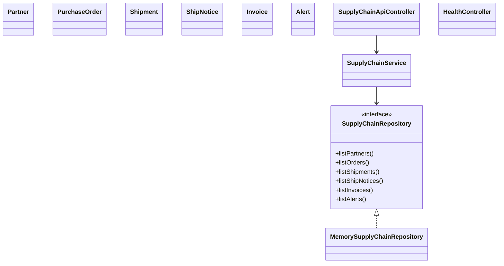

# UML

```mermaid
classDiagram
  class Partner
  class PurchaseOrder
  class Shipment
  class ShipNotice
  class Invoice
  class Alert
  class SupplyChainRepository {
    <<interface>>
    +listPartners()
    +listOrders()
    +listShipments()
    +listShipNotices()
    +listInvoices()
    +listAlerts()
  }
  class MemorySupplyChainRepository
  class SupplyChainService
  class SupplyChainApiController
  class HealthController

  SupplyChainRepository <|.. MemorySupplyChainRepository
  SupplyChainService --> SupplyChainRepository
  SupplyChainApiController --> SupplyChainService
```
