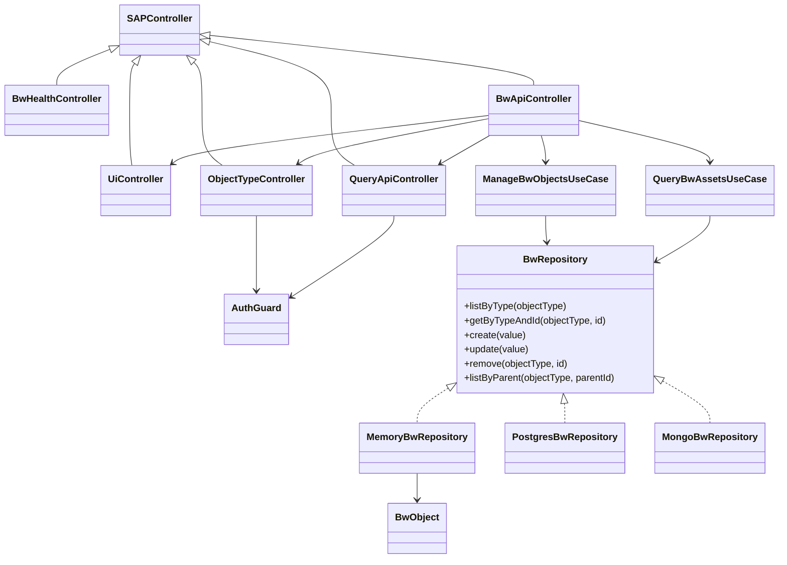
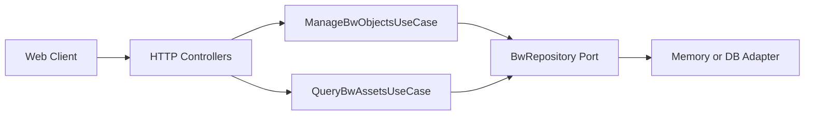

# UML

```mermaid
classDiagram
  class SAPController
  class BwHealthController
  class BwApiController
  class UiController
  class QueryApiController
  class ObjectTypeController
  class AuthGuard

  class BwRepository {
    +listByType(objectType)
    +getByTypeAndId(objectType, id)
    +create(value)
    +update(value)
    +remove(objectType, id)
    +listByParent(objectType, parentId)
  }

  class MemoryBwRepository
  class PostgresBwRepository
  class MongoBwRepository
  class ManageBwObjectsUseCase
  class QueryBwAssetsUseCase
  class BwObject

  SAPController <|-- BwHealthController
  SAPController <|-- BwApiController
  SAPController <|-- UiController
  SAPController <|-- QueryApiController
  SAPController <|-- ObjectTypeController

  BwRepository <|.. MemoryBwRepository
  BwRepository <|.. PostgresBwRepository
  BwRepository <|.. MongoBwRepository
  ManageBwObjectsUseCase --> BwRepository
  QueryBwAssetsUseCase --> BwRepository
  BwApiController --> ManageBwObjectsUseCase
  BwApiController --> QueryBwAssetsUseCase
  BwApiController --> UiController
  BwApiController --> QueryApiController
  BwApiController --> ObjectTypeController
  ObjectTypeController --> AuthGuard
  QueryApiController --> AuthGuard
  MemoryBwRepository --> BwObject
```

```mermaid
flowchart LR
  UI[Web Client] --> API[HTTP Controllers]
  API --> UC1[ManageBwObjectsUseCase]
  API --> UC2[QueryBwAssetsUseCase]
  UC1 --> PORT[BwRepository Port]
  UC2 --> PORT
  PORT --> ADAPTER[Memory or DB Adapter]
```
