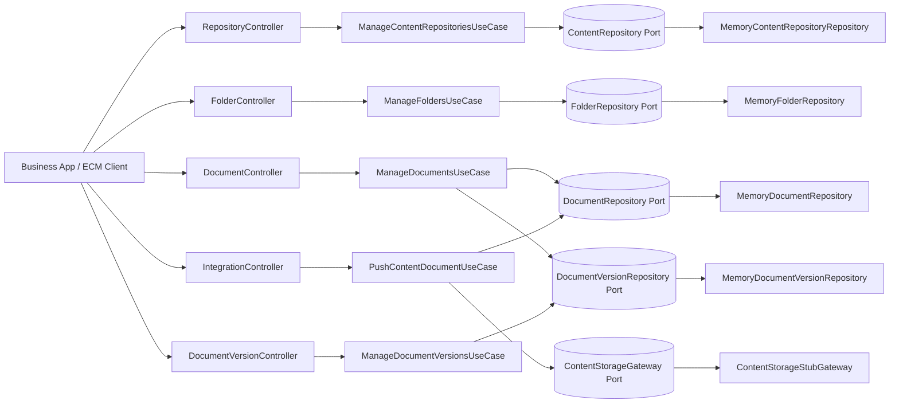
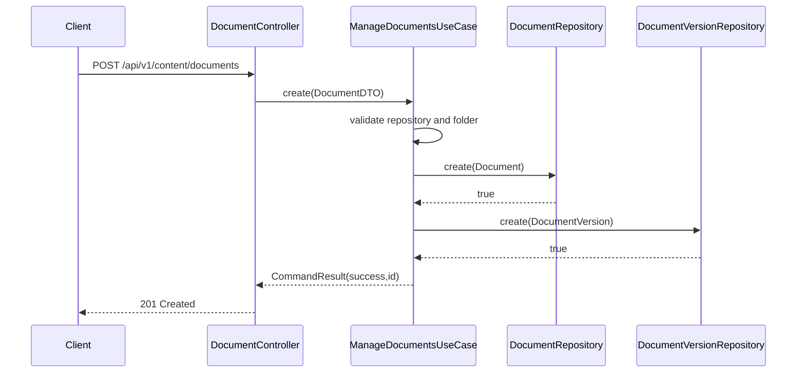
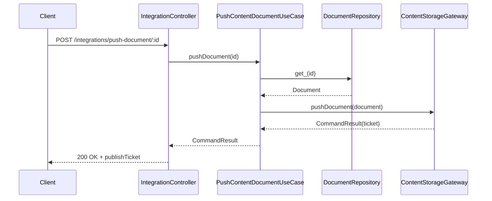

# Content Server UML

## Hexagonal Component View

```mermaid
flowchart LR
    Client[Business App / ECM Client] --> C1[RepositoryController]
    Client --> C2[FolderController]
    Client --> C3[DocumentController]
    Client --> C4[DocumentVersionController]
    Client --> C5[IntegrationController]

    C1 --> U1[ManageContentRepositoriesUseCase]
    C2 --> U2[ManageFoldersUseCase]
    C3 --> U3[ManageDocumentsUseCase]
    C4 --> U4[ManageDocumentVersionsUseCase]
    C5 --> U5[PushContentDocumentUseCase]

    U1 --> P1[(ContentRepository Port)]
    U2 --> P2[(FolderRepository Port)]
    U3 --> P3[(DocumentRepository Port)]
    U3 --> P4[(DocumentVersionRepository Port)]
    U4 --> P4
    U5 --> P3
    U5 --> G1[(ContentStorageGateway Port)]

    P1 --> A1[MemoryContentRepositoryRepository]
    P2 --> A2[MemoryFolderRepository]
    P3 --> A3[MemoryDocumentRepository]
    P4 --> A4[MemoryDocumentVersionRepository]
    G1 --> A5[ContentStorageStubGateway]
```

## Document Creation Sequence

```mermaid
sequenceDiagram
    participant Client
    participant Controller as DocumentController
    participant UseCase as ManageDocumentsUseCase
    participant Repo as DocumentRepository
    participant VersionRepo as DocumentVersionRepository

    Client->>Controller: POST /api/v1/content/documents
    Controller->>UseCase: create(DocumentDTO)
    UseCase->>UseCase: validate repository and folder
    UseCase->>Repo: create(Document)
    Repo-->>UseCase: true
    UseCase->>VersionRepo: create(DocumentVersion)
    VersionRepo-->>UseCase: true
    UseCase-->>Controller: CommandResult(success,id)
    Controller-->>Client: 201 Created
```

## Push Sequence

```mermaid
sequenceDiagram
    participant Client
    participant Controller as IntegrationController
    participant UseCase as PushContentDocumentUseCase
    participant Repo as DocumentRepository
    participant Gateway as ContentStorageGateway

    Client->>Controller: POST /integrations/push-document/:id
    Controller->>UseCase: pushDocument(id)
    UseCase->>Repo: get_(id)
    Repo-->>UseCase: Document
    UseCase->>Gateway: pushDocument(document)
    Gateway-->>UseCase: CommandResult(ticket)
    UseCase-->>Controller: CommandResult
    Controller-->>Client: 200 OK + publishTicket
```
