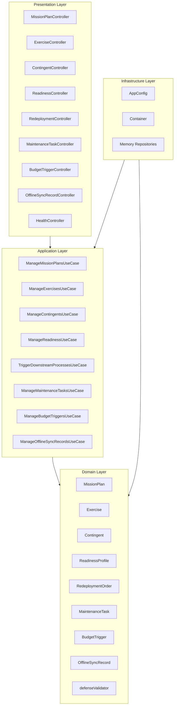
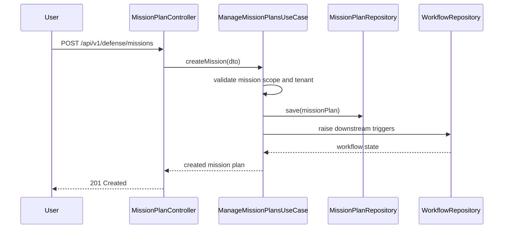
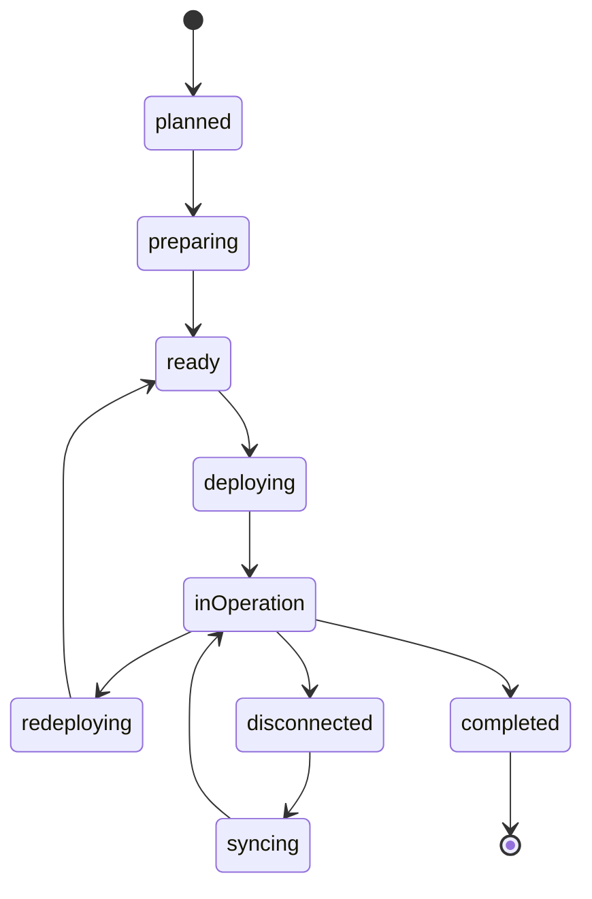

# Defense & Security Service - UML Diagrams

<!-- markdownlint-disable MD040 MD060 -->

## 1. Package Structure

```
uim.platform.defense
├── domain
│   ├── entities
│   │   ├── MissionPlan
│   │   ├── Exercise
│   │   ├── Contingent
│   │   ├── ReadinessProfile
│   │   ├── RedeploymentOrder
│   │   ├── BudgetTrigger
│   │   └── OfflineSyncRecord
│   │   ├── MaintenanceTask
│   ├── repositories
│   │   ├── MissionPlanRepository
│   │   ├── ExerciseRepository
│   │   ├── ContingentRepository
│   │   ├── ReadinessRepository
│   │   ├── RedeploymentOrderRepository
│   │   ├── MaintenanceTaskRepository
│   │   ├── BudgetTriggerRepository
│   │   └── OfflineSyncRecordRepository
│   └── services
│       └── defenseValidator
├── application
│   ├── dto
│   └── usecases
│       ├── ManageMissionPlansUseCase
│       ├── ManageExercisesUseCase
│       ├── ManageContingentsUseCase
│       ├── ManageReadinessUseCase
│       ├── ManageRedeploymentOrdersUseCase
│       ├── ManageMaintenanceTasksUseCase
│       ├── ManageBudgetTriggersUseCase
│       └── ManageOfflineSyncRecordsUseCase
├── infrastructure
│   ├── config
│   └── container
└── presentation.http
    ├── controllers
    └── json_utils
```

## 2. Domain Class Diagram

```mermaid
classDiagram
    direction TB

    class MissionPlan {
        +MissionPlanId id
        +TenantId tenantId
        +string reference
        +string name
        +string missionType
        +string objective
        +string startDate
        +string endDate
        +string status
        +string assignedUnitId
        +string locationId
        +string downstreamProcessState
        +UserId createdBy
        +UserId modifiedBy
        +string createdAt
        +string modifiedAt
    }

    class Exercise {
        +ExerciseId id
        +TenantId tenantId
        +string reference
        +string name
        +string exerciseType
        +string exerciseScope
        +string status
        +string plannedStart
        +string plannedEnd
        +string contingencyLevel
        +string relocationRequired
        +UserId createdBy
        +UserId modifiedBy
        +string createdAt
        +string modifiedAt
    }

    class Contingent {
        +ContingentId id
        +TenantId tenantId
        +string code
        +string name
        +string unitType
        +string personnelStrength
        +string equipmentCount
        +string readinessStatus
        +string currentLocationId
        +string destinationLocationId
        +string transportMode
        +UserId createdBy
        +UserId modifiedBy
        +string createdAt
        +string modifiedAt
    }

    class ReadinessProfile {
        +ReadinessProfileId id
        +TenantId tenantId
        +string contingentId
        +string personnelReadyPercent
        +string equipmentReadyPercent
        +string supplyReadyPercent
        +string maintenanceOpenCount
        +string mobilityState
        +string communicationState
        +string status
        +UserId createdBy
        +UserId modifiedBy
        +string createdAt
        +string modifiedAt
    }

    class RedeploymentOrder {
        +RedeploymentOrderId id
        +TenantId tenantId
        +string missionPlanId
        +string contingentId
        +string originLocationId
        +string destinationLocationId
        +string transportType
        +string priority
        +string executionWindow
        +string status
        +UserId createdBy
        +UserId modifiedBy
        +string createdAt
        +string modifiedAt
    }

    class MaintenanceTask {
        +MaintenanceTaskId id
        +TenantId tenantId
        +string contingentId
        +string equipmentId
        +string taskType
        +string priority
        +string dueAt
        +string status
        +string locationId
        +UserId createdBy
        +UserId modifiedBy
        +string createdAt
        +string modifiedAt
    }

    class BudgetTrigger {
        +BudgetTriggerId id
        +TenantId tenantId
        +string missionPlanId
        +string sourceProcess
        +string amount
        +string currency
        +string triggerReason
        +string status
        +UserId createdBy
        +UserId modifiedBy
        +string createdAt
        +string modifiedAt
    }

    class OfflineSyncRecord {
        +OfflineSyncRecordId id
        +TenantId tenantId
        +string recordType
        +string recordId
        +string action
        +string payload
        +string status
        +string lastSyncedAt
        +UserId createdBy
        +UserId modifiedBy
        +string createdAt
        +string modifiedAt
    }

    class MaintenanceTask {
        +MaintenanceTaskId id
        +TenantId tenantId
        +string contingentId
        +string equipmentId
        +string taskType
        +string scheduledAt
        +string dueAt
        +string status
        +string workCenterId
        +string locationId
        +UserId createdBy
        +UserId modifiedBy
        +string createdAt
        +string modifiedAt
    }

    class BudgetTrigger {
        +BudgetTriggerId id
        +TenantId tenantId
        +string missionPlanId
        +string sourceProcess
        +string amount
        +string currency
        +string triggerReason
        +string status
        +UserId createdBy
        +UserId modifiedBy
        +string createdAt
        +string modifiedAt
    }

    MissionPlan --> Contingent : assigns
    MissionPlan --> RedeploymentOrder : initiates
    MissionPlan --> BudgetTrigger : triggers
    MissionPlan --> MaintenanceTask : creates follow-up work
    Exercise --> Contingent : uses
    Contingent --> ReadinessProfile : has
    Contingent --> MaintenanceTask : requires
    Contingent --> RedeploymentOrder : executes
    RedeploymentOrder --> MaintenanceTask : may require support
    MaintenanceTask --> BudgetTrigger : may create cost event
    OfflineSyncRecord --> MissionPlan : reconciles
    OfflineSyncRecord --> Contingent : reconciles
    OfflineSyncRecord --> MaintenanceTask : reconciles
    OfflineSyncRecord --> BudgetTrigger : reconciles
```



## 3. Hexagonal Architecture



## 4. Mission Planning Sequence



## 5. Readiness State Machine


