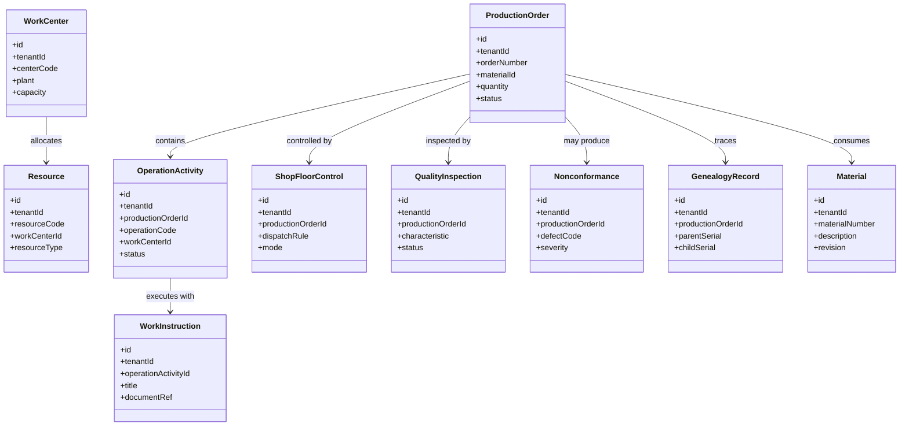
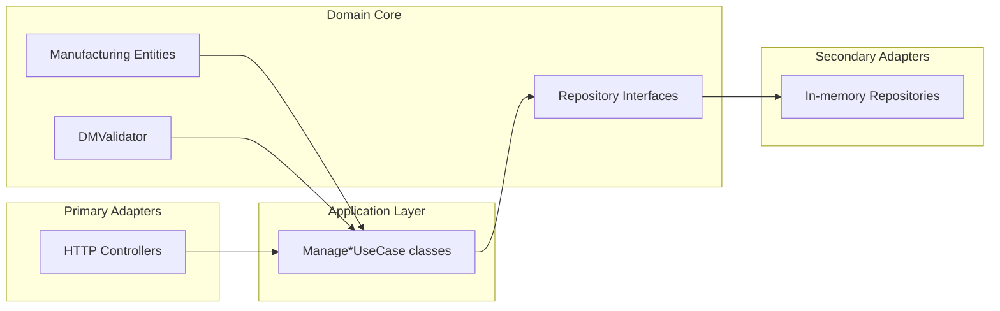

# UML Diagrams - SAP Digital Manufacturing

## Domain Class Diagram

```mermaid
classDiagram
    class ProductionOrder {
        +id
        +tenantId
        +orderNumber
        +materialId
        +quantity
        +status
    }

    class OperationActivity {
        +id
        +tenantId
        +productionOrderId
        +operationCode
        +workCenterId
        +status
    }

    class WorkCenter {
        +id
        +tenantId
        +centerCode
        +plant
        +capacity
    }

    class Resource {
        +id
        +tenantId
        +resourceCode
        +workCenterId
        +resourceType
    }

    class Material {
        +id
        +tenantId
        +materialNumber
        +description
        +revision
    }

    class ShopFloorControl {
        +id
        +tenantId
        +productionOrderId
        +dispatchRule
        +mode
    }

    class WorkInstruction {
        +id
        +tenantId
        +operationActivityId
        +title
        +documentRef
    }

    class QualityInspection {
        +id
        +tenantId
        +productionOrderId
        +characteristic
        +status
    }

    class Nonconformance {
        +id
        +tenantId
        +productionOrderId
        +defectCode
        +severity
    }

    class GenealogyRecord {
        +id
        +tenantId
        +productionOrderId
        +parentSerial
        +childSerial
    }

    ProductionOrder --> OperationActivity : contains
    ProductionOrder --> ShopFloorControl : controlled by
    ProductionOrder --> QualityInspection : inspected by
    ProductionOrder --> Nonconformance : may produce
    ProductionOrder --> GenealogyRecord : traces
    OperationActivity --> WorkInstruction : executes with
    WorkCenter --> Resource : allocates
    ProductionOrder --> Material : consumes
```

## Hexagonal View

```mermaid
graph LR
    subgraph Primary[Primary Adapters]
        HTTP[HTTP Controllers]
    end

    subgraph Application[Application Layer]
        UC[Manage*UseCase classes]
    end

    subgraph Domain[Domain Core]
        ENT[Manufacturing Entities]
        PORTS[Repository Interfaces]
        VAL[DMValidator]
    end

    subgraph Secondary[Secondary Adapters]
        MEM[In-memory Repositories]
    end

    HTTP --> UC
    UC --> PORTS
    ENT --> UC
    VAL --> UC
    PORTS --> MEM
```
