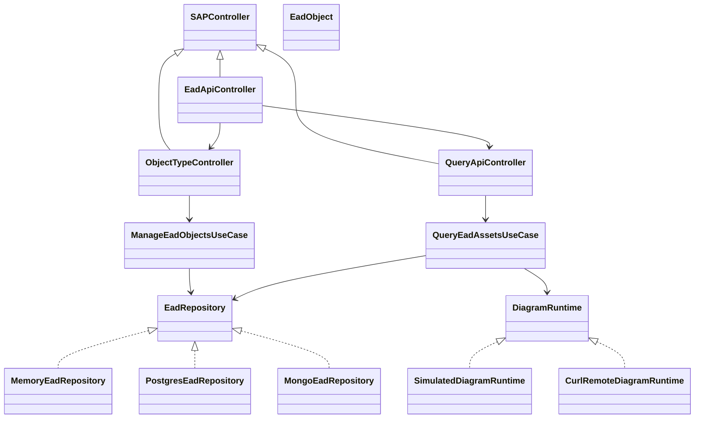

# UML Overview

```mermaid
classDiagram
    class SAPController
    class EadApiController
    class ObjectTypeController
    class QueryApiController

    class ManageEadObjectsUseCase
    class QueryEadAssetsUseCase

    class EadRepository
    class MemoryEadRepository
    class PostgresEadRepository
    class MongoEadRepository

    class DiagramRuntime
    class SimulatedDiagramRuntime
    class CurlRemoteDiagramRuntime

    class EadObject

    SAPController <|-- EadApiController
    SAPController <|-- ObjectTypeController
    SAPController <|-- QueryApiController

    EadApiController --> ObjectTypeController
    EadApiController --> QueryApiController

    ObjectTypeController --> ManageEadObjectsUseCase
    QueryApiController --> QueryEadAssetsUseCase

    ManageEadObjectsUseCase --> EadRepository
    QueryEadAssetsUseCase --> EadRepository
    QueryEadAssetsUseCase --> DiagramRuntime

    EadRepository <|.. MemoryEadRepository
    EadRepository <|.. PostgresEadRepository
    EadRepository <|.. MongoEadRepository

    DiagramRuntime <|.. SimulatedDiagramRuntime
    DiagramRuntime <|.. CurlRemoteDiagramRuntime
```
