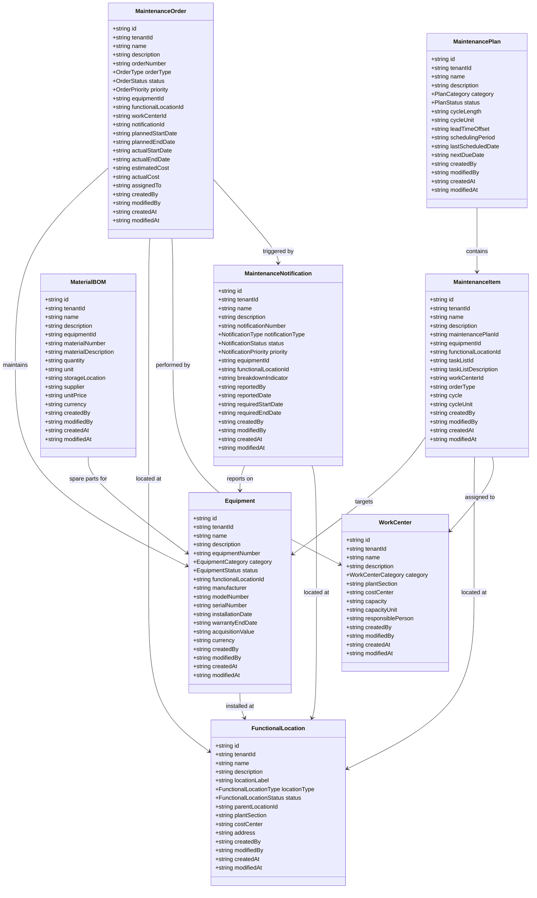
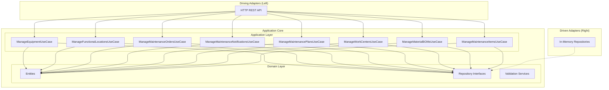
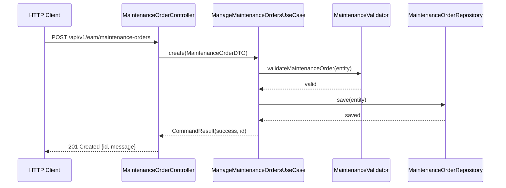
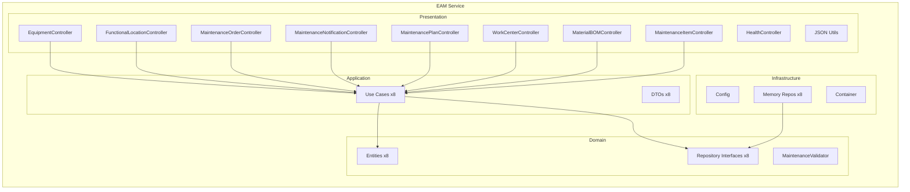
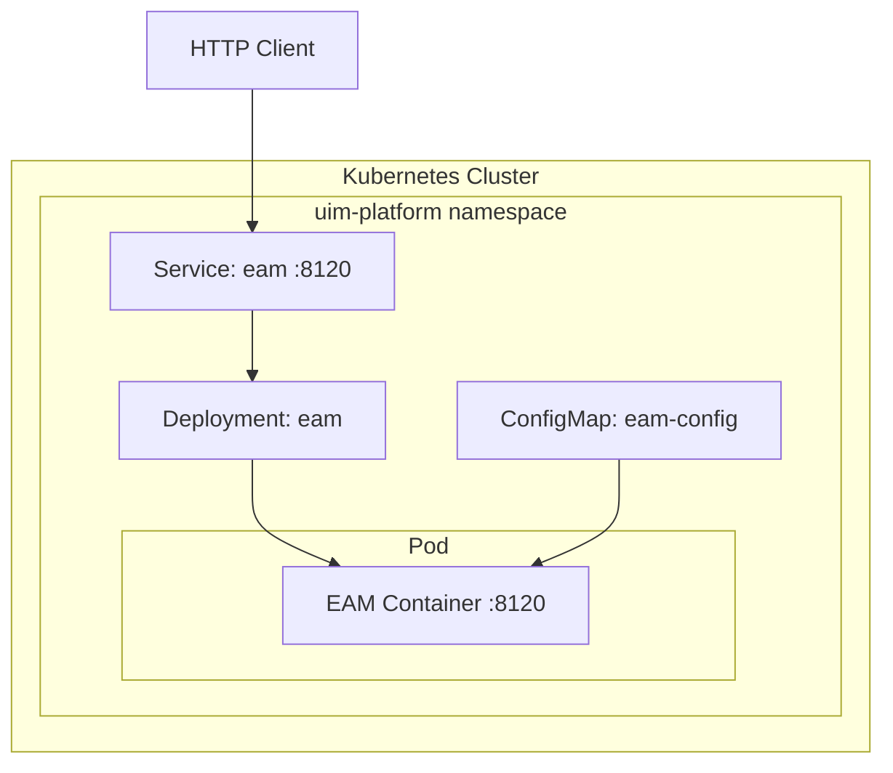

# UML Diagrams - SAP S/4HANA Enterprise Asset Management (EAM)

## Domain Model

```mermaid
classDiagram
    class Equipment {
        +string id
        +string tenantId
        +string name
        +string description
        +string equipmentNumber
        +EquipmentCategory category
        +EquipmentStatus status
        +string functionalLocationId
        +string manufacturer
        +string modelNumber
        +string serialNumber
        +string installationDate
        +string warrantyEndDate
        +string acquisitionValue
        +string currency
        +string createdBy
        +string modifiedBy
        +string createdAt
        +string modifiedAt
    }

    class FunctionalLocation {
        +string id
        +string tenantId
        +string name
        +string description
        +string locationLabel
        +FunctionalLocationType locationType
        +FunctionalLocationStatus status
        +string parentLocationId
        +string plantSection
        +string costCenter
        +string address
        +string createdBy
        +string modifiedBy
        +string createdAt
        +string modifiedAt
    }

    class MaintenanceOrder {
        +string id
        +string tenantId
        +string name
        +string description
        +string orderNumber
        +OrderType orderType
        +OrderStatus status
        +OrderPriority priority
        +string equipmentId
        +string functionalLocationId
        +string workCenterId
        +string notificationId
        +string plannedStartDate
        +string plannedEndDate
        +string actualStartDate
        +string actualEndDate
        +string estimatedCost
        +string actualCost
        +string assignedTo
        +string createdBy
        +string modifiedBy
        +string createdAt
        +string modifiedAt
    }

    class MaintenanceNotification {
        +string id
        +string tenantId
        +string name
        +string description
        +string notificationNumber
        +NotificationType notificationType
        +NotificationStatus status
        +NotificationPriority priority
        +string equipmentId
        +string functionalLocationId
        +string breakdownIndicator
        +string reportedBy
        +string reportedDate
        +string requiredStartDate
        +string requiredEndDate
        +string createdBy
        +string modifiedBy
        +string createdAt
        +string modifiedAt
    }

    class MaintenancePlan {
        +string id
        +string tenantId
        +string name
        +string description
        +PlanCategory category
        +PlanStatus status
        +string cycleLength
        +string cycleUnit
        +string leadTimeOffset
        +string schedulingPeriod
        +string lastScheduledDate
        +string nextDueDate
        +string createdBy
        +string modifiedBy
        +string createdAt
        +string modifiedAt
    }

    class WorkCenter {
        +string id
        +string tenantId
        +string name
        +string description
        +WorkCenterCategory category
        +string plantSection
        +string costCenter
        +string capacity
        +string capacityUnit
        +string responsiblePerson
        +string createdBy
        +string modifiedBy
        +string createdAt
        +string modifiedAt
    }

    class MaterialBOM {
        +string id
        +string tenantId
        +string name
        +string description
        +string equipmentId
        +string materialNumber
        +string materialDescription
        +string quantity
        +string unit
        +string storageLocation
        +string supplier
        +string unitPrice
        +string currency
        +string createdBy
        +string modifiedBy
        +string createdAt
        +string modifiedAt
    }

    class MaintenanceItem {
        +string id
        +string tenantId
        +string name
        +string description
        +string maintenancePlanId
        +string equipmentId
        +string functionalLocationId
        +string taskListId
        +string taskListDescription
        +string workCenterId
        +string orderType
        +string cycle
        +string cycleUnit
        +string createdBy
        +string modifiedBy
        +string createdAt
        +string modifiedAt
    }

    Equipment --> FunctionalLocation : installed at
    MaintenanceOrder --> Equipment : maintains
    MaintenanceOrder --> FunctionalLocation : located at
    MaintenanceOrder --> WorkCenter : performed by
    MaintenanceOrder --> MaintenanceNotification : triggered by
    MaintenanceNotification --> Equipment : reports on
    MaintenanceNotification --> FunctionalLocation : located at
    MaintenancePlan --> MaintenanceItem : contains
    MaintenanceItem --> Equipment : targets
    MaintenanceItem --> FunctionalLocation : located at
    MaintenanceItem --> WorkCenter : assigned to
    MaterialBOM --> Equipment : spare parts for
```

## Hexagonal Architecture

```mermaid
graph TB
    subgraph "Driving Adapters (Left)"
        HTTP[HTTP REST API]
    end

    subgraph "Application Core"
        subgraph "Application Layer"
            UC1[ManageEquipmentUseCase]
            UC2[ManageFunctionalLocationsUseCase]
            UC3[ManageMaintenanceOrdersUseCase]
            UC4[ManageMaintenanceNotificationsUseCase]
            UC5[ManageMaintenancePlansUseCase]
            UC6[ManageWorkCentersUseCase]
            UC7[ManageMaterialBOMsUseCase]
            UC8[ManageMaintenanceItemsUseCase]
        end

        subgraph "Domain Layer"
            E[Entities]
            RI[Repository Interfaces]
            VS[Validation Services]
        end
    end

    subgraph "Driven Adapters (Right)"
        MEM[In-Memory Repositories]
    end

    HTTP --> UC1
    HTTP --> UC2
    HTTP --> UC3
    HTTP --> UC4
    HTTP --> UC5
    HTTP --> UC6
    HTTP --> UC7
    HTTP --> UC8

    UC1 --> E
    UC2 --> E
    UC3 --> E
    UC4 --> E
    UC5 --> E
    UC6 --> E
    UC7 --> E
    UC8 --> E

    UC1 --> RI
    UC2 --> RI
    UC3 --> RI
    UC4 --> RI
    UC5 --> RI
    UC6 --> RI
    UC7 --> RI
    UC8 --> RI

    MEM -.-> RI
```

## Use Case Sequence Diagram

```mermaid
sequenceDiagram
    participant C as HTTP Client
    participant Ctrl as MaintenanceOrderController
    participant UC as ManageMaintenanceOrdersUseCase
    participant V as MaintenanceValidator
    participant R as MaintenanceOrderRepository

    C->>Ctrl: POST /api/v1/eam/maintenance-orders
    Ctrl->>UC: create(MaintenanceOrderDTO)
    UC->>V: validateMaintenanceOrder(entity)
    V-->>UC: valid
    UC->>R: save(entity)
    R-->>UC: saved
    UC-->>Ctrl: CommandResult(success, id)
    Ctrl-->>C: 201 Created {id, message}
```

## Component Diagram

```mermaid
graph LR
    subgraph "EAM Service"
        subgraph "Presentation"
            EC[EquipmentController]
            FLC[FunctionalLocationController]
            MOC[MaintenanceOrderController]
            MNC[MaintenanceNotificationController]
            MPC[MaintenancePlanController]
            WCC[WorkCenterController]
            BOMC[MaterialBOMController]
            MIC[MaintenanceItemController]
            HC[HealthController]
            JU[JSON Utils]
        end

        subgraph "Application"
            UC[Use Cases x8]
            DTO[DTOs x8]
        end

        subgraph "Domain"
            ENT[Entities x8]
            REPO[Repository Interfaces x8]
            VAL[MaintenanceValidator]
        end

        subgraph "Infrastructure"
            CFG[Config]
            CNT[Container]
            MR[Memory Repos x8]
        end
    end

    EC --> UC
    FLC --> UC
    MOC --> UC
    MNC --> UC
    MPC --> UC
    WCC --> UC
    BOMC --> UC
    MIC --> UC
    UC --> ENT
    UC --> REPO
    MR --> REPO
```

## Deployment Diagram

```mermaid
graph TB
    subgraph "Kubernetes Cluster"
        subgraph "uim-platform namespace"
            CM[ConfigMap: eam-config]
            SVC[Service: eam :8120]
            DEP[Deployment: eam]
            subgraph "Pod"
                APP[EAM Container :8120]
            end
        end
    end

    CLIENT[HTTP Client] --> SVC
    SVC --> DEP
    DEP --> APP
    CM --> APP
```
