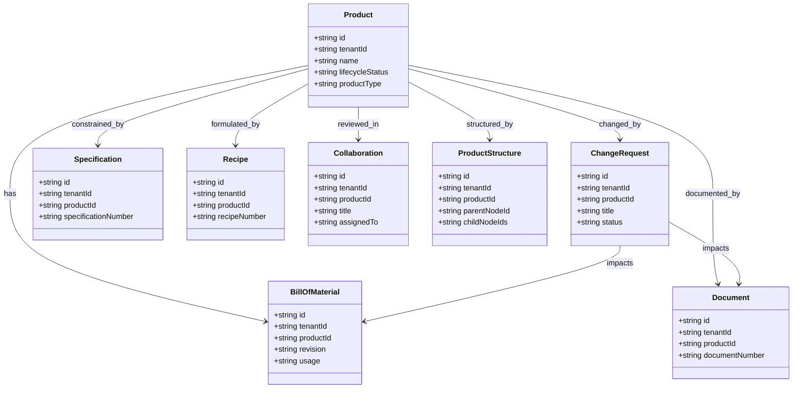
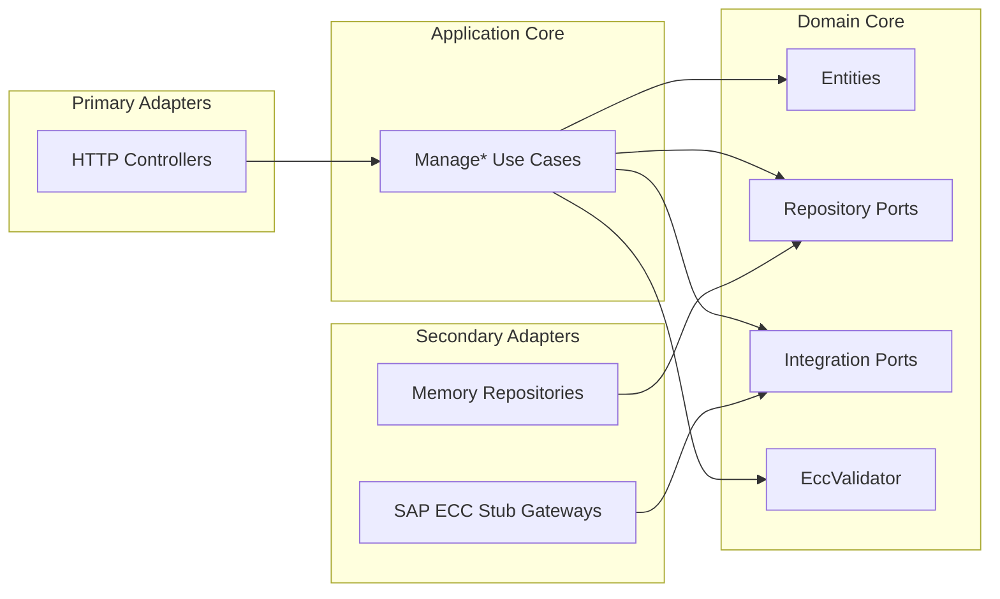
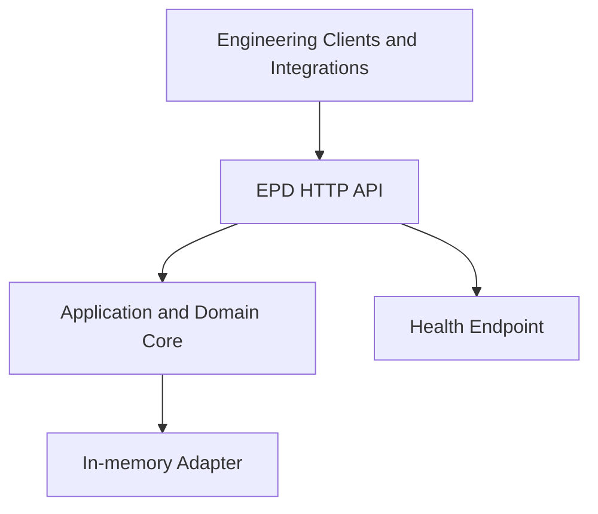

# Engineering Control Center Service - UML

<!-- markdownlint-disable MD040 MD060 MD047 -->

## Package Overview

```text
uim.platform.ecc
├── domain
│   ├── types
│   ├── entities
│   ├── integration
│   │   ├── Product
│   │   ├── BillOfMaterial
│   │   ├── ChangeRequest
│   │   ├── Document
│   │   ├── Specification
│   │   ├── Recipe
│   │   ├── Collaboration
│   │   └── ProductStructure
│   ├── repositories
│   └── services
│       └── EccValidator
├── application
│   ├── dto
│   ├── usecases.integration
│   └── usecases.manage
├── infrastructure
│   ├── config
│   ├── container
│   ├── integrations.sap_ecc
│   └── persistence.memory
└── presentation.http
    ├── controllers
    └── json_utils
```

## Domain Model



## Hexagonal Interaction View



## Deployment Context


