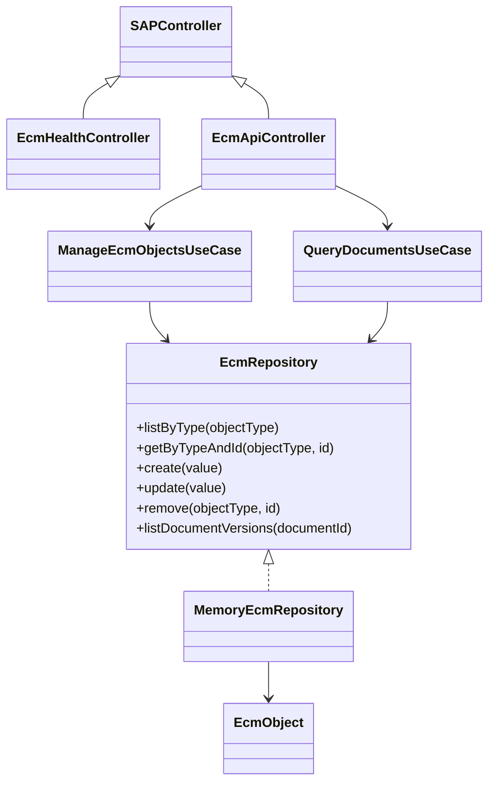
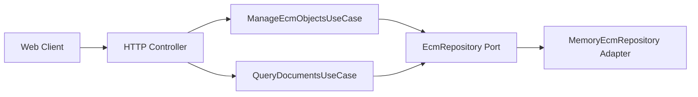

# UML

```mermaid
classDiagram
  class SAPController
  class EcmHealthController
  class EcmApiController

  class EcmRepository {
    +listByType(objectType)
    +getByTypeAndId(objectType, id)
    +create(value)
    +update(value)
    +remove(objectType, id)
    +listDocumentVersions(documentId)
  }

  class MemoryEcmRepository
  class ManageEcmObjectsUseCase
  class QueryDocumentsUseCase
  class EcmObject

  SAPController <|-- EcmHealthController
  SAPController <|-- EcmApiController

  EcmRepository <|.. MemoryEcmRepository
  ManageEcmObjectsUseCase --> EcmRepository
  QueryDocumentsUseCase --> EcmRepository
  EcmApiController --> ManageEcmObjectsUseCase
  EcmApiController --> QueryDocumentsUseCase
  MemoryEcmRepository --> EcmObject
```

```mermaid
flowchart LR
  UI[Web Client] --> API[HTTP Controller]
  API --> UC1[ManageEcmObjectsUseCase]
  API --> UC2[QueryDocumentsUseCase]
  UC1 --> PORT[EcmRepository Port]
  UC2 --> PORT
  PORT --> ADAPTER[MemoryEcmRepository Adapter]
```
