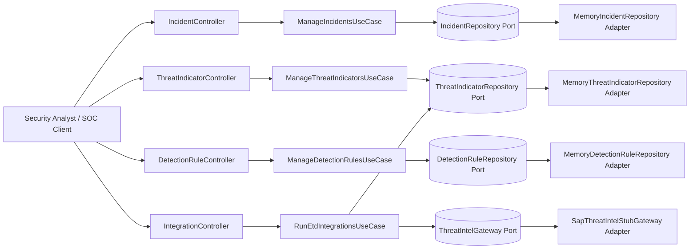
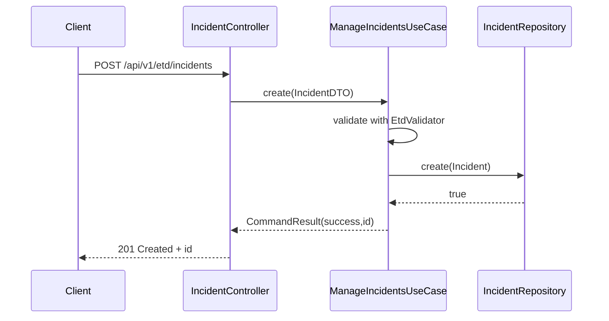
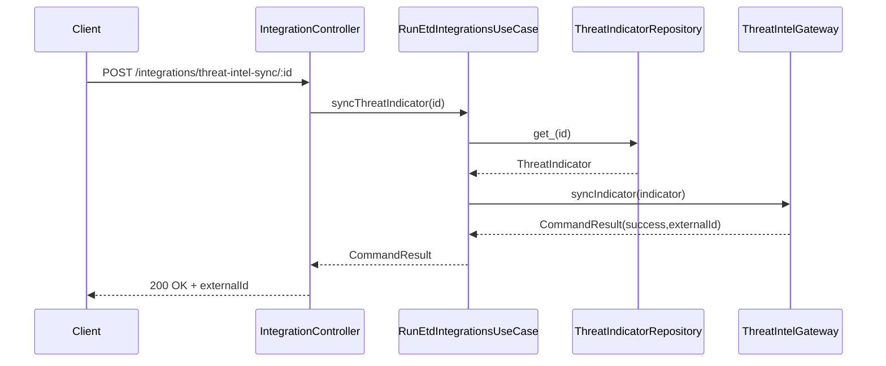

# ETD UML

## Layered/Hexagonal Component View

```mermaid
flowchart LR
    Client[Security Analyst / SOC Client] --> C1[IncidentController]
    Client --> C2[ThreatIndicatorController]
    Client --> C3[DetectionRuleController]
    Client --> C4[IntegrationController]

    C1 --> U1[ManageIncidentsUseCase]
    C2 --> U2[ManageThreatIndicatorsUseCase]
    C3 --> U3[ManageDetectionRulesUseCase]
    C4 --> U4[RunEtdIntegrationsUseCase]

    U1 --> R1[(IncidentRepository Port)]
    U2 --> R2[(ThreatIndicatorRepository Port)]
    U3 --> R3[(DetectionRuleRepository Port)]
    U4 --> R2
    U4 --> G1[(ThreatIntelGateway Port)]

    R1 --> A1[MemoryIncidentRepository Adapter]
    R2 --> A2[MemoryThreatIndicatorRepository Adapter]
    R3 --> A3[MemoryDetectionRuleRepository Adapter]
    G1 --> A4[SapThreatIntelStubGateway Adapter]
```

## Incident Lifecycle Sequence

```mermaid
sequenceDiagram
    participant Client
    participant Controller as IncidentController
    participant UseCase as ManageIncidentsUseCase
    participant Repo as IncidentRepository

    Client->>Controller: POST /api/v1/etd/incidents
    Controller->>UseCase: create(IncidentDTO)
    UseCase->>UseCase: validate with EtdValidator
    UseCase->>Repo: create(Incident)
    Repo-->>UseCase: true
    UseCase-->>Controller: CommandResult(success,id)
    Controller-->>Client: 201 Created + id
```

## Integration Sequence

```mermaid
sequenceDiagram
    participant Client
    participant Controller as IntegrationController
    participant UseCase as RunEtdIntegrationsUseCase
    participant Repo as ThreatIndicatorRepository
    participant Gateway as ThreatIntelGateway

    Client->>Controller: POST /integrations/threat-intel-sync/:id
    Controller->>UseCase: syncThreatIndicator(id)
    UseCase->>Repo: get_(id)
    Repo-->>UseCase: ThreatIndicator
    UseCase->>Gateway: syncIndicator(indicator)
    Gateway-->>UseCase: CommandResult(success,externalId)
    UseCase-->>Controller: CommandResult
    Controller-->>Client: 200 OK + externalId
```
