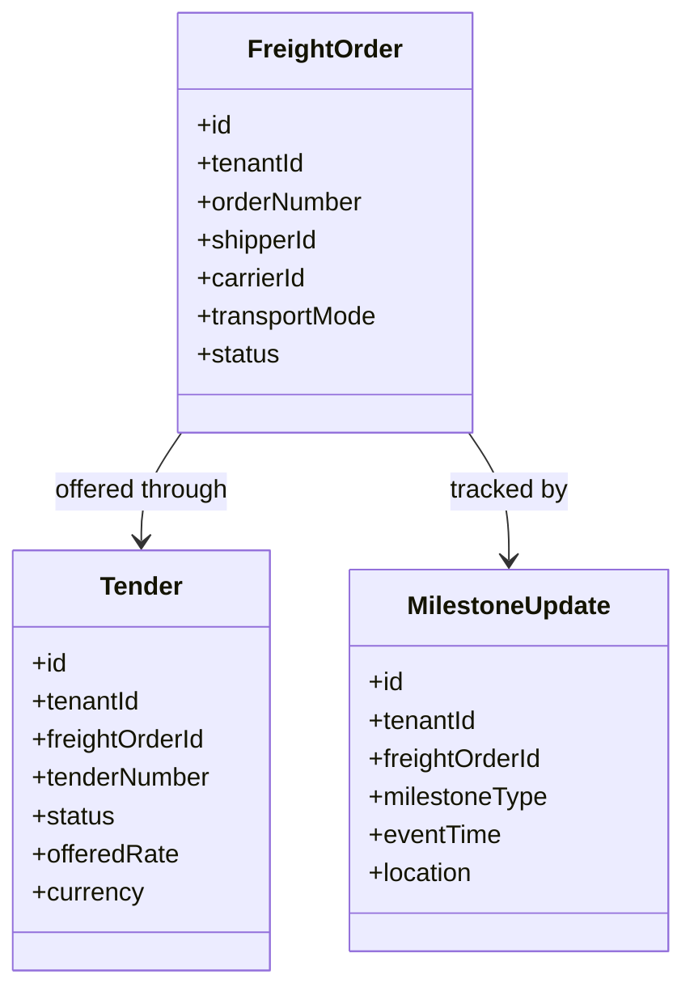
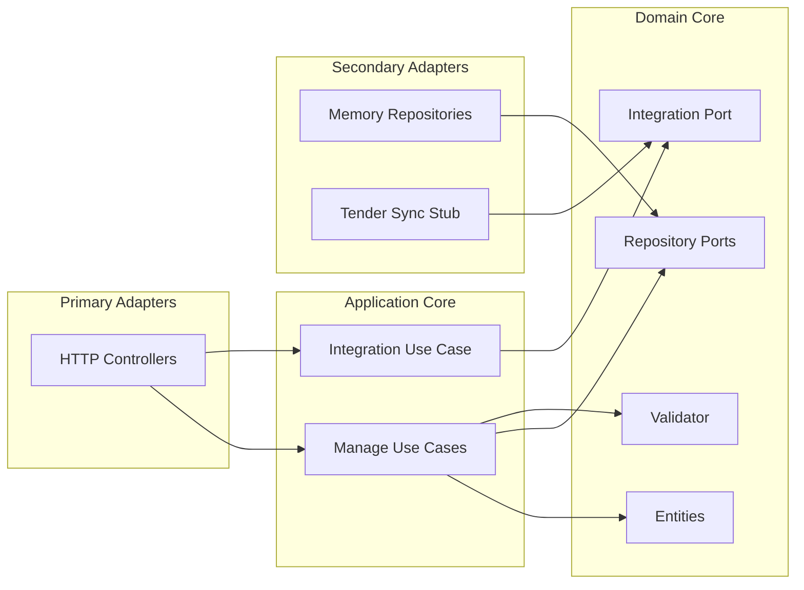

# SAP Business Network Freight Collaboration Service - UML

<!-- markdownlint-disable MD040 MD060 MD047 -->

## Package Overview

uim.platform.freight_collaboration
├── domain
│   ├── types
│   ├── entities
│   │   ├── FreightOrder
│   │   ├── Tender
│   │   └── MilestoneUpdate
│   ├── integration
│   │   └── TenderSyncGateway
│   ├── repositories
│   └── services
│       └── FreightCollaborationValidator
├── application
│   ├── dto
│   ├── usecases.manage
│   └── usecases.integration
├── infrastructure
│   ├── config
│   ├── container
│   ├── integrations.sap_bn_fc
│   └── persistence.memory
└── presentation.http
    ├── controllers
    └── json_utils

## Domain Class Model

## Hexagonal View

