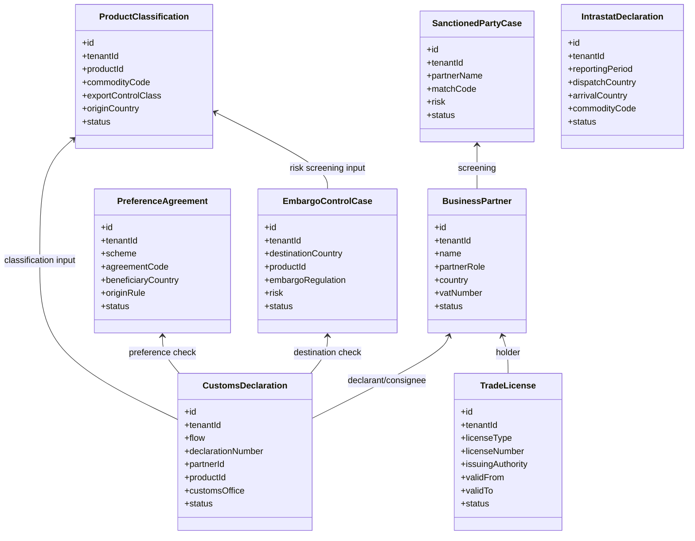
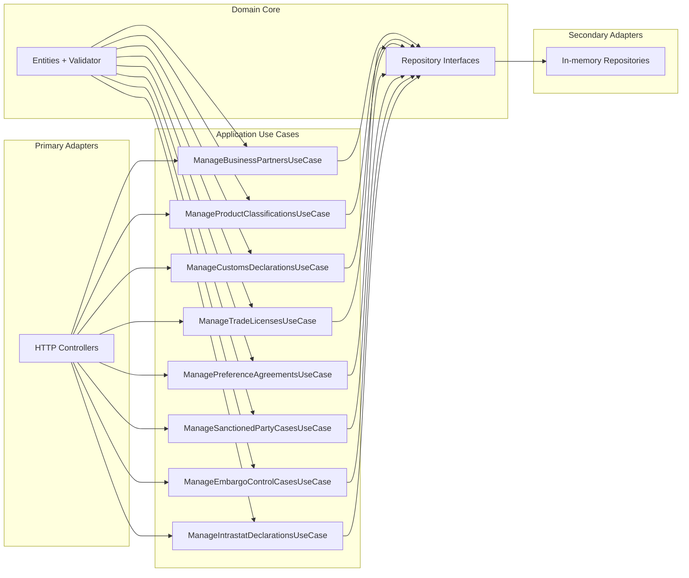

# UML Diagrams - SAP Global Trade Services

## Domain Class Diagram

```mermaid
classDiagram
    class BusinessPartner {
        +id
        +tenantId
        +name
        +partnerRole
        +country
        +vatNumber
        +status
    }

    class ProductClassification {
        +id
        +tenantId
        +productId
        +commodityCode
        +exportControlClass
        +originCountry
        +status
    }

    class CustomsDeclaration {
        +id
        +tenantId
        +flow
        +declarationNumber
        +partnerId
        +productId
        +customsOffice
        +status
    }

    class TradeLicense {
        +id
        +tenantId
        +licenseType
        +licenseNumber
        +issuingAuthority
        +validFrom
        +validTo
        +status
    }

    class PreferenceAgreement {
        +id
        +tenantId
        +scheme
        +agreementCode
        +beneficiaryCountry
        +originRule
        +status
    }

    class SanctionedPartyCase {
        +id
        +tenantId
        +partnerName
        +matchCode
        +risk
        +status
    }

    class EmbargoControlCase {
        +id
        +tenantId
        +destinationCountry
        +productId
        +embargoRegulation
        +risk
        +status
    }

    class IntrastatDeclaration {
        +id
        +tenantId
        +reportingPeriod
        +dispatchCountry
        +arrivalCountry
        +commodityCode
        +status
    }

    BusinessPartner <-- CustomsDeclaration : declarant/consignee
    BusinessPartner <-- TradeLicense : holder
    ProductClassification <-- CustomsDeclaration : classification input
    ProductClassification <-- EmbargoControlCase : risk screening input
    PreferenceAgreement <-- CustomsDeclaration : preference check
    SanctionedPartyCase <-- BusinessPartner : screening
    EmbargoControlCase <-- CustomsDeclaration : destination check
```

## Hexagonal View

```mermaid
graph LR
    subgraph Primary[Primary Adapters]
        HTTP[HTTP Controllers]
    end

    subgraph Application[Application Use Cases]
        UC1[ManageBusinessPartnersUseCase]
        UC2[ManageProductClassificationsUseCase]
        UC3[ManageCustomsDeclarationsUseCase]
        UC4[ManageTradeLicensesUseCase]
        UC5[ManagePreferenceAgreementsUseCase]
        UC6[ManageSanctionedPartyCasesUseCase]
        UC7[ManageEmbargoControlCasesUseCase]
        UC8[ManageIntrastatDeclarationsUseCase]
    end

    subgraph Domain[Domain Core]
        ENT[Entities + Validator]
        PORTS[Repository Interfaces]
    end

    subgraph Secondary[Secondary Adapters]
        MEM[In-memory Repositories]
    end

    HTTP --> UC1
    HTTP --> UC2
    HTTP --> UC3
    HTTP --> UC4
    HTTP --> UC5
    HTTP --> UC6
    HTTP --> UC7
    HTTP --> UC8

    UC1 --> PORTS
    UC2 --> PORTS
    UC3 --> PORTS
    UC4 --> PORTS
    UC5 --> PORTS
    UC6 --> PORTS
    UC7 --> PORTS
    UC8 --> PORTS

    PORTS --> MEM
    ENT --> UC1
    ENT --> UC2
    ENT --> UC3
    ENT --> UC4
    ENT --> UC5
    ENT --> UC6
    ENT --> UC7
    ENT --> UC8
```
