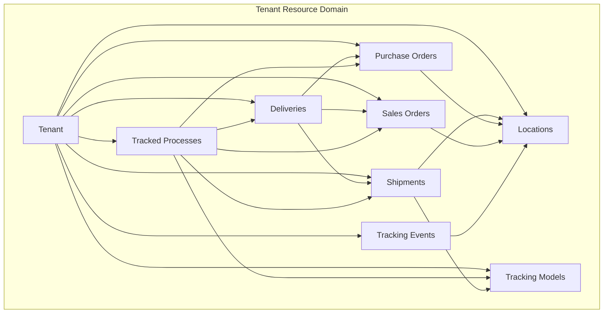
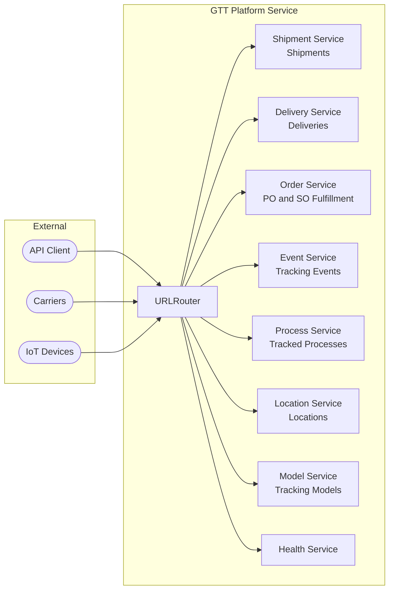

# NAF v4 Views - Global Track and Trace Service

This document maps the Global Track and Trace (GTT) service to NATO Architecture Framework version 4 viewpoints, providing strategic, operational, service, and logical perspectives on the track-and-trace platform.

---

## C1 - Capability Taxonomy

Defines the hierarchy of capabilities the GTT platform delivers.

```
Global Track and Trace Platform
├── Shipment Tracking
│   ├── Shipment Lifecycle (create, update, cancel, complete)
│   ├── Carrier Assignment and Tracking ID Management
│   ├── Transport Mode Support (road, rail, ocean, air, multimodal)
│   ├── Departure/Arrival Event Tracking (planned vs actual)
│   ├── Route Waypoint Monitoring
│   └── Tracking Model Association
├── Delivery Monitoring
│   ├── Delivery Lifecycle (create, dispatch, in-transit, receive, confirm)
│   ├── Inbound ASN (Advanced Shipping Notice) Processing
│   ├── Outbound Delivery Tracking
│   ├── Item and Quantity Tracking
│   ├── Carrier Reference Management
│   └── Proof of Delivery Capture
├── Purchase Order Fulfillment
│   ├── PO Lifecycle (created, confirmed, shipped, received, invoiced)
│   ├── Order Confirmation Tracking
│   ├── Goods Issue and In-Transit Monitoring
│   ├── Goods Receipt Verification
│   └── Supplier and Buyer Location Correlation
├── Sales Order Fulfillment
│   ├── SO Lifecycle (accepted, picking, packing, shipped, delivered)
│   ├── Order Acceptance and Processing
│   ├── Picking and Packing Tracking
│   ├── Shipment and Delivery Correlation
│   └── Customer Confirmation Capture
├── Event Processing
│   ├── Real-Time Event Capture (location, status, milestone, exception, sensor)
│   ├── Carrier and Logistics Provider Integration
│   ├── IoT Device and Sensor Data Ingestion
│   ├── Event Timestamp and Geolocation Recording
│   └── Milestone Completion Tracking
├── Process Correlation
│   ├── Tracked Process Lifecycle (initiated, inProgress, completed, exception)
│   ├── Cross-Document Correlation (shipments, deliveries, orders)
│   ├── Unified End-to-End Process View
│   ├── Completion Percentage Tracking
│   └── Tracking Model-Based Monitoring
├── Location Management
│   ├── Location Lifecycle (create, update, deactivate)
│   ├── Location Type Support (plant, warehouse, distributionCenter, port, terminal, customerSite)
│   ├── Geolocation and Address Management
│   ├── Timezone and Country Configuration
│   └── Location Replication from Source Systems
└── Model Administration
    ├── Tracking Model Lifecycle (draft, active, deprecated_)
    ├── Tracked Object Type Definition
    ├── Expected Event Sequence Configuration
    ├── Milestone Definition
    ├── Correlation Rule Management
    └── Exception Rule Configuration
```

## C2 - Enterprise Vision

### Vision Statement

Provide a cloud-based track-and-trace platform that captures, processes, and stores tracking information about business processes, enabling real-time end-to-end visibility of shipment, delivery, and order fulfillment execution across multi-enterprise logistics networks.

### Strategic Goals

| Goal | Description |
|------|-------------|
| **End-to-End Visibility** | Enable business users to query any tracked process and display retrieved data from origin to destination across all partners |
| **Real-Time Transparency** | Capture and process tracking events in real time from carriers, logistics providers, and IoT sources |
| **Multi-Enterprise Collaboration** | Support data exchange between solution owners and data contributors across organizational boundaries |
| **Process Correlation** | Correlate shipments, deliveries, purchase orders, and sales orders into unified tracked process views |
| **Exception Management** | Detect deviations from expected event sequences and trigger alerts based on configurable tracking models |
| **Scalable Integration** | Support integration via tracking APIs, ANSI X12, EDIFACT, and location replication from SAP S/4HANA and other systems |

## L1 - Node Types

Defines the logical and physical node types in the GTT architecture.

| Node Type | Description | Role |
|-----------|-------------|------|
| **GTT Service** | vibe.d HTTP microservice | API gateway and tracking management |
| **Shipment Tracker** | Shipment monitoring engine | Tracks carrier shipments with departure/arrival events |
| **Delivery Monitor** | Delivery processing unit | Monitors inbound ASNs and outbound deliveries |
| **Order Tracker** | Fulfillment tracking engine | Tracks PO and SO fulfillment lifecycle |
| **Event Processor** | Event ingestion and processing | Captures and correlates real-time tracking events |
| **Process Correlator** | Cross-document correlation engine | Unifies shipments, deliveries, and orders into tracked processes |
| **Location Registry** | Location master data store | Manages location network with geolocation data |
| **Model Engine** | Tracking model management | Defines expected events, milestones, and exception rules |
| **Kubernetes Control Plane** | Container orchestrator | Manages GTT service deployment and scaling |

## L2 - Logical Scenario

### Shipment Tracking Scenario

```
1. Solution owner creates a tracking model for freight shipments
2. Shipper creates a shipment with origin/destination locations and carrier details
3. Carrier reports departure event via tracking API
4. In-transit location events are captured from carrier/IoT feeds
5. Waypoint milestones are matched against tracking model expectations
6. Arrival event is reported with actual time
7. Tracked process completion percentage is updated
8. Exception is raised if actual events deviate from model expectations
```

### Order Fulfillment Scenario

```
1. Purchaser creates a purchase order with expected delivery date
2. Supplier confirms order and creates outbound delivery
3. Goods issue event is captured at supplier location
4. Shipment is created and associated with delivery
5. In-transit tracking events are correlated to PO, delivery, and shipment
6. Goods receipt event is captured at buyer location
7. Delivery is confirmed with proof of delivery
8. Tracked process is marked complete across all correlated documents
```

## L4 - Logical Activities

| Activity | Input | Process | Output |
|----------|-------|---------|--------|
| Track Shipment | ShipmentDTO | Validate -> Create entity -> Assign carrier/locations -> Save | Shipment with ID |
| Monitor Delivery | DeliveryDTO | Validate -> Create delivery -> Link to shipment/orders -> Save | Delivery tracked |
| Track PO Fulfillment | PurchaseOrderDTO | Validate -> Create PO -> Monitor lifecycle events -> Save | PO with status |
| Track SO Fulfillment | SalesOrderDTO | Validate -> Create SO -> Monitor fulfillment -> Save | SO with status |
| Capture Event | TrackingEventDTO | Validate -> Record event -> Update tracked object -> Save | Event recorded |
| Correlate Process | TrackedProcessDTO | Validate -> Link documents -> Calculate completion -> Save | Process correlated |
| Register Location | LocationDTO | Validate -> Create location -> Assign geolocation -> Save | Location registered |
| Deploy Model | TrackingModelDTO | Validate -> Define events/milestones/rules -> Save | Model active |

## P1 - Resource Types

| Resource Type | Attributes | Lifecycle |
|---------------|-----------|-----------|
| **Shipment** | ID, number, carrier, transport mode, origin, destination, times | Created -> InTransit -> Delivered -> Completed |
| **Delivery** | ID, number, type, shipment, items, carrier ref, proof | Created -> Dispatched -> InTransit -> Received -> Confirmed |
| **PurchaseOrder** | ID, number, supplier, buyer location, items, amounts | Created -> Confirmed -> Shipped -> Received -> Invoiced |
| **SalesOrder** | ID, number, customer, seller location, items, amounts | Accepted -> Picking -> Packing -> Shipped -> Delivered |
| **TrackingEvent** | ID, type, tracked object, location, timestamp, sensor data | Created -> Processed -> Correlated |
| **TrackedProcess** | ID, type, model, correlated documents, completion | Initiated -> InProgress -> Completed -> Exception |
| **Location** | ID, type, address, city, country, lat/lon, timezone | Created -> Active -> Deactivated |
| **TrackingModel** | ID, object type, events, milestones, rules, version | Draft -> Active -> Deprecated |

## P2 - Resource Structure



## S1 - Service Taxonomy

### Service Categories

| Category | Services | GTT Mapping |
|----------|----------|-------------|
| **Shipment Services** | Freight Tracking, Carrier Management, Route Monitoring | ShipmentController, ManageShipmentsUseCase |
| **Delivery Services** | ASN Processing, Outbound Tracking, Proof of Delivery | DeliveryController, ManageDeliveriesUseCase |
| **PO Services** | PO Fulfillment Tracking, Goods Receipt Verification | PurchaseOrderController, ManagePurchaseOrdersUseCase |
| **SO Services** | SO Fulfillment Tracking, Customer Confirmation | SalesOrderController, ManageSalesOrdersUseCase |
| **Event Services** | Event Capture, Event Processing, Sensor Ingestion | TrackingEventController, ManageTrackingEventsUseCase |
| **Process Services** | Process Correlation, Completion Tracking, Exception Detection | TrackedProcessController, ManageTrackedProcessesUseCase |
| **Location Services** | Location Registration, Geolocation, Location Replication | LocationController, ManageLocationsUseCase |
| **Model Services** | Model Definition, Milestone Configuration, Rule Management | TrackingModelController, ManageTrackingModelsUseCase |
| **Platform Services** | Health Check, Configuration, DI Container | HealthController, AppConfig, Container |

### Service Interfaces

All services are exposed through RESTful HTTP interfaces at `/api/v1/gtt/` with:

- **JSON** request/response format
- **X-Tenant-Id** header for tenant isolation
- **CRUD** operations (GET, POST, PUT, DELETE)
- **Validation** via domain TrackingValidator
- **Error handling** with structured error responses

## S4 - Service Functions



---

*This NAFv4 mapping provides a structured view of the GTT platform aligned with NATO Architecture Framework v4 viewpoints, supporting enterprise architecture documentation, capability planning, and interoperability analysis.*
