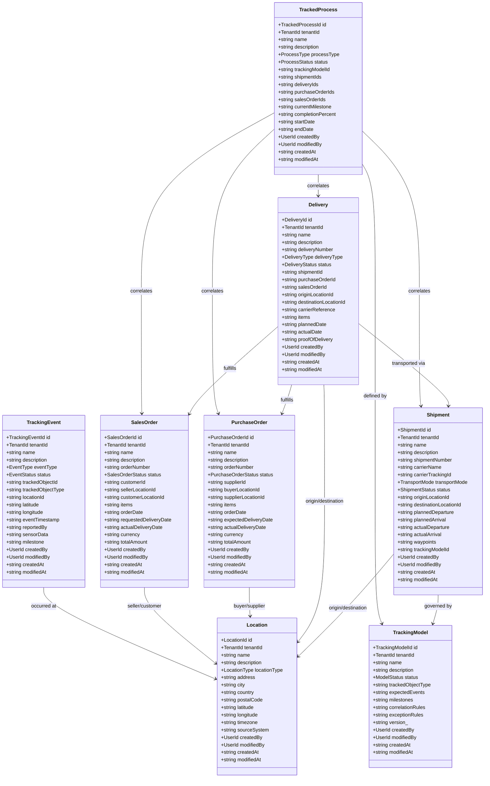
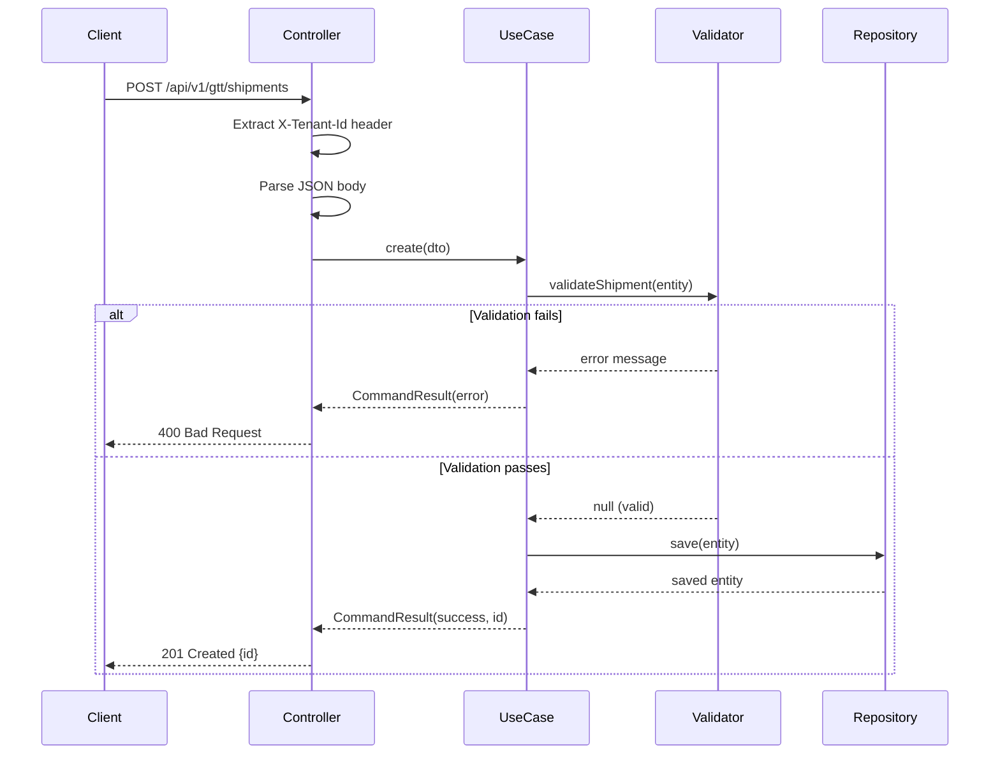
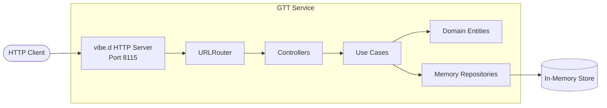
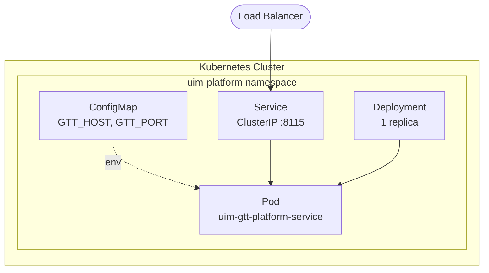

# UML Diagrams - Global Track and Trace Service

## Domain Model

```mermaid
classDiagram
    direction TB

    class Shipment {
        +ShipmentId id
        +TenantId tenantId
        +string name
        +string description
        +string shipmentNumber
        +string carrierName
        +string carrierTrackingId
        +TransportMode transportMode
        +ShipmentStatus status
        +string originLocationId
        +string destinationLocationId
        +string plannedDeparture
        +string plannedArrival
        +string actualDeparture
        +string actualArrival
        +string waypoints
        +string trackingModelId
        +UserId createdBy
        +UserId modifiedBy
        +string createdAt
        +string modifiedAt
    }

    class Delivery {
        +DeliveryId id
        +TenantId tenantId
        +string name
        +string description
        +string deliveryNumber
        +DeliveryType deliveryType
        +DeliveryStatus status
        +string shipmentId
        +string purchaseOrderId
        +string salesOrderId
        +string originLocationId
        +string destinationLocationId
        +string carrierReference
        +string items
        +string plannedDate
        +string actualDate
        +string proofOfDelivery
        +UserId createdBy
        +UserId modifiedBy
        +string createdAt
        +string modifiedAt
    }

    class PurchaseOrder {
        +PurchaseOrderId id
        +TenantId tenantId
        +string name
        +string description
        +string orderNumber
        +PurchaseOrderStatus status
        +string supplierId
        +string buyerLocationId
        +string supplierLocationId
        +string items
        +string orderDate
        +string expectedDeliveryDate
        +string actualDeliveryDate
        +string currency
        +string totalAmount
        +UserId createdBy
        +UserId modifiedBy
        +string createdAt
        +string modifiedAt
    }

    class SalesOrder {
        +SalesOrderId id
        +TenantId tenantId
        +string name
        +string description
        +string orderNumber
        +SalesOrderStatus status
        +string customerId
        +string sellerLocationId
        +string customerLocationId
        +string items
        +string orderDate
        +string requestedDeliveryDate
        +string actualDeliveryDate
        +string currency
        +string totalAmount
        +UserId createdBy
        +UserId modifiedBy
        +string createdAt
        +string modifiedAt
    }

    class TrackingEvent {
        +TrackingEventId id
        +TenantId tenantId
        +string name
        +string description
        +EventType eventType
        +EventStatus status
        +string trackedObjectId
        +string trackedObjectType
        +string locationId
        +string latitude
        +string longitude
        +string eventTimestamp
        +string reportedBy
        +string sensorData
        +string milestone
        +UserId createdBy
        +UserId modifiedBy
        +string createdAt
        +string modifiedAt
    }

    class TrackedProcess {
        +TrackedProcessId id
        +TenantId tenantId
        +string name
        +string description
        +ProcessType processType
        +ProcessStatus status
        +string trackingModelId
        +string shipmentIds
        +string deliveryIds
        +string purchaseOrderIds
        +string salesOrderIds
        +string currentMilestone
        +string completionPercent
        +string startDate
        +string endDate
        +UserId createdBy
        +UserId modifiedBy
        +string createdAt
        +string modifiedAt
    }

    class Location {
        +LocationId id
        +TenantId tenantId
        +string name
        +string description
        +LocationType locationType
        +string address
        +string city
        +string country
        +string postalCode
        +string latitude
        +string longitude
        +string timezone
        +string sourceSystem
        +UserId createdBy
        +UserId modifiedBy
        +string createdAt
        +string modifiedAt
    }

    class TrackingModel {
        +TrackingModelId id
        +TenantId tenantId
        +string name
        +string description
        +ModelStatus status
        +string trackedObjectType
        +string expectedEvents
        +string milestones
        +string correlationRules
        +string exceptionRules
        +string version_
        +UserId createdBy
        +UserId modifiedBy
        +string createdAt
        +string modifiedAt
    }

    Shipment --> Location : origin/destination
    Shipment --> TrackingModel : governed by
    Delivery --> Shipment : transported via
    Delivery --> PurchaseOrder : fulfills
    Delivery --> SalesOrder : fulfills
    Delivery --> Location : origin/destination
    PurchaseOrder --> Location : buyer/supplier
    SalesOrder --> Location : seller/customer
    TrackingEvent --> Location : occurred at
    TrackedProcess --> Shipment : correlates
    TrackedProcess --> Delivery : correlates
    TrackedProcess --> PurchaseOrder : correlates
    TrackedProcess --> SalesOrder : correlates
    TrackedProcess --> TrackingModel : defined by
```

## Hexagonal Architecture

```mermaid
graph TB
    subgraph Presentation ["Presentation Layer (HTTP Adapters)"]
        SC[ShipmentController]
        DC[DeliveryController]
        POC[PurchaseOrderController]
        SOC[SalesOrderController]
        TEC[TrackingEventController]
        TPC[TrackedProcessController]
        LC[LocationController]
        TMC[TrackingModelController]
        HC[HealthController]
    end

    subgraph Application ["Application Layer (Use Cases)"]
        SUC[ManageShipmentsUseCase]
        DUC[ManageDeliveriesUseCase]
        POUC[ManagePurchaseOrdersUseCase]
        SOUC[ManageSalesOrdersUseCase]
        TEUC[ManageTrackingEventsUseCase]
        TPUC[ManageTrackedProcessesUseCase]
        LUC[ManageLocationsUseCase]
        TMUC[ManageTrackingModelsUseCase]
    end

    subgraph Domain ["Domain Layer (Core)"]
        E[Entities]
        RI[Repository Interfaces]
        TV[TrackingValidator]
        T[Types and Enums]
    end

    subgraph Infrastructure ["Infrastructure Layer (Adapters)"]
        MR[Memory Repositories]
        CF[AppConfig]
        DI[Container - DI]
    end

    SC --> SUC
    DC --> DUC
    POC --> POUC
    SOC --> SOUC
    TEC --> TEUC
    TPC --> TPUC
    LC --> LUC
    TMC --> TMUC

    SUC --> RI
    DUC --> RI
    POUC --> RI
    SOUC --> RI
    TEUC --> RI
    TPUC --> RI
    LUC --> RI
    TMUC --> RI

    MR -.implements.-> RI
    DI --> MR
    DI --> CF
```

## Use Case Flow

```mermaid
sequenceDiagram
    participant Client
    participant Controller
    participant UseCase
    participant Validator
    participant Repository

    Client->>Controller: POST /api/v1/gtt/shipments
    Controller->>Controller: Extract X-Tenant-Id header
    Controller->>Controller: Parse JSON body
    Controller->>UseCase: create(dto)
    UseCase->>Validator: validateShipment(entity)
    alt Validation fails
        Validator-->>UseCase: error message
        UseCase-->>Controller: CommandResult(error)
        Controller-->>Client: 400 Bad Request
    else Validation passes
        Validator-->>UseCase: null (valid)
        UseCase->>Repository: save(entity)
        Repository-->>UseCase: saved entity
        UseCase-->>Controller: CommandResult(success, id)
        Controller-->>Client: 201 Created {id}
    end
```

## Component Diagram

```mermaid
graph LR
    subgraph GTT Service
        direction TB
        A[vibe.d HTTP Server<br/>Port 8115]
        B[URLRouter]
        C[Controllers]
        D[Use Cases]
        E[Domain Entities]
        F[Memory Repositories]
    end

    Client([HTTP Client]) --> A
    A --> B
    B --> C
    C --> D
    D --> E
    D --> F
    F --> G[(In-Memory Store)]
```

## Deployment

```mermaid
graph TB
    subgraph Kubernetes Cluster
        subgraph uim-platform namespace
            CM[ConfigMap<br/>GTT_HOST, GTT_PORT]
            SVC[Service<br/>ClusterIP :8115]
            DEP[Deployment<br/>1 replica]
            POD[Pod<br/>uim-gtt-platform-service]
        end
    end

    CM -.env.-> POD
    SVC --> POD
    DEP --> POD
    LB([Load Balancer]) --> SVC
```
