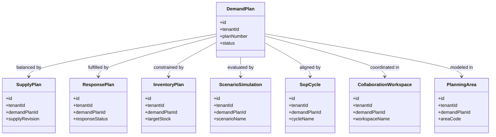
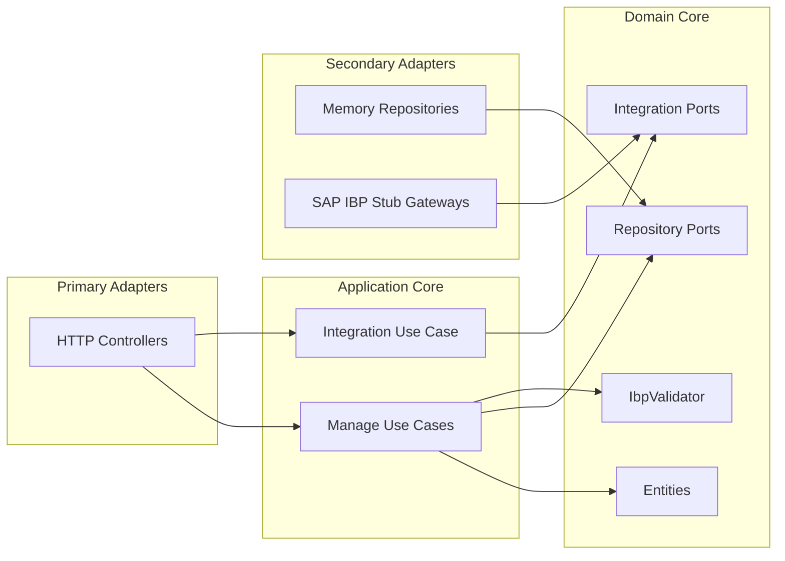

# Integrated Business Planning Service - UML

<!-- markdownlint-disable MD040 MD060 MD047 -->

## Package Overview

```text
uim.platform.ibp
├── domain
│   ├── types
│   ├── entities
│   │   ├── DemandPlan
│   │   ├── SupplyPlan
│   │   ├── ResponsePlan
│   │   ├── InventoryPlan
│   │   ├── ScenarioSimulation
│   │   ├── SopCycle
│   │   ├── CollaborationWorkspace
│   │   └── PlanningArea
│   ├── integration
│   │   ├── PlanningMasterSyncGateway
│   │   └── ScenarioAnalyticsSyncGateway
│   ├── repositories
│   └── services
│       └── IbpValidator
├── application
│   ├── dto
│   ├── usecases.manage
│   └── usecases.integration
├── infrastructure
│   ├── config
│   ├── container
│   ├── integrations.sap_ibp
│   └── persistence.repositories
└── presentation.http
    ├── controllers
    └── json_utils
```

## Domain Class Model



## Hexagonal View


