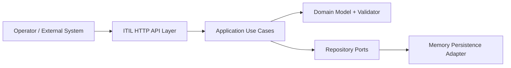
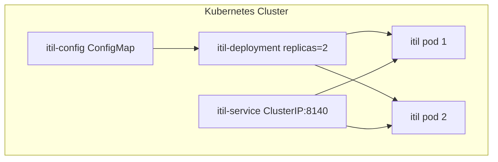

# NAF v4 - ITIL 5 Platform Service

This document maps the ITIL 5 platform service to selected NAF v4 viewpoints.

## Scope

System: ITIL 5 Platform Service
Context: Enterprise platform service for IT service management (ITSM)
Technology: D language, vibe.d HTTP, in-memory adapter (extensible to DB), Kubernetes deployment

## C1 - Capability Taxonomy

### Operational Capabilities

1. Service Portfolio and Catalogue Capability
2. Service Request Fulfilment Capability
3. Incident Response and Restoration Capability
4. Problem Analysis and Error Control Capability
5. Change Planning and Authorization Capability
6. Configuration Control (CMDB-like) Capability
7. Service Level Governance Capability
8. Knowledge Capture and Reuse Capability
9. Release and Deployment Coordination Capability
10. Event Monitoring and Correlation Capability
11. Continual Improvement Management Capability
12. IT Asset Lifecycle Management Capability

### Enabling Capabilities

1. API-based System Integration Capability
2. Tenant Isolation Capability
3. Audit and Traceability Data Capture Capability
4. Runtime Configuration Capability
5. Containerized Deployment Capability

## C2 - Capability Vision

Target state:

1. Standardized ITIL 5 process orchestration across platform domains.
2. Single API surface for service, incident, change, and asset data.
3. Faster mean time to restore service through codified lifecycle states.
4. Improved governance through explicit state transitions and auditable records.
5. Cloud-native deployability via Kubernetes and container artifacts.

Desired outcomes:

1. Reduced process fragmentation across IT operations.
2. Increased automation readiness for future workflow engines.
3. Improved data quality through domain-level validation rules.

## C4 - Capability Dependencies and Standards

### Standards and Patterns Applied

1. ITIL 5 practice model (domain semantics)
2. Clean Architecture (domain isolation)
3. Hexagonal Architecture (ports and adapters)
4. REST/HTTP JSON API style
5. Kubernetes deployment descriptors

### Dependency Matrix (high-level)

| Capability | Depends On |
|---|---|
| Incident Management | Service Catalogue, Configuration Control, Event Monitoring |
| Problem Management | Incident Management, Knowledge Management |
| Change Enablement | Configuration Control, Release Management, Knowledge Management |
| SLA Governance | Service Catalogue, Incident Management |
| Asset Management | Configuration Control |
| Continual Improvement | Incident, Problem, Change, SLA metrics |

## C7 - Service View

### Provided Service Endpoints

Base URL: `/api/v1/itil`

1. `/services`
2. `/service-requests`
3. `/incidents`
4. `/problems`
5. `/changes`
6. `/configuration-items`
7. `/slas`
8. `/knowledge`
9. `/releases`
10. `/events`
11. `/improvements`
12. `/assets`
13. `/api/v1/health` (platform health)

### Service Contract Characteristics

1. JSON request/response payloads.
2. CRUD resource pattern with path-based identity.
3. HTTP status-based error signaling (4xx for client errors).
4. Stateless operation per request.

## C8 - Capability Motivation

### Drivers

1. Need for unified ITSM workflows across digital platform domains.
2. Need for operational transparency and governance.
3. Need to reduce manual handoffs and inconsistent records.

### Constraints

1. Must align with existing D/vibe.d service ecosystem.
2. Must fit existing UIM platform module conventions.
3. Initial persistence is in-memory for rapid delivery; persistence adapters can evolve.

### Risks and Mitigations

| Risk | Impact | Mitigation |
|---|---|---|
| In-memory persistence loss on restart | High | Add database adapter under repository ports |
| Process misuse across tenants | Medium | TenantId in all core entities and repository filters |
| State inconsistency in client payloads | Medium | Domain validation and explicit enum states |

## Logical Node Diagram

## Physical Resource View

## Evolution Roadmap

1. Replace memory adapters with persistent adapters (PostgreSQL or MongoDB) through existing repository ports.
2. Add authentication and authorization adapter.
3. Add event bus integration for ITIL lifecycle notifications.
4. Add reporting/analytics bounded context for SLA and continual improvement KPIs.
