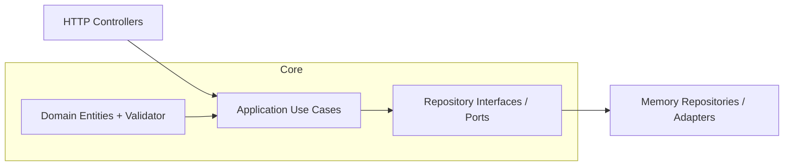
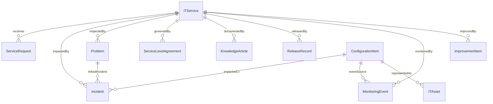
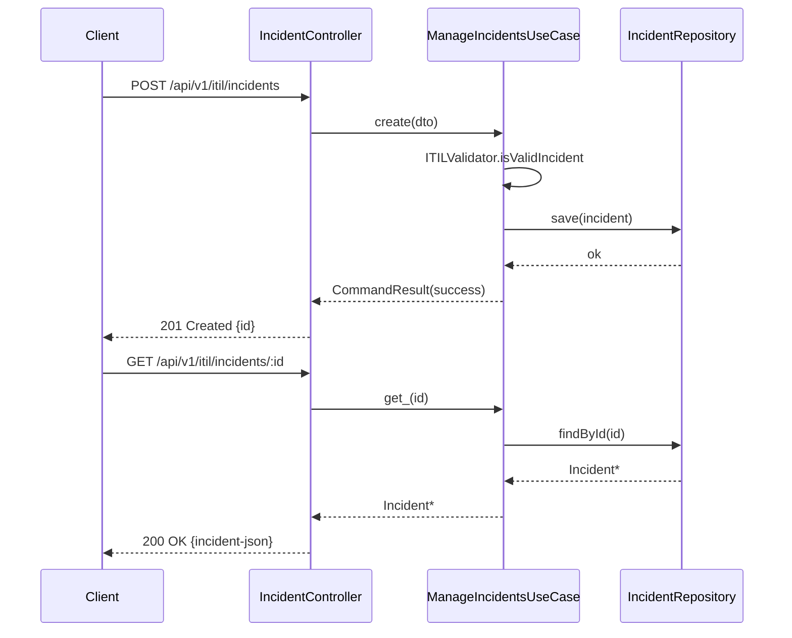
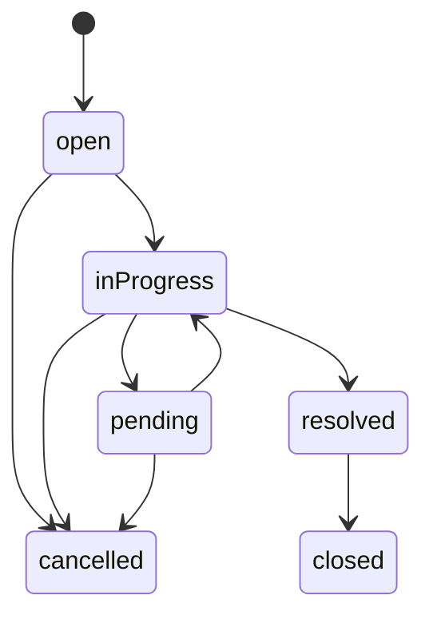
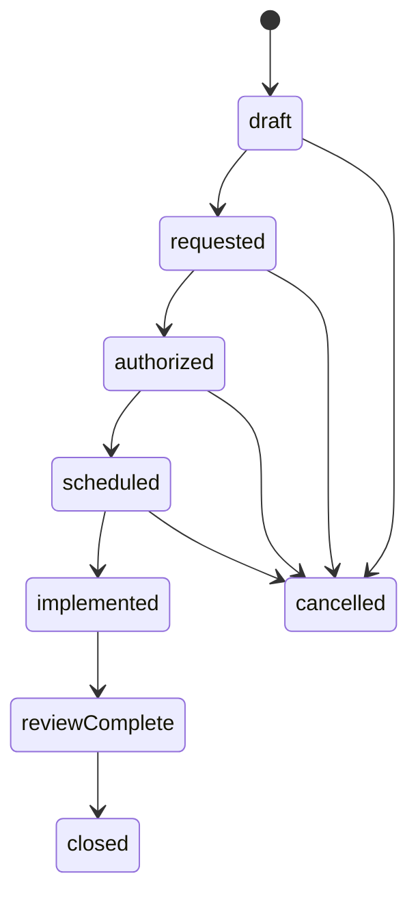
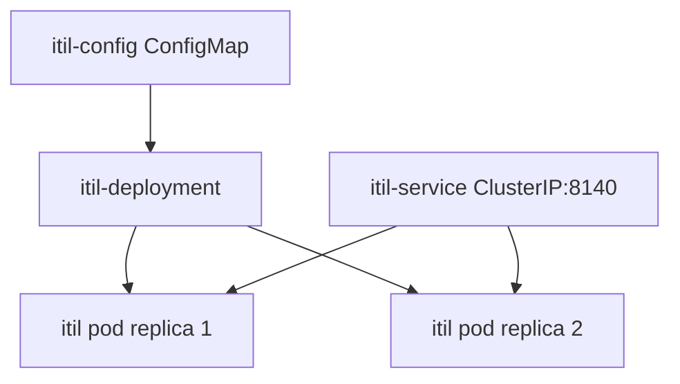

# UML - ITIL 5 Platform Service

This document describes the structural and behavioral design of the ITIL 5 platform service.

## 1. Package Structure (Clean + Hexagonal)

```mermaid
classDiagram
    namespace Domain {
        class ITService
        class ServiceRequest
        class Incident
        class Problem
        class ChangeRecord
        class ConfigurationItem
        class ServiceLevelAgreement
        class KnowledgeArticle
        class ReleaseRecord
        class MonitoringEvent
        class ImprovementItem
        class ITAsset

        class ITServiceRepository
        class ServiceRequestRepository
        class IncidentRepository
        class ProblemRepository
        class ChangeRecordRepository
        class ConfigurationItemRepository
        class SLARepository
        class KnowledgeArticleRepository
        class ReleaseRecordRepository
        class MonitoringEventRepository
        class ImprovementItemRepository
        class ITAssetRepository

        class ITILValidator
    }

    namespace Application {
        class ManageITServicesUseCase
        class ManageServiceRequestsUseCase
        class ManageIncidentsUseCase
        class ManageProblemsUseCase
        class ManageChangeRecordsUseCase
        class ManageConfigurationItemsUseCase
        class ManageSLAsUseCase
        class ManageKnowledgeArticlesUseCase
        class ManageReleaseRecordsUseCase
        class ManageMonitoringEventsUseCase
        class ManageImprovementItemsUseCase
        class ManageITAssetsUseCase
    }

    namespace Infrastructure {
        class MemoryITServiceRepository
        class MemoryServiceRequestRepository
        class MemoryIncidentRepository
        class MemoryProblemRepository
        class MemoryChangeRecordRepository
        class MemoryConfigurationItemRepository
        class MemorySLARepository
        class MemoryKnowledgeArticleRepository
        class MemoryReleaseRecordRepository
        class MemoryMonitoringEventRepository
        class MemoryImprovementItemRepository
        class MemoryITAssetRepository
        class Container
        class AppConfig
    }

    namespace Presentation {
        class ITServiceController
        class ServiceRequestController
        class IncidentController
        class ProblemController
        class ChangeController
        class ConfigurationItemController
        class SLAController
        class KnowledgeController
        class ReleaseController
        class EventController
        class ImprovementController
        class AssetController
    }

    ManageITServicesUseCase --> ITServiceRepository
    ManageServiceRequestsUseCase --> ServiceRequestRepository
    ManageIncidentsUseCase --> IncidentRepository
    ManageProblemsUseCase --> ProblemRepository
    ManageChangeRecordsUseCase --> ChangeRecordRepository
    ManageConfigurationItemsUseCase --> ConfigurationItemRepository
    ManageSLAsUseCase --> SLARepository
    ManageKnowledgeArticlesUseCase --> KnowledgeArticleRepository
    ManageReleaseRecordsUseCase --> ReleaseRecordRepository
    ManageMonitoringEventsUseCase --> MonitoringEventRepository
    ManageImprovementItemsUseCase --> ImprovementItemRepository
    ManageITAssetsUseCase --> ITAssetRepository

    MemoryITServiceRepository ..|> ITServiceRepository
    MemoryServiceRequestRepository ..|> ServiceRequestRepository
    MemoryIncidentRepository ..|> IncidentRepository
    MemoryProblemRepository ..|> ProblemRepository
    MemoryChangeRecordRepository ..|> ChangeRecordRepository
    MemoryConfigurationItemRepository ..|> ConfigurationItemRepository
    MemorySLARepository ..|> SLARepository
    MemoryKnowledgeArticleRepository ..|> KnowledgeArticleRepository
    MemoryReleaseRecordRepository ..|> ReleaseRecordRepository
    MemoryMonitoringEventRepository ..|> MonitoringEventRepository
    MemoryImprovementItemRepository ..|> ImprovementItemRepository
    MemoryITAssetRepository ..|> ITAssetRepository

    ITServiceController --> ManageITServicesUseCase
    ServiceRequestController --> ManageServiceRequestsUseCase
    IncidentController --> ManageIncidentsUseCase
    ProblemController --> ManageProblemsUseCase
    ChangeController --> ManageChangeRecordsUseCase
    ConfigurationItemController --> ManageConfigurationItemsUseCase
    SLAController --> ManageSLAsUseCase
    KnowledgeController --> ManageKnowledgeArticlesUseCase
    ReleaseController --> ManageReleaseRecordsUseCase
    EventController --> ManageMonitoringEventsUseCase
    ImprovementController --> ManageImprovementItemsUseCase
    AssetController --> ManageITAssetsUseCase
```

## 2. Hexagonal View

## 3. Key Entity Relationships

## 4. Sequence Diagram: Incident Lifecycle

## 5. State Machines

### Incident Status

### Change Record Status

## 6. Deployment Components

