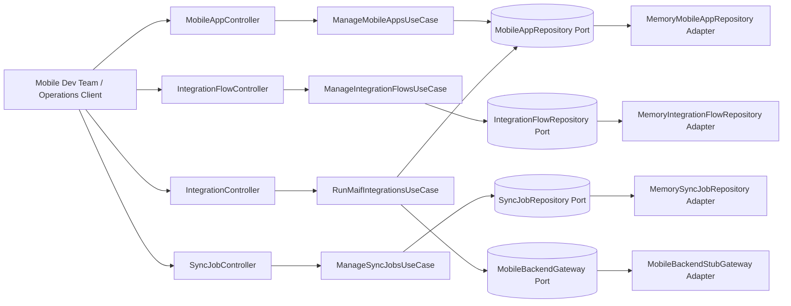
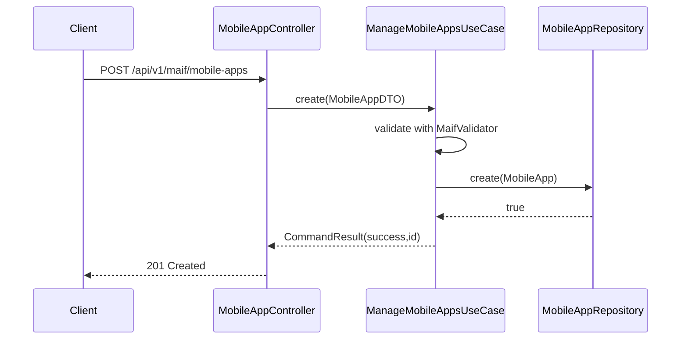
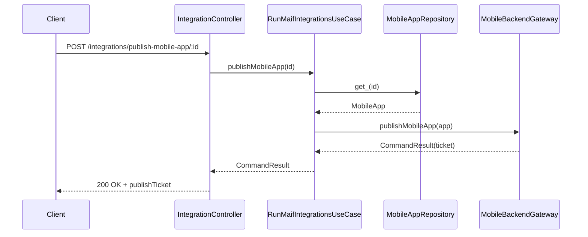

# MAIF UML

## Hexagonal Component Diagram

```mermaid
flowchart LR
    Client[Mobile Dev Team / Operations Client] --> C1[MobileAppController]
    Client --> C2[IntegrationFlowController]
    Client --> C3[SyncJobController]
    Client --> C4[IntegrationController]

    C1 --> U1[ManageMobileAppsUseCase]
    C2 --> U2[ManageIntegrationFlowsUseCase]
    C3 --> U3[ManageSyncJobsUseCase]
    C4 --> U4[RunMaifIntegrationsUseCase]

    U1 --> P1[(MobileAppRepository Port)]
    U2 --> P2[(IntegrationFlowRepository Port)]
    U3 --> P3[(SyncJobRepository Port)]
    U4 --> P1
    U4 --> G1[(MobileBackendGateway Port)]

    P1 --> A1[MemoryMobileAppRepository Adapter]
    P2 --> A2[MemoryIntegrationFlowRepository Adapter]
    P3 --> A3[MemorySyncJobRepository Adapter]
    G1 --> A4[MobileBackendStubGateway Adapter]
```

## Mobile App Lifecycle Sequence

```mermaid
sequenceDiagram
    participant Client
    participant Controller as MobileAppController
    participant UseCase as ManageMobileAppsUseCase
    participant Repo as MobileAppRepository

    Client->>Controller: POST /api/v1/maif/mobile-apps
    Controller->>UseCase: create(MobileAppDTO)
    UseCase->>UseCase: validate with MaifValidator
    UseCase->>Repo: create(MobileApp)
    Repo-->>UseCase: true
    UseCase-->>Controller: CommandResult(success,id)
    Controller-->>Client: 201 Created
```

## Publish Integration Sequence

```mermaid
sequenceDiagram
    participant Client
    participant Controller as IntegrationController
    participant UseCase as RunMaifIntegrationsUseCase
    participant Repo as MobileAppRepository
    participant Gateway as MobileBackendGateway

    Client->>Controller: POST /integrations/publish-mobile-app/:id
    Controller->>UseCase: publishMobileApp(id)
    UseCase->>Repo: get_(id)
    Repo-->>UseCase: MobileApp
    UseCase->>Gateway: publishMobileApp(app)
    Gateway-->>UseCase: CommandResult(ticket)
    UseCase-->>Controller: CommandResult
    Controller-->>Client: 200 OK + publishTicket
```
