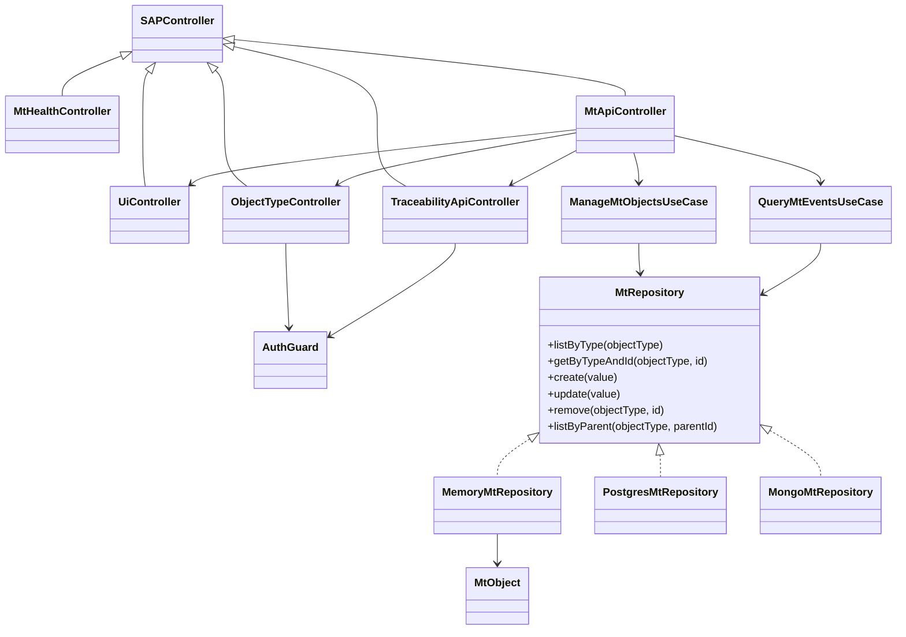
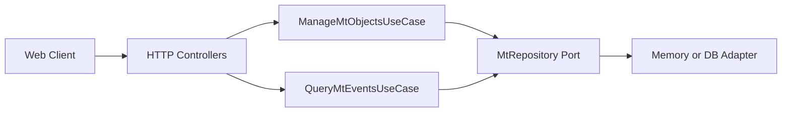

# UML

```mermaid
classDiagram
  class SAPController
  class MtHealthController
  class MtApiController
  class UiController
  class TraceabilityApiController
  class ObjectTypeController
  class AuthGuard

  class MtRepository {
    +listByType(objectType)
    +getByTypeAndId(objectType, id)
    +create(value)
    +update(value)
    +remove(objectType, id)
    +listByParent(objectType, parentId)
  }

  class MemoryMtRepository
  class PostgresMtRepository
  class MongoMtRepository
  class ManageMtObjectsUseCase
  class QueryMtEventsUseCase
  class MtObject

  SAPController <|-- MtHealthController
  SAPController <|-- MtApiController
  SAPController <|-- UiController
  SAPController <|-- TraceabilityApiController
  SAPController <|-- ObjectTypeController

  MtRepository <|.. MemoryMtRepository
  MtRepository <|.. PostgresMtRepository
  MtRepository <|.. MongoMtRepository
  ManageMtObjectsUseCase --> MtRepository
  QueryMtEventsUseCase --> MtRepository
  MtApiController --> ManageMtObjectsUseCase
  MtApiController --> QueryMtEventsUseCase
  MtApiController --> UiController
  MtApiController --> TraceabilityApiController
  MtApiController --> ObjectTypeController
  ObjectTypeController --> AuthGuard
  TraceabilityApiController --> AuthGuard
  MemoryMtRepository --> MtObject
```

```mermaid
flowchart LR
  UI[Web Client] --> API[HTTP Controllers]
  API --> UC1[ManageMtObjectsUseCase]
  API --> UC2[QueryMtEventsUseCase]
  UC1 --> PORT[MtRepository Port]
  UC2 --> PORT
  PORT --> ADAPTER[Memory or DB Adapter]
```
