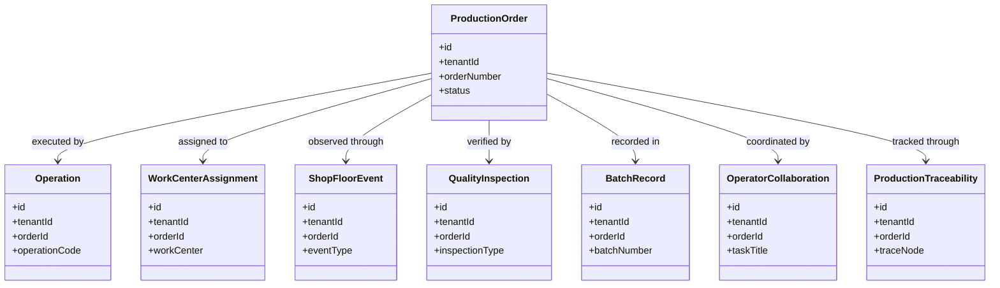
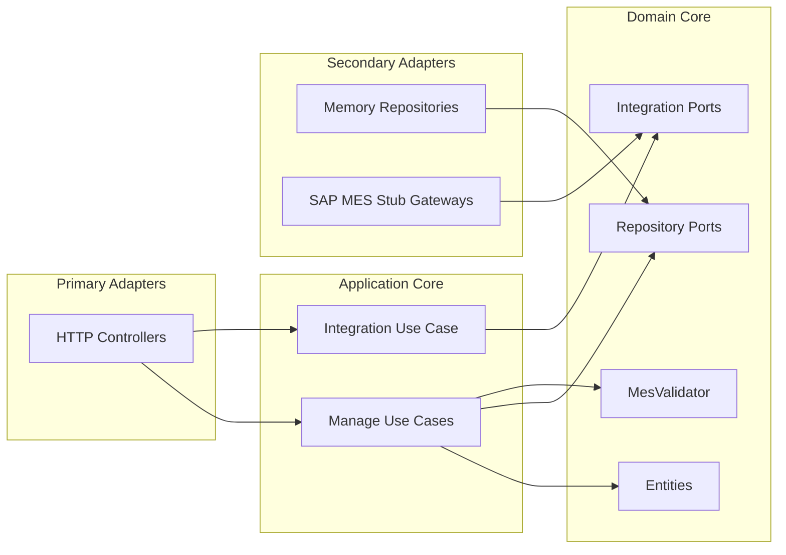

# Manufacturing Execution Service - UML

<!-- markdownlint-disable MD040 MD060 MD047 -->

## Package Overview

```text
uim.platform.mes
├── domain
│   ├── types
│   ├── entities
│   │   ├── ProductionOrder
│   │   ├── Operation
│   │   ├── WorkCenterAssignment
│   │   ├── ShopFloorEvent
│   │   ├── QualityInspection
│   │   ├── BatchRecord
│   │   ├── OperatorCollaboration
│   │   └── ProductionTraceability
│   ├── integration
│   │   ├── OrderSyncGateway
│   │   └── QualitySyncGateway
│   ├── repositories
│   └── services
│       └── MesValidator
├── application
│   ├── dto
│   ├── usecases.manage
│   └── usecases.integration
├── infrastructure
│   ├── config
│   ├── container
│   ├── integrations.sap_mes
│   └── persistence.memory
└── presentation.http
    ├── controllers
    └── json_utils
```

## Domain Class Model



## Hexagonal View


