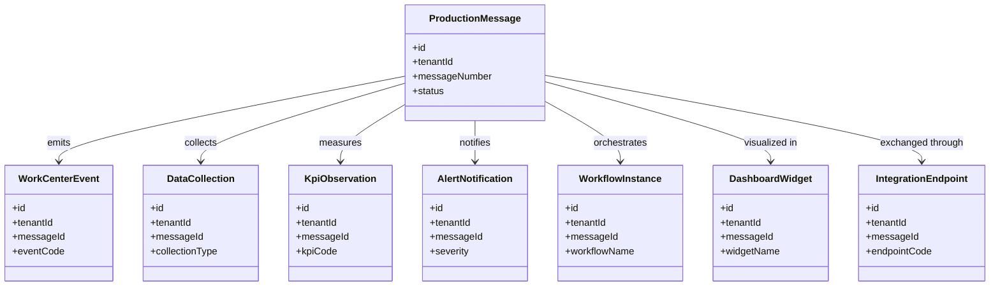
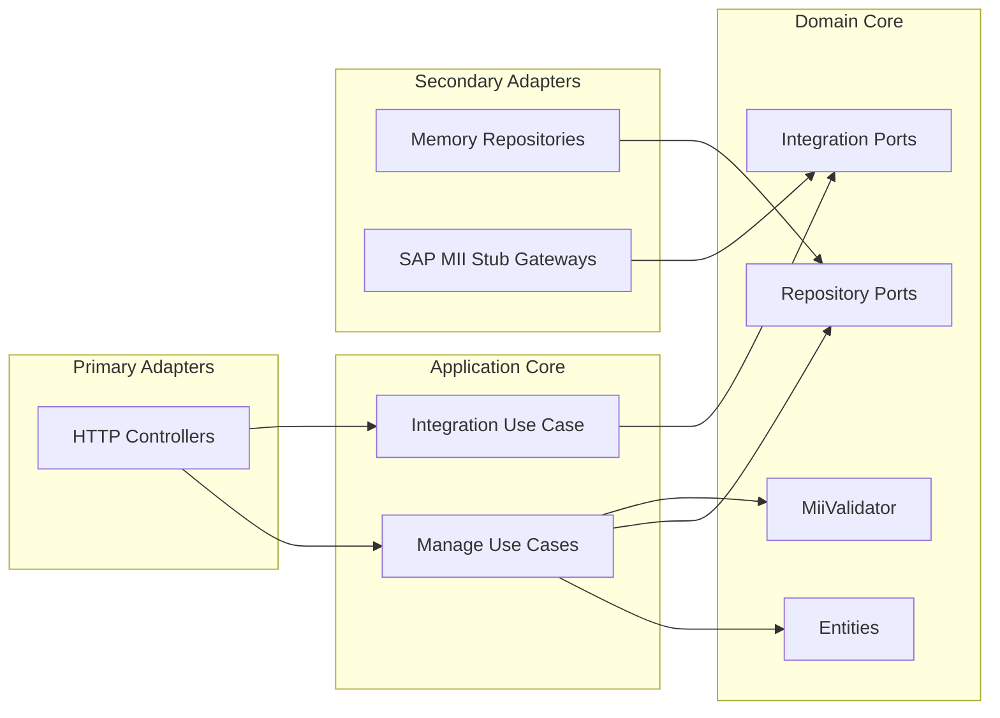

# Manufacturing Integration and Intelligence Service - UML

<!-- markdownlint-disable MD040 MD060 MD047 -->

## Package Overview

```text
uim.platform.mii
├── domain
│   ├── types
│   ├── entities
│   │   ├── ProductionMessage
│   │   ├── WorkCenterEvent
│   │   ├── DataCollection
│   │   ├── KpiObservation
│   │   ├── AlertNotification
│   │   ├── WorkflowInstance
│   │   ├── DashboardWidget
│   │   └── IntegrationEndpoint
│   ├── integration
│   │   ├── ErpMessageSyncGateway
│   │   └── AnalyticsSyncGateway
│   ├── repositories
│   └── services
│       └── MiiValidator
├── application
│   ├── dto
│   ├── usecases.manage
│   └── usecases.integration
├── infrastructure
│   ├── config
│   ├── container
│   ├── integrations.sap_mii
│   └── persistence.repositories
└── presentation.http
    ├── controllers
    └── json_utils
```

## Domain Class Model



## Hexagonal View


