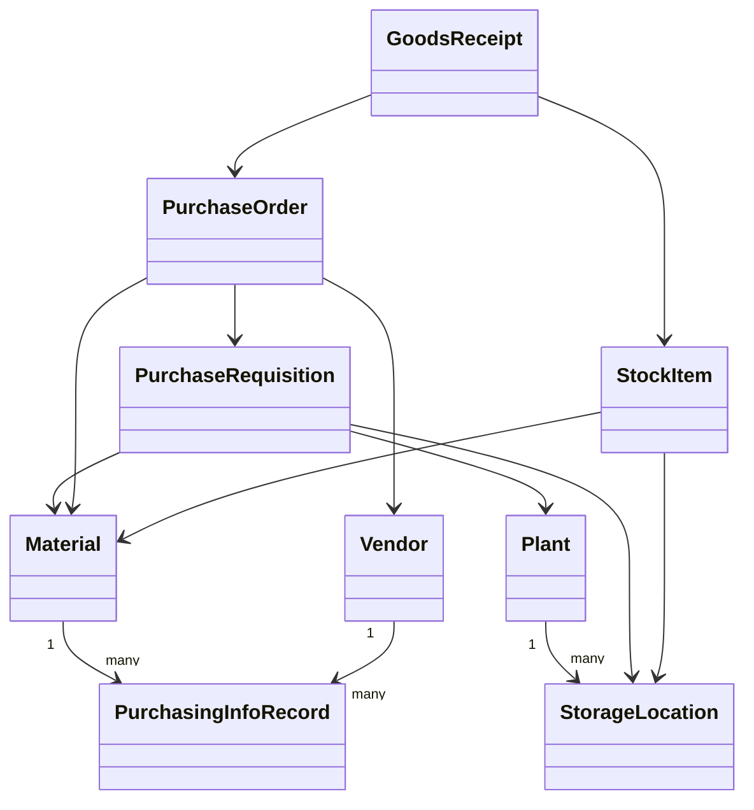
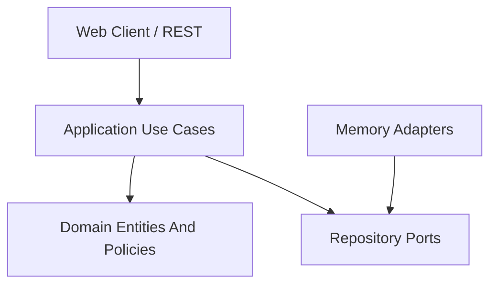

# UML Overview

```mermaid
classDiagram
    class Material
    class Plant
    class StorageLocation
    class Vendor
    class PurchasingInfoRecord
    class PurchaseRequisition
    class PurchaseOrder
    class GoodsReceipt
    class StockItem

    Plant "1" --> "many" StorageLocation
    Material "1" --> "many" PurchasingInfoRecord
    Vendor "1" --> "many" PurchasingInfoRecord
    PurchaseRequisition --> Material
    PurchaseRequisition --> Plant
    PurchaseRequisition --> StorageLocation
    PurchaseOrder --> PurchaseRequisition
    PurchaseOrder --> Vendor
    PurchaseOrder --> Material
    GoodsReceipt --> PurchaseOrder
    GoodsReceipt --> StockItem
    StockItem --> Material
    StockItem --> StorageLocation
```

## Layering

```mermaid
flowchart TD
    UI[Web Client / REST] --> APP[Application Use Cases]
    APP --> DOM[Domain Entities And Policies]
    APP --> PORTS[Repository Ports]
    ADAPTERS[Memory Adapters] --> PORTS
```