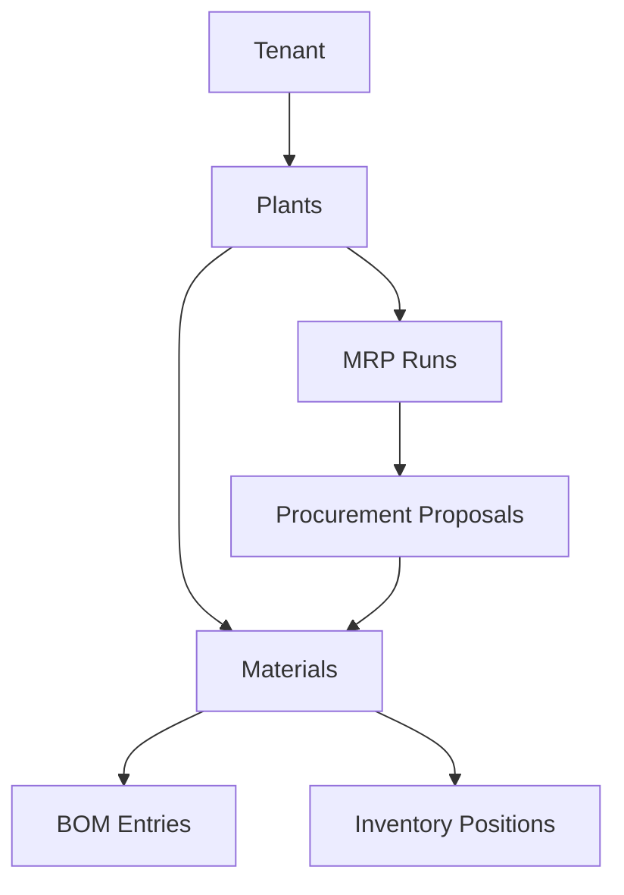
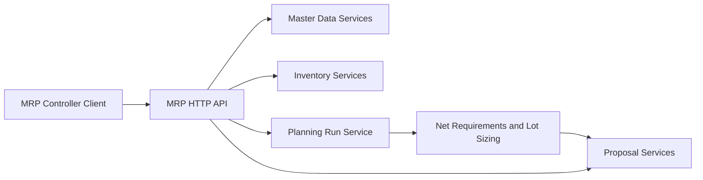

# NAF v4 Views - Material Requirements Planning Service

This document maps the MRP service to NATO Architecture Framework v4 viewpoints and uses the SAP PP-MRP functional description as baseline behavior.

## C1 - Capability Taxonomy

```
Material Requirements Planning Platform
├── Material Availability Management
│   ├── Monitor stock, receipts, and reservations
│   ├── Detect shortages
│   └── Time-phase requirements by planning date and horizon
├── Procurement Proposal Generation
│   ├── Planned order generation
│   ├── Purchase requisition generation
│   └── Quantity determination via lot sizing
├── Master Data Integration
│   ├── Material master planning parameters
│   ├── Plant and planning scope context
│   └── Bill of material component structures
├── Inventory and Demand Consolidation
│   ├── Plant-level stock consolidation
│   ├── Independent demand capture
│   └── Dependent demand explosion via BOM
└── MRP Run Governance
    ├── Run execution lifecycle
    ├── Run status and outputs
    └── Exception handling and controller review
```

## C2 - Enterprise Vision

### Vision Statement

Provide a planning service that guarantees material availability and automatically creates procurement proposals while balancing service level and inventory costs, aligned to SAP PP-MRP planning principles.

### Strategic Goals

| Goal | Description |
|------|-------------|
| Material Availability | Ensure right quantity at the right time |
| Planning Automation | Reduce manual planning effort via automatic run logic |
| Cost and Capital Optimization | Avoid overstock and unnecessary capital lockup |
| Planning Transparency | Expose run outputs and proposal rationale over APIs |
| Integration Readiness | Align with material master, BOM, demand, and plant planning structures |

## L1 - Node Types

| Node Type | Description | Role |
|-----------|-------------|------|
| MRP API Service | vibe.d microservice | Exposes planning and master data APIs |
| Planning Engine | Application use case logic | Performs net requirement checks and lot sizing |
| Master Data Node | Material/Plant/BOM domain stores | Holds planning-relevant master data |
| Inventory Node | Inventory position store | Supplies stock and receipt signals |
| Proposal Node | Procurement proposal store | Persists generated supply elements |
| Kubernetes Cluster | Runtime platform | Deployment, scaling, and health management |

## L2 - Logical Scenario

### Automatic Planning Run Scenario

```
1. MRP controller submits a planning run for a tenant and plant
2. Engine collects active materials in planning scope
3. Engine aggregates independent demand and explodes BOM dependent demand
4. Engine computes net availability from stock, receipts, reservations, and safety stock
5. Engine determines shortage quantities
6. Engine applies lot-sizing logic
7. Engine creates procurement proposals (planned order or purchase requisition)
8. Engine stores run result and generated proposal count
```

## L4 - Logical Activities

| Activity | Input | Process | Output |
|----------|-------|---------|--------|
| Maintain Material | MaterialDTO | Validate -> Save planning parameters | Material master planning record |
| Maintain BOM | BillOfMaterialDTO | Validate -> Save structure | Component demand model |
| Maintain Inventory Position | InventoryPositionDTO | Validate -> Save stock state | Planning stock snapshot |
| Execute MRP Run | MrpRunDTO | Net requirements -> Lot sizing -> Proposal generation | MRP run with proposals |
| Review Proposals | Query proposal API | Filter and inspect by run/material/status | Actionable procurement list |

## P1 - Resource Types

| Resource Type | Attributes | Lifecycle |
|---------------|-----------|-----------|
| Material | Number, MRP procedure, lot sizing, safety stock | Active -> Blocked -> Discontinued |
| Plant | Plant code, planning scope, MRP areas | Created -> Active -> Retired |
| BOM | Parent, component, quantity, validity | Draft -> Active -> Obsolete |
| InventoryPosition | On hand, receipts, reservations | Snapshot refreshes over time |
| MrpRun | Plant, mode, planning date, status | Planned -> Running -> Completed/Failed |
| ProcurementProposal | Type, quantity, due date, source | Created -> Released -> Converted/Cancelled |

## P2 - Resource Structure



## S1 - Service Taxonomy

| Category | Services | Implementation Mapping |
|----------|----------|------------------------|
| Master Data Services | Material, Plant, BOM maintenance | Material/Plant/BOM controllers + use cases |
| Inventory Services | Inventory position lifecycle | InventoryPosition controller + use case |
| Planning Services | MRP run execution and tracking | MrpRun controller + ManageMrpRunsUseCase |
| Proposal Services | Procurement proposal management | ProcurementProposal controller + use case |
| Platform Services | Health and config | Health controller, AppConfig, Container |

## S4 - Service Functions



This NAFv4 mapping captures how the service operationalizes SAP PP-MRP style planning capabilities in a microservice architecture.
