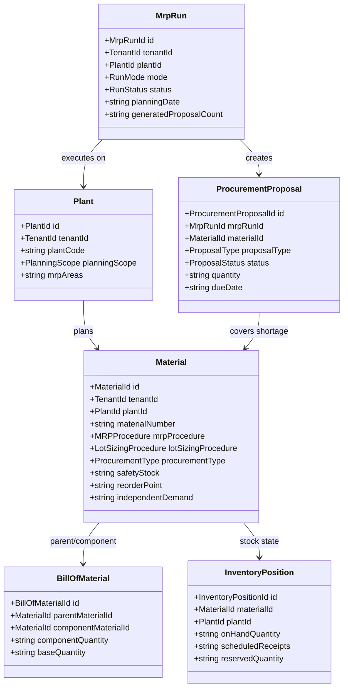
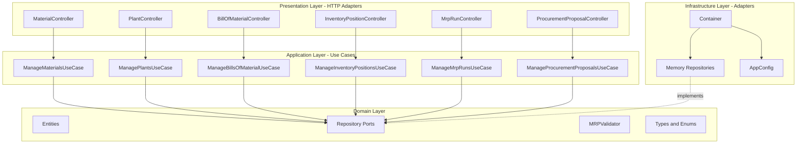

# UML Diagrams - Material Requirements Planning Service

## Domain Model

```mermaid
classDiagram
    direction TB

    class Plant {
        +PlantId id
        +TenantId tenantId
        +string plantCode
        +PlanningScope planningScope
        +string mrpAreas
    }

    class Material {
        +MaterialId id
        +TenantId tenantId
        +PlantId plantId
        +string materialNumber
        +MRPProcedure mrpProcedure
        +LotSizingProcedure lotSizingProcedure
        +ProcurementType procurementType
        +string safetyStock
        +string reorderPoint
        +string independentDemand
    }

    class BillOfMaterial {
        +BillOfMaterialId id
        +MaterialId parentMaterialId
        +MaterialId componentMaterialId
        +string componentQuantity
        +string baseQuantity
    }

    class InventoryPosition {
        +InventoryPositionId id
        +MaterialId materialId
        +PlantId plantId
        +string onHandQuantity
        +string scheduledReceipts
        +string reservedQuantity
    }

    class MrpRun {
        +MrpRunId id
        +TenantId tenantId
        +PlantId plantId
        +RunMode mode
        +RunStatus status
        +string planningDate
        +string generatedProposalCount
    }

    class ProcurementProposal {
        +ProcurementProposalId id
        +MrpRunId mrpRunId
        +MaterialId materialId
        +ProposalType proposalType
        +ProposalStatus status
        +string quantity
        +string dueDate
    }

    Plant --> Material : plans
    Material --> BillOfMaterial : parent/component
    Material --> InventoryPosition : stock state
    MrpRun --> Plant : executes on
    MrpRun --> ProcurementProposal : creates
    ProcurementProposal --> Material : covers shortage
```

## Hexagonal Architecture

```mermaid
graph TB
    subgraph Presentation [Presentation Layer - HTTP Adapters]
        MC[MaterialController]
        PC[PlantController]
        BC[BillOfMaterialController]
        IC[InventoryPositionController]
        RC[MrpRunController]
        QC[ProcurementProposalController]
    end

    subgraph Application [Application Layer - Use Cases]
        MU[ManageMaterialsUseCase]
        PU[ManagePlantsUseCase]
        BU[ManageBillsOfMaterialUseCase]
        IU[ManageInventoryPositionsUseCase]
        RU[ManageMrpRunsUseCase]
        QU[ManageProcurementProposalsUseCase]
    end

    subgraph Domain [Domain Layer]
        E[Entities]
        R[Repository Ports]
        V[MRPValidator]
        T[Types and Enums]
    end

    subgraph Infrastructure [Infrastructure Layer - Adapters]
        MR[Memory Repositories]
        C[Container]
        CFG[AppConfig]
    end

    MC --> MU
    PC --> PU
    BC --> BU
    IC --> IU
    RC --> RU
    QC --> QU

    MU --> R
    PU --> R
    BU --> R
    IU --> R
    RU --> R
    QU --> R

    MR -.implements.-> R
    C --> MR
    C --> CFG
```
