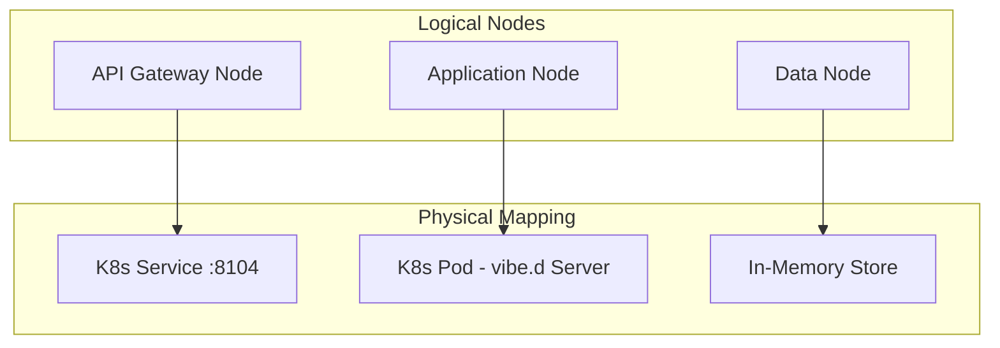
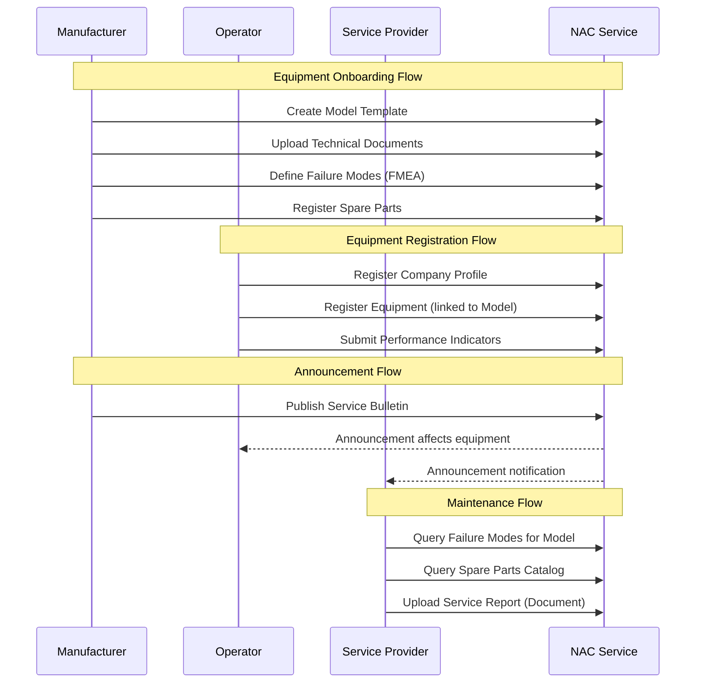
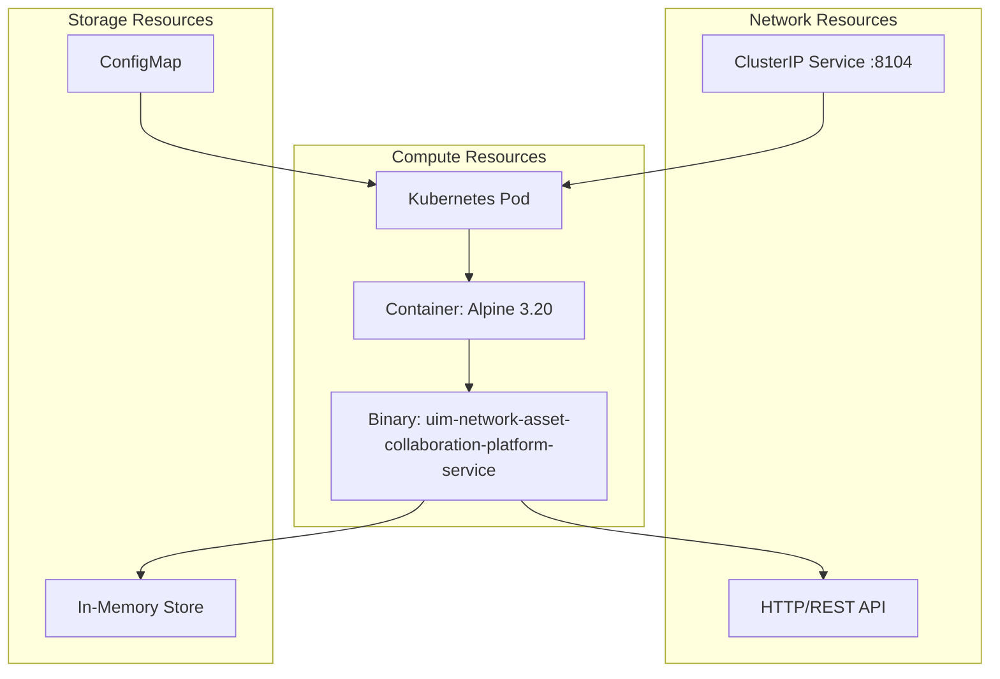
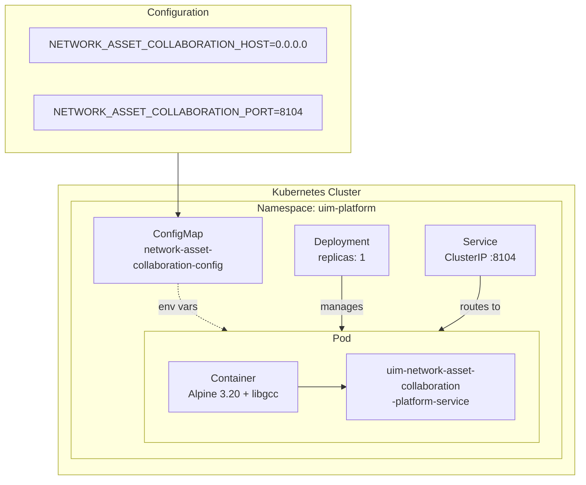
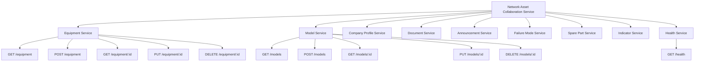

# NAF v4 Architecture Views - Network Asset Collaboration Service

NATO Architecture Framework v4 (NAFv4) views for the Network Asset Collaboration Service, modeled after SAP Business Network Asset Collaboration (SAP AIN).

## C1 - Capability Taxonomy

```mermaid
graph TB
    NAC[Network Asset Collaboration]
    NAC --> ERM[Equipment Registry Management]
    NAC --> MTM[Model Template Management]
    NAC --> CPM[Company Profile Management]
    NAC --> DM[Document Management]
    NAC --> ANM[Announcement Management]
    NAC --> FMA[Failure Mode Analysis]
    NAC --> SPM[Spare Parts Management]
    NAC --> PIM[Performance Indicator Management]

    ERM --> ERM1[Register Equipment]
    ERM --> ERM2[Track Equipment Lifecycle]
    ERM --> ERM3[Locate Equipment]
    ERM --> ERM4[Monitor Firmware]

    MTM --> MTM1[Define Model Templates]
    MTM --> MTM2[Categorize Models]
    MTM --> MTM3[Publish Models]

    CPM --> CPM1[Register Business Partners]
    CPM --> CPM2[Classify Company Types]
    CPM --> CPM3[Manage Contact Information]

    DM --> DM1[Upload Technical Documents]
    DM --> DM2[Version Documents]
    DM --> DM3[Link to Equipment/Models]

    ANM --> ANM1[Publish Service Bulletins]
    ANM --> ANM2[Issue Recalls]
    ANM --> ANM3[Safety Alerts]
    ANM --> ANM4[End-of-Life Notices]

    FMA --> FMA1[Define Failure Modes]
    FMA --> FMA2[Assess Risk Priority]
    FMA --> FMA3[Document Mitigations]

    SPM --> SPM1[Catalog Spare Parts]
    SPM --> SPM2[Track Availability]
    SPM --> SPM3[Manage Criticality]

    PIM --> PIM1[Collect Measurements]
    PIM --> PIM2[Threshold Monitoring]
    PIM --> PIM3[Status Assessment]
```

## C2 - Enterprise Vision

The Network Asset Collaboration Service provides a centralized platform for managing a global registry of equipment using common definitions shared between manufacturers, OEMs, operators, and service providers. It enables:

1. **Standardized Equipment Management** through asset master data and spare parts
2. **Streamlined Maintenance** through task lists and service bulletins
3. **Collaborative Design** for installation and maintenance procedures
4. **Collaborative Network Services** for equipment management, asset performance analysis, and feedback

## L1 - Node Types

## L2 - Logical Scenario

## L4 - Logical Activities

| Activity | Input | Process | Output |
|----------|-------|---------|--------|
| Register Equipment | Equipment details, Model ID | Validate, assign ID, persist | Equipment record |
| Create Model Template | Model specs, manufacturer | Validate, categorize, persist | Model record |
| Register Company | Company details, type | Validate contacts, persist | CompanyProfile record |
| Upload Document | File metadata, equipment/model link | Validate linkage, persist | Document record |
| Publish Announcement | Title, severity, affected models | Validate, set status, persist | Announcement record |
| Define Failure Mode | Model ID, cause, effect | FMEA analysis, risk scoring | FailureMode record |
| Catalog Spare Part | Part details, model link | Validate, set criticality | SparePart record |
| Record Indicator | Equipment ID, measurement | Validate thresholds, assess | Indicator record |

## P1 - Resource Types

## P2 - Resource Structure

## S1 - Service Taxonomy

## S4 - Service Functions

| Service | Function | HTTP Method | Path | Description |
|---------|----------|-------------|------|-------------|
| Equipment | List | GET | /equipment | List all equipment, filter by manufacturer |
| Equipment | Create | POST | /equipment | Register new equipment |
| Equipment | Get | GET | /equipment/:id | Get equipment details |
| Equipment | Update | PUT | /equipment/:id | Update equipment |
| Equipment | Delete | DELETE | /equipment/:id | Remove equipment |
| Model | List | GET | /models | List model templates |
| Model | Create | POST | /models | Create model template |
| Company | List | GET | /companies | List company profiles |
| Company | Create | POST | /companies | Register company |
| Document | List | GET | /documents | List documents, filter by equipment/model |
| Document | Create | POST | /documents | Upload document metadata |
| Announcement | List | GET | /announcements | List announcements |
| Announcement | Create | POST | /announcements | Publish announcement |
| Failure Mode | List | GET | /failure-modes | List failure modes, filter by model |
| Failure Mode | Create | POST | /failure-modes | Define failure mode |
| Spare Part | List | GET | /spare-parts | List spare parts, filter by model/manufacturer |
| Spare Part | Create | POST | /spare-parts | Catalog spare part |
| Indicator | List | GET | /indicators | List indicators, filter by equipment |
| Indicator | Create | POST | /indicators | Record indicator measurement |
| Health | Check | GET | /health | Service health status |

## S8 - Service Policy

| Policy | Description |
|--------|-------------|
| Authentication | X-Tenant-Id header required for tenant isolation |
| Content Type | application/json for all request and response bodies |
| Error Handling | Standardized error responses with HTTP status codes |
| Validation | Domain-level validation via AssetValidator before persistence |
| Idempotency | Equipment and model IDs provided by client |
| Health Check | Liveness probe at /health, readiness probe at /health |
