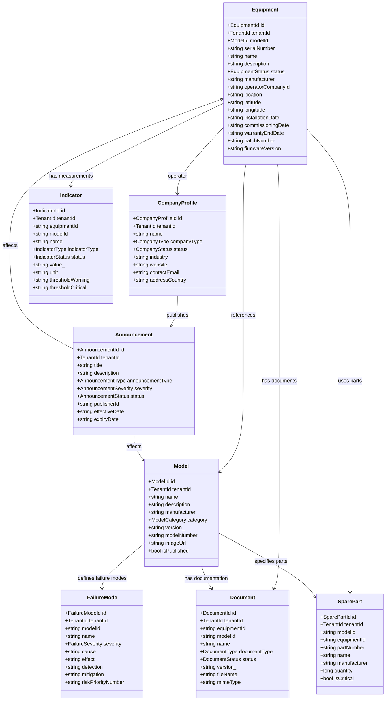
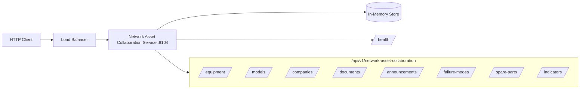
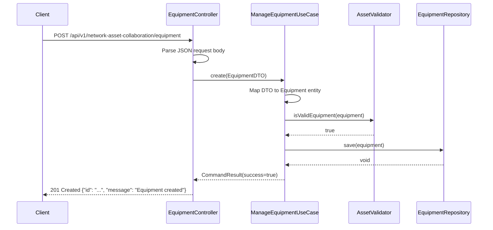
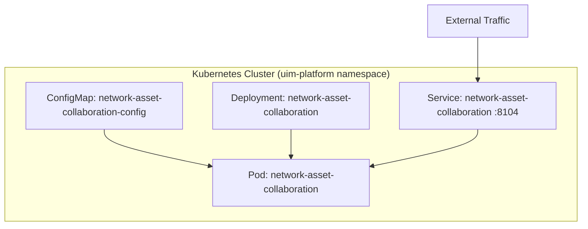

# UML Diagrams - Network Asset Collaboration Service

## Domain Model

```mermaid
classDiagram
    class Equipment {
        +EquipmentId id
        +TenantId tenantId
        +ModelId modelId
        +string serialNumber
        +string name
        +string description
        +EquipmentStatus status
        +string manufacturer
        +string operatorCompanyId
        +string location
        +string latitude
        +string longitude
        +string installationDate
        +string commissioningDate
        +string warrantyEndDate
        +string batchNumber
        +string firmwareVersion
    }

    class Model {
        +ModelId id
        +TenantId tenantId
        +string name
        +string description
        +string manufacturer
        +ModelCategory category
        +string version_
        +string modelNumber
        +string imageUrl
        +bool isPublished
    }

    class CompanyProfile {
        +CompanyProfileId id
        +TenantId tenantId
        +string name
        +CompanyType companyType
        +CompanyStatus status
        +string industry
        +string website
        +string contactEmail
        +string addressCountry
    }

    class Document {
        +DocumentId id
        +TenantId tenantId
        +string equipmentId
        +string modelId
        +string name
        +DocumentType documentType
        +DocumentStatus status
        +string version_
        +string fileName
        +string mimeType
    }

    class Announcement {
        +AnnouncementId id
        +TenantId tenantId
        +string title
        +string description
        +AnnouncementType announcementType
        +AnnouncementSeverity severity
        +AnnouncementStatus status
        +string publisherId
        +string effectiveDate
        +string expiryDate
    }

    class FailureMode {
        +FailureModeId id
        +TenantId tenantId
        +string modelId
        +string name
        +FailureSeverity severity
        +string cause
        +string effect
        +string detection
        +string mitigation
        +string riskPriorityNumber
    }

    class SparePart {
        +SparePartId id
        +TenantId tenantId
        +string modelId
        +string equipmentId
        +string partNumber
        +string name
        +string manufacturer
        +long quantity
        +bool isCritical
    }

    class Indicator {
        +IndicatorId id
        +TenantId tenantId
        +string equipmentId
        +string modelId
        +string name
        +IndicatorType indicatorType
        +IndicatorStatus status
        +string value_
        +string unit
        +string thresholdWarning
        +string thresholdCritical
    }

    Equipment --> Model : references
    Equipment --> CompanyProfile : operator
    Equipment --> Document : has documents
    Equipment --> Indicator : has measurements
    Equipment --> SparePart : uses parts
    Model --> FailureMode : defines failure modes
    Model --> SparePart : specifies parts
    Model --> Document : has documentation
    CompanyProfile --> Announcement : publishes
    Announcement --> Model : affects
    Announcement --> Equipment : affects
```

## Hexagonal Architecture

```mermaid
graph TB
    subgraph Presentation["Presentation Layer (HTTP)"]
        EC[EquipmentController]
        MC[ModelController]
        CPC[CompanyProfileController]
        DC[DocumentController]
        AC[AnnouncementController]
        FMC[FailureModeController]
        SPC[SparePartController]
        IC[IndicatorController]
        HC[HealthController]
    end

    subgraph Application["Application Layer (Use Cases)"]
        MEU[ManageEquipmentUseCase]
        MMU[ManageModelsUseCase]
        MCPU[ManageCompanyProfilesUseCase]
        MDU[ManageDocumentsUseCase]
        MAU[ManageAnnouncementsUseCase]
        MFMU[ManageFailureModesUseCase]
        MSPU[ManageSparePartsUseCase]
        MIU[ManageIndicatorsUseCase]
    end

    subgraph Domain["Domain Layer"]
        E[Equipment]
        M[Model]
        CP[CompanyProfile]
        D[Document]
        A[Announcement]
        FM[FailureMode]
        SP[SparePart]
        I[Indicator]
        ER[EquipmentRepository]
        MR[ModelRepository]
        CPR[CompanyProfileRepository]
        DR[DocumentRepository]
        AR[AnnouncementRepository]
        FMR[FailureModeRepository]
        SPR[SparePartRepository]
        IR[IndicatorRepository]
        AV[AssetValidator]
    end

    subgraph Infrastructure["Infrastructure Layer"]
        CFG[AppConfig]
        CTR[Container]
        MER[MemoryEquipmentRepo]
        MMR[MemoryModelRepo]
        MCPR[MemoryCompanyProfileRepo]
        MDR[MemoryDocumentRepo]
        MAR[MemoryAnnouncementRepo]
        MFMR[MemoryFailureModeRepo]
        MSPR[MemorySparePartRepo]
        MIR[MemoryIndicatorRepo]
    end

    EC --> MEU
    MC --> MMU
    CPC --> MCPU
    DC --> MDU
    AC --> MAU
    FMC --> MFMU
    SPC --> MSPU
    IC --> MIU

    MEU --> ER
    MMU --> MR
    MCPU --> CPR
    MDU --> DR
    MAU --> AR
    MFMU --> FMR
    MSPU --> SPR
    MIU --> IR

    MER -.-> ER
    MMR -.-> MR
    MCPR -.-> CPR
    MDR -.-> DR
    MAR -.-> AR
    MFMR -.-> FMR
    MSPR -.-> SPR
    MIR -.-> IR
```

## Component Diagram

```mermaid
graph LR
    Client[HTTP Client] --> LB[Load Balancer]
    LB --> NAC[Network Asset Collaboration Service :8104]

    NAC --> DB[(In-Memory Store)]
    NAC --> Health[/health/]

    subgraph API["/api/v1/network-asset-collaboration"]
        EQ[/equipment/]
        MOD[/models/]
        COM[/companies/]
        DOC[/documents/]
        ANN[/announcements/]
        FM[/failure-modes/]
        SP[/spare-parts/]
        IND[/indicators/]
    end

    NAC --> API
```

## Sequence Diagram - Create Equipment

```mermaid
sequenceDiagram
    participant C as Client
    participant EC as EquipmentController
    participant UC as ManageEquipmentUseCase
    participant V as AssetValidator
    participant R as EquipmentRepository

    C->>EC: POST /api/v1/network-asset-collaboration/equipment
    EC->>EC: Parse JSON request body
    EC->>UC: create(EquipmentDTO)
    UC->>UC: Map DTO to Equipment entity
    UC->>V: isValidEquipment(equipment)
    V-->>UC: true
    UC->>R: save(equipment)
    R-->>UC: void
    UC-->>EC: CommandResult(success=true)
    EC-->>C: 201 Created {"id": "...", "message": "Equipment created"}
```

## Deployment Diagram

```mermaid
graph TB
    subgraph K8s["Kubernetes Cluster (uim-platform namespace)"]
        CM[ConfigMap: network-asset-collaboration-config]
        DEP[Deployment: network-asset-collaboration]
        SVC[Service: network-asset-collaboration :8104]
        POD[Pod: network-asset-collaboration]

        CM --> POD
        DEP --> POD
        SVC --> POD
    end

    EXT[External Traffic] --> SVC
```
