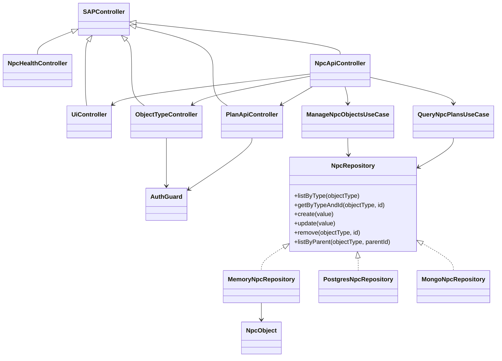
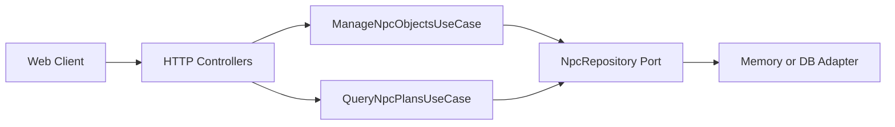

# UML

```mermaid
classDiagram
  class SAPController
  class NpcHealthController
  class NpcApiController
  class UiController
  class PlanApiController
  class ObjectTypeController
  class AuthGuard

  class NpcRepository {
    +listByType(objectType)
    +getByTypeAndId(objectType, id)
    +create(value)
    +update(value)
    +remove(objectType, id)
    +listByParent(objectType, parentId)
  }

  class MemoryNpcRepository
  class PostgresNpcRepository
  class MongoNpcRepository
  class ManageNpcObjectsUseCase
  class QueryNpcPlansUseCase
  class NpcObject

  SAPController <|-- NpcHealthController
  SAPController <|-- NpcApiController
  SAPController <|-- UiController
  SAPController <|-- PlanApiController
  SAPController <|-- ObjectTypeController

  NpcRepository <|.. MemoryNpcRepository
  NpcRepository <|.. PostgresNpcRepository
  NpcRepository <|.. MongoNpcRepository
  ManageNpcObjectsUseCase --> NpcRepository
  QueryNpcPlansUseCase --> NpcRepository
  NpcApiController --> ManageNpcObjectsUseCase
  NpcApiController --> QueryNpcPlansUseCase
  NpcApiController --> UiController
  NpcApiController --> PlanApiController
  NpcApiController --> ObjectTypeController
  ObjectTypeController --> AuthGuard
  PlanApiController --> AuthGuard
  MemoryNpcRepository --> NpcObject
```

```mermaid
flowchart LR
  UI[Web Client] --> API[HTTP Controllers]
  API --> UC1[ManageNpcObjectsUseCase]
  API --> UC2[QueryNpcPlansUseCase]
  UC1 --> PORT[NpcRepository Port]
  UC2 --> PORT
  PORT --> ADAPTER[Memory or DB Adapter]
```
