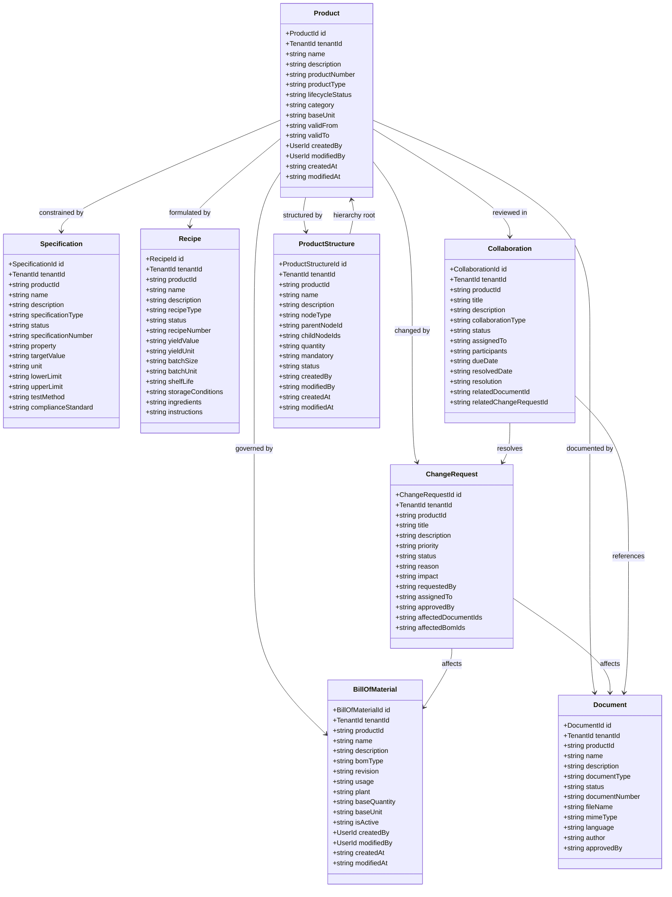
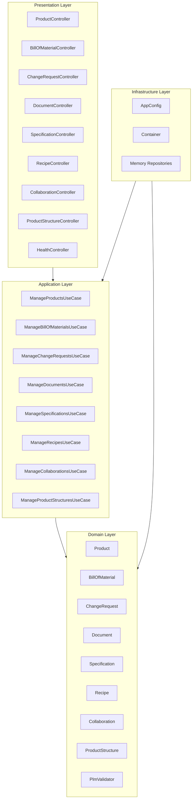

# Product Lifecycle Management Service - UML Diagrams

<!-- markdownlint-disable MD040 MD060 MD047 -->

## 1. Package Structure

```
uim.platform.plm
├── domain
│   ├── types
│   ├── entities
│   │   ├── Product
│   │   ├── BillOfMaterial
│   │   ├── ChangeRequest
│   │   ├── Document
│   │   ├── Specification
│   │   ├── Recipe
│   │   ├── Collaboration
│   │   └── ProductStructure
│   ├── repositories
│   │   ├── ProductRepository
│   │   ├── BillOfMaterialRepository
│   │   ├── ChangeRequestRepository
│   │   ├── DocumentRepository
│   │   ├── SpecificationRepository
│   │   ├── RecipeRepository
│   │   ├── CollaborationRepository
│   │   └── ProductStructureRepository
│   └── services
│       └── PlmValidator
├── application
│   ├── dto
│   └── usecases.manage
│       ├── ManageProductsUseCase
│       ├── ManageBillOfMaterialsUseCase
│       ├── ManageChangeRequestsUseCase
│       ├── ManageDocumentsUseCase
│       ├── ManageSpecificationsUseCase
│       ├── ManageRecipesUseCase
│       ├── ManageCollaborationsUseCase
│       └── ManageProductStructuresUseCase
├── infrastructure
│   ├── config
│   ├── container
│   └── persistence.repositories
└── presentation.http
    ├── json_utils
    └── controllers
```

## 2. Domain Class Diagram



## 3. Hexagonal Architecture

