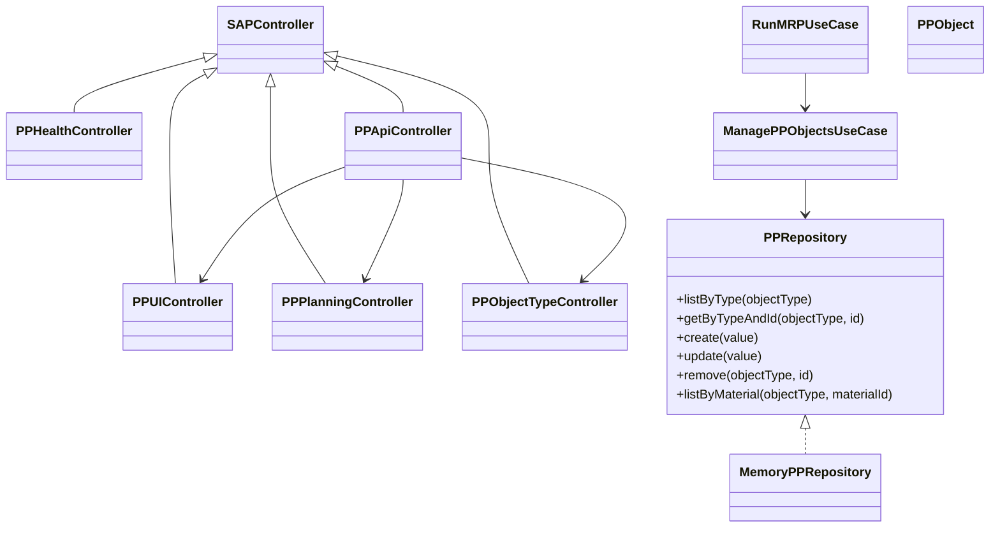
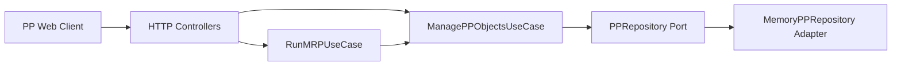

# UML

```mermaid
classDiagram
  class SAPController
  class PPHealthController
  class PPUIController
  class PPPlanningController
  class PPObjectTypeController
  class PPApiController

  class PPRepository {
    +listByType(objectType)
    +getByTypeAndId(objectType, id)
    +create(value)
    +update(value)
    +remove(objectType, id)
    +listByMaterial(objectType, materialId)
  }

  class MemoryPPRepository
  class ManagePPObjectsUseCase
  class RunMRPUseCase
  class PPObject

  SAPController <|-- PPHealthController
  SAPController <|-- PPUIController
  SAPController <|-- PPPlanningController
  SAPController <|-- PPObjectTypeController
  SAPController <|-- PPApiController

  PPRepository <|.. MemoryPPRepository
  ManagePPObjectsUseCase --> PPRepository
  RunMRPUseCase --> ManagePPObjectsUseCase
  PPApiController --> PPUIController
  PPApiController --> PPPlanningController
  PPApiController --> PPObjectTypeController
```

```mermaid
flowchart LR
  UI[PP Web Client] --> API[HTTP Controllers]
  API --> UC1[ManagePPObjectsUseCase]
  API --> UC2[RunMRPUseCase]
  UC2 --> UC1
  UC1 --> PORT[PPRepository Port]
  PORT --> ADAPTER[MemoryPPRepository Adapter]
```
