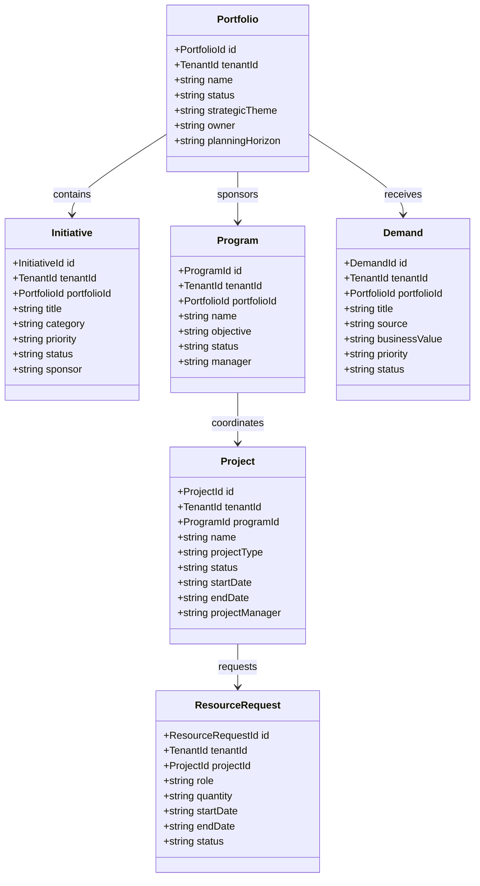
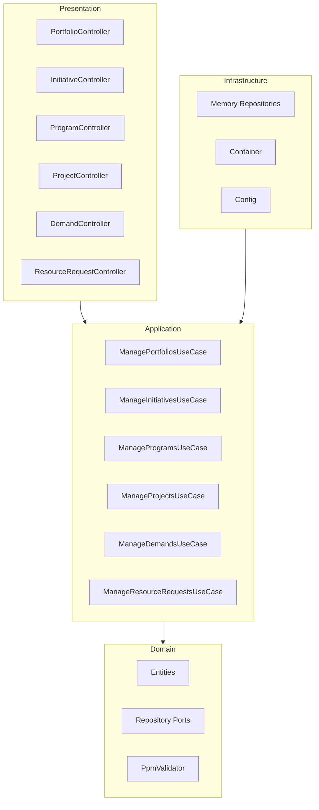

# Enterprise Portfolio and Project Management Service - UML

## 1. Package Structure

```text
uim.platform.ppm
├── domain
│   ├── types
│   ├── entities
│   │   ├── Portfolio
│   │   ├── Initiative
│   │   ├── Program
│   │   ├── Project
│   │   ├── Demand
│   │   └── ResourceRequest
│   ├── repositories
│   └── services
├── application
│   ├── dto
│   └── usecases.manage
├── infrastructure
│   ├── config
│   ├── container
│   └── persistence.memory
└── presentation.http
```

## 2. Domain Class Diagram



## 3. Hexagonal Diagram


