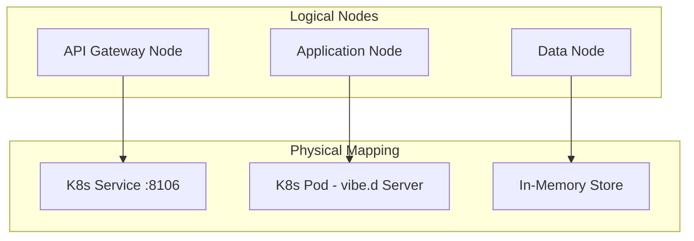
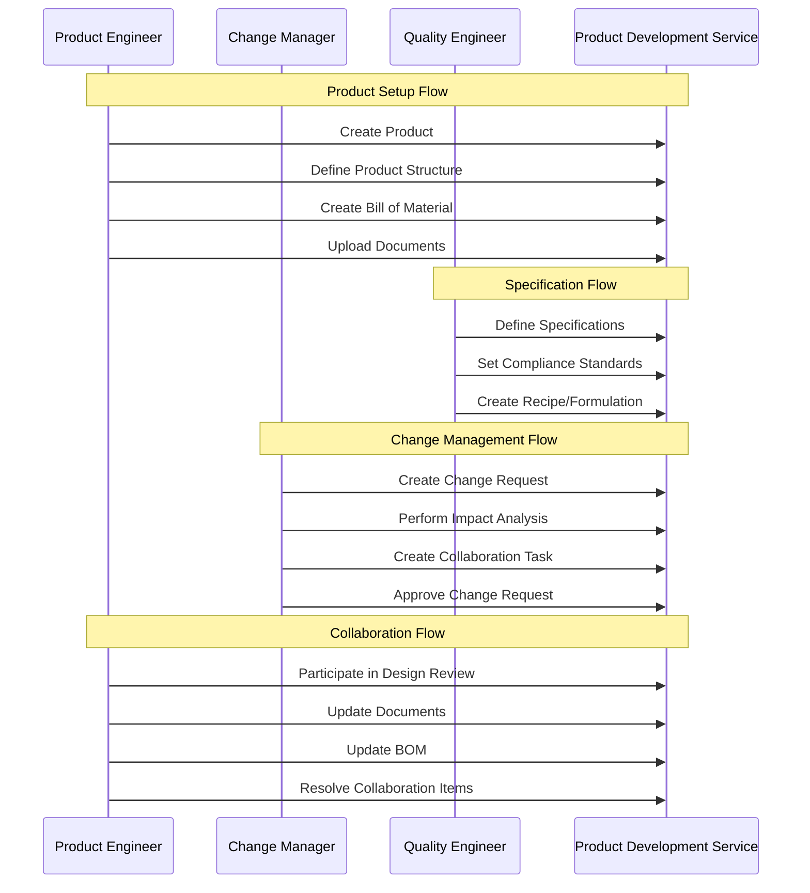
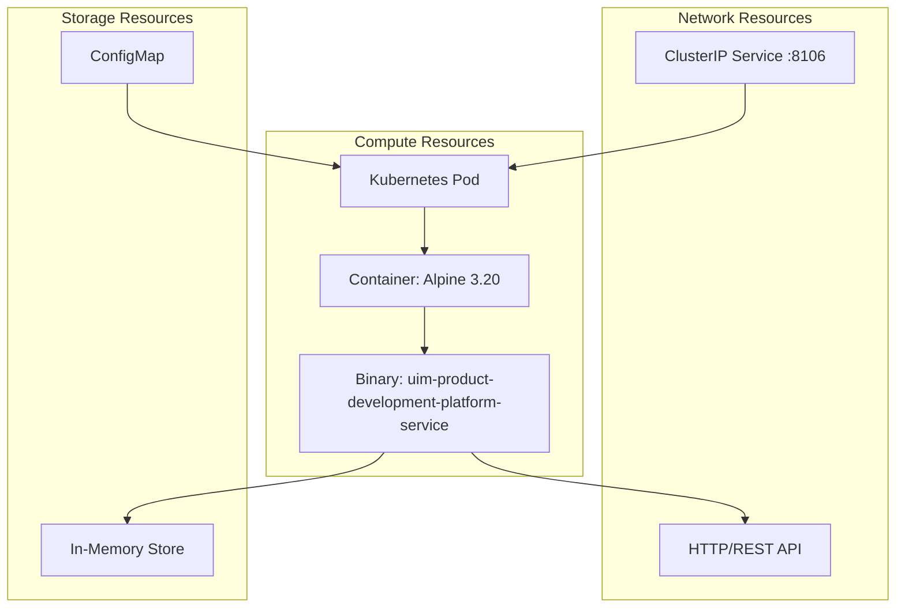
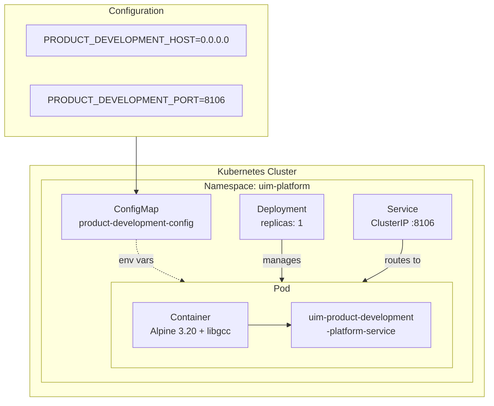

# NAF v4 Architecture Views - Product Development Service

NATO Architecture Framework v4 (NAFv4) views for the Product Development Service, modeled after SAP Integrated Product Development (SAP IPD/PLM EPD).

## C1 - Capability Taxonomy

```mermaid
graph TB
    IPD[Integrated Product Development]
    IPD --> PDM[Product Management]
    IPD --> BOM[BOM Management]
    IPD --> ECM[Change Management]
    IPD --> DMS[Document Management]
    IPD --> SPM[Specification Management]
    IPD --> RFM[Recipe/Formulation Management]
    IPD --> CLB[Collaboration Management]
    IPD --> EPS[Product Structure Management]

    PDM --> PDM1[Register Products]
    PDM --> PDM2[Track Product Lifecycle]
    PDM --> PDM3[Manage Product Versions]
    PDM --> PDM4[Classify Product Types]

    BOM --> BOM1[Create Engineering BOMs]
    BOM --> BOM2[Create Manufacturing BOMs]
    BOM --> BOM3[Manage BOM Components]
    BOM --> BOM4[BOM Version Control]

    ECM --> ECM1[Create Change Requests]
    ECM --> ECM2[Impact Analysis]
    ECM --> ECM3[Change Approval Workflow]
    ECM --> ECM4[Track Affected Artifacts]

    DMS --> DMS1[Document Registration]
    DMS --> DMS2[Document Versioning]
    DMS --> DMS3[Document Classification]
    DMS --> DMS4[Document Approval]

    SPM --> SPM1[Define Specifications]
    SPM --> SPM2[Set Tolerance Limits]
    SPM --> SPM3[Compliance Standards]
    SPM --> SPM4[Test Methods]

    RFM --> RFM1[Define Recipes]
    RFM --> RFM2[Batch Sizing]
    RFM --> RFM3[Ingredient Management]
    RFM --> RFM4[Shelf Life Tracking]

    CLB --> CLB1[Design Reviews]
    CLB --> CLB2[Cross-functional Tasks]
    CLB --> CLB3[Issue Tracking]
    CLB --> CLB4[Team Collaboration]

    EPS --> EPS1[Define Structure Hierarchy]
    EPS --> EPS2[Variant Configuration]
    EPS --> EPS3[Configuration Profiles]
    EPS --> EPS4[Mandatory/Optional Nodes]
```

## C2 - Enterprise Vision

The Product Development Service provides a comprehensive platform for integrated product lifecycle management. It enables:

1. **Product Lifecycle Management** through product registration, type classification, lifecycle phase tracking, and version control
2. **Engineering BOM Management** through bill of material creation, component tracking, plant assignments, and BOM versioning
3. **Engineering Change Management** through change requests, impact analysis, approval workflows, and affected artifact tracking
4. **Document Information Management** through document registration, versioning, classification, and approval workflows
5. **Specification and Compliance** through specification definitions, tolerance management, test methods, and compliance standards
6. **Formulation/Recipe Management** through recipe definitions, batch sizing, ingredient management, and shelf life tracking
7. **Cross-functional Collaboration** through design reviews, task assignments, issue resolution, and team coordination
8. **Enterprise Product Structure** through hierarchical structures, variant conditions, configuration profiles, and node management

## L1 - Node Types

## L2 - Logical Scenario

## L4 - Logical Activities

| Activity | Input | Process | Output |
|----------|-------|---------|--------|
| Register Product | Product details, type, category | Validate, assign ID, set lifecycle phase, persist | Product record |
| Create BOM | Product ID, components, quantities | Validate structure, assign positions, persist | BillOfMaterial record |
| Create Change Request | Product ID, reason, impact, priority | Validate, assign to reviewer, persist | ChangeRequest record |
| Register Document | Product ID, file metadata, type | Validate, assign document number, persist | Document record |
| Define Specification | Product ID, property, limits, method | Validate ranges, set compliance standard, persist | Specification record |
| Create Recipe | Product ID, ingredients, batch size | Validate formulation, calculate yield, persist | Recipe record |
| Create Collaboration | Product ID, type, participants, due date | Validate, assign team, persist | Collaboration record |
| Define Structure | Product ID, hierarchy, variant conditions | Validate tree, set mandatory flags, persist | ProductStructure record |

## P1 - Resource Types

## P2 - Resource Structure

## S1 - Service Taxonomy

```mermaid
graph TB
    IPD[Product Development Service]

    IPD --> PS[Product Service]
    IPD --> BS[BOM Service]
    IPD --> CRS[Change Request Service]
    IPD --> DS[Document Service]
    IPD --> SS[Specification Service]
    IPD --> RS[Recipe Service]
    IPD --> CS[Collaboration Service]
    IPD --> PSS[Product Structure Service]
    IPD --> HS[Health Service]

    PS --> PS1["GET /products"]
    PS --> PS2["POST /products"]
    PS --> PS3["GET /products/:id"]
    PS --> PS4["PUT /products/:id"]
    PS --> PS5["DELETE /products/:id"]

    BS --> BS1["GET /boms"]
    BS --> BS2["POST /boms"]
    BS --> BS3["GET /boms/:id"]
    BS --> BS4["PUT /boms/:id"]
    BS --> BS5["DELETE /boms/:id"]

    CRS --> CRS1["GET /change-requests"]
    CRS --> CRS2["POST /change-requests"]
    CRS --> CRS3["GET /change-requests/:id"]
    CRS --> CRS4["PUT /change-requests/:id"]
    CRS --> CRS5["DELETE /change-requests/:id"]

    HS --> HS1["GET /health"]
```

## S4 - Service Functions

| Service | Function | HTTP Method | Path | Description |
|---------|----------|-------------|------|-------------|
| Product | List | GET | /products | List all products |
| Product | Create | POST | /products | Register new product |
| Product | Get | GET | /products/:id | Get product details |
| Product | Update | PUT | /products/:id | Update product |
| Product | Delete | DELETE | /products/:id | Remove product |
| BOM | List | GET | /boms | List all BOMs |
| BOM | Create | POST | /boms | Create BOM |
| BOM | Get | GET | /boms/:id | Get BOM details |
| BOM | Update | PUT | /boms/:id | Update BOM |
| BOM | Delete | DELETE | /boms/:id | Remove BOM |
| Change Request | List | GET | /change-requests | List change requests |
| Change Request | Create | POST | /change-requests | Create change request |
| Change Request | Get | GET | /change-requests/:id | Get change request details |
| Change Request | Update | PUT | /change-requests/:id | Update change request |
| Change Request | Delete | DELETE | /change-requests/:id | Remove change request |
| Document | List | GET | /documents | List documents |
| Document | Create | POST | /documents | Register document |
| Document | Get | GET | /documents/:id | Get document details |
| Document | Update | PUT | /documents/:id | Update document |
| Document | Delete | DELETE | /documents/:id | Remove document |
| Specification | List | GET | /specifications | List specifications |
| Specification | Create | POST | /specifications | Define specification |
| Specification | Get | GET | /specifications/:id | Get specification details |
| Specification | Update | PUT | /specifications/:id | Update specification |
| Specification | Delete | DELETE | /specifications/:id | Remove specification |
| Recipe | List | GET | /recipes | List recipes |
| Recipe | Create | POST | /recipes | Create recipe |
| Recipe | Get | GET | /recipes/:id | Get recipe details |
| Recipe | Update | PUT | /recipes/:id | Update recipe |
| Recipe | Delete | DELETE | /recipes/:id | Remove recipe |
| Collaboration | List | GET | /collaborations | List collaborations |
| Collaboration | Create | POST | /collaborations | Create collaboration |
| Collaboration | Get | GET | /collaborations/:id | Get collaboration details |
| Collaboration | Update | PUT | /collaborations/:id | Update collaboration |
| Collaboration | Delete | DELETE | /collaborations/:id | Remove collaboration |
| Structure | List | GET | /structures | List product structures |
| Structure | Create | POST | /structures | Define structure node |
| Structure | Get | GET | /structures/:id | Get structure details |
| Structure | Update | PUT | /structures/:id | Update structure |
| Structure | Delete | DELETE | /structures/:id | Remove structure |
| Health | Check | GET | /health | Service health status |

## S8 - Service Policy

| Policy | Description |
|--------|-------------|
| Authentication | X-Tenant-Id header required for tenant isolation |
| Content Type | application/json for all request and response bodies |
| Error Handling | Standardized error responses with HTTP status codes |
| Validation | Domain-level validation via ProductValidator before persistence |
| Idempotency | Product, BOM, and document IDs provided by client |
| Health Check | Liveness probe at /health, readiness probe at /health |
