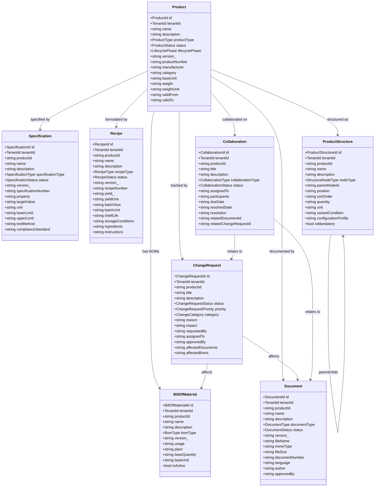
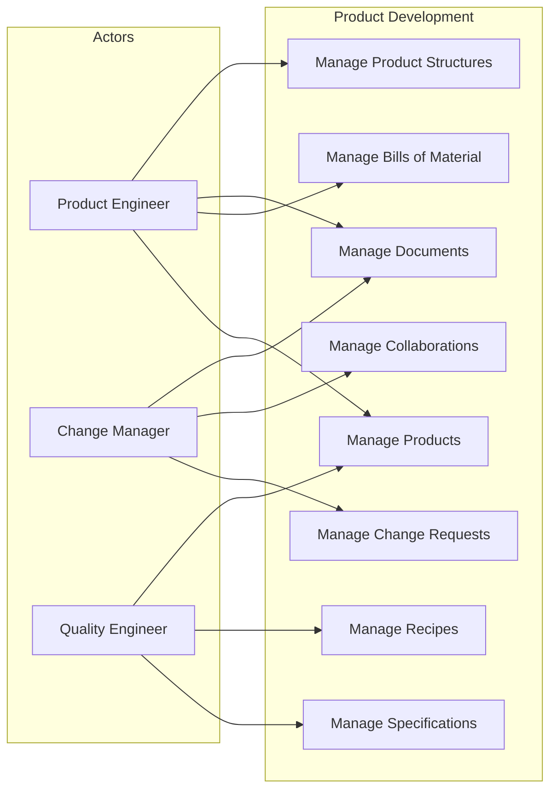

# UML Diagrams - Product Development Service

## Domain Model

```mermaid
classDiagram
    class Product {
        +ProductId id
        +TenantId tenantId
        +string name
        +string description
        +ProductType productType
        +ProductStatus status
        +LifecyclePhase lifecyclePhase
        +string version_
        +string productNumber
        +string manufacturer
        +string category
        +string baseUnit
        +string weight
        +string weightUnit
        +string validFrom
        +string validTo
    }

    class BillOfMaterial {
        +BillOfMaterialId id
        +TenantId tenantId
        +string productId
        +string name
        +string description
        +BomType bomType
        +string version_
        +string usage
        +string plant
        +string baseQuantity
        +string baseUnit
        +bool isActive
    }

    class ChangeRequest {
        +ChangeRequestId id
        +TenantId tenantId
        +string productId
        +string title
        +string description
        +ChangeRequestStatus status
        +ChangeRequestPriority priority
        +ChangeCategory category
        +string reason
        +string impact
        +string requestedBy
        +string assignedTo
        +string approvedBy
        +string affectedDocuments
        +string affectedBoms
    }

    class Document {
        +DocumentId id
        +TenantId tenantId
        +string productId
        +string name
        +string description
        +DocumentType documentType
        +DocumentStatus status
        +string version_
        +string fileName
        +string mimeType
        +string fileSize
        +string documentNumber
        +string language
        +string author
        +string approvedBy
    }

    class Specification {
        +SpecificationId id
        +TenantId tenantId
        +string productId
        +string name
        +string description
        +SpecificationType specificationType
        +SpecificationStatus status
        +string version_
        +string specificationNumber
        +string property
        +string targetValue
        +string unit
        +string lowerLimit
        +string upperLimit
        +string testMethod
        +string complianceStandard
    }

    class Recipe {
        +RecipeId id
        +TenantId tenantId
        +string productId
        +string name
        +string description
        +RecipeType recipeType
        +RecipeStatus status
        +string version_
        +string recipeNumber
        +string yield_
        +string yieldUnit
        +string batchSize
        +string batchUnit
        +string shelfLife
        +string storageConditions
        +string ingredients
        +string instructions
    }

    class Collaboration {
        +CollaborationId id
        +TenantId tenantId
        +string productId
        +string title
        +string description
        +CollaborationType collaborationType
        +CollaborationStatus status
        +string assignedTo
        +string participants
        +string dueDate
        +string resolvedDate
        +string resolution
        +string relatedDocumentId
        +string relatedChangeRequestId
    }

    class ProductStructure {
        +ProductStructureId id
        +TenantId tenantId
        +string productId
        +string name
        +string description
        +StructureNodeType nodeType
        +string parentNodeId
        +string position
        +string sortOrder
        +string quantity
        +string unit
        +string variantCondition
        +string configurationProfile
        +bool isMandatory
    }

    Product --> BillOfMaterial : has BOMs
    Product --> ChangeRequest : tracked by
    Product --> Document : documented by
    Product --> Specification : specified by
    Product --> Recipe : formulated by
    Product --> Collaboration : collaborated on
    Product --> ProductStructure : structured as
    ChangeRequest --> Document : affects
    ChangeRequest --> BillOfMaterial : affects
    Collaboration --> Document : relates to
    Collaboration --> ChangeRequest : relates to
    ProductStructure --> ProductStructure : parent/child
```

## Hexagonal Architecture

```mermaid
graph TB
    subgraph Presentation["Presentation Layer (HTTP)"]
        PC[ProductController]
        BC[BomController]
        CRC[ChangeRequestController]
        DC[DocumentController]
        SC[SpecificationController]
        RC[RecipeController]
        CC[CollaborationController]
        PSC[ProductStructureController]
        HC[HealthController]
    end

    subgraph Application["Application Layer (Use Cases)"]
        MPU[ManageProductsUseCase]
        MBU[ManageBomsUseCase]
        MCRU[ManageChangeRequestsUseCase]
        MDU[ManageDocumentsUseCase]
        MSU[ManageSpecificationsUseCase]
        MRU[ManageRecipesUseCase]
        MCU[ManageCollaborationsUseCase]
        MPSU[ManageProductStructuresUseCase]
    end

    subgraph Domain["Domain Layer"]
        P[Product]
        B[BillOfMaterial]
        CR[ChangeRequest]
        D[Document]
        S[Specification]
        R[Recipe]
        C[Collaboration]
        PS[ProductStructure]
        PR[ProductRepository]
        BR[BillOfMaterialRepository]
        CRR[ChangeRequestRepository]
        DR[DocumentRepository]
        SR[SpecificationRepository]
        RR[RecipeRepository]
        CLR[CollaborationRepository]
        PSR[ProductStructureRepository]
        PV[ProductValidator]
    end

    subgraph Infrastructure["Infrastructure Layer"]
        CFG[AppConfig]
        CTR[Container]
        MPR[MemoryProductRepo]
        MBR[MemoryBomRepo]
        MCRR[MemoryChangeRequestRepo]
        MDR[MemoryDocumentRepo]
        MSR[MemorySpecificationRepo]
        MRR[MemoryRecipeRepo]
        MCR[MemoryCollaborationRepo]
        MPSR[MemoryProductStructureRepo]
    end

    PC --> MPU
    BC --> MBU
    CRC --> MCRU
    DC --> MDU
    SC --> MSU
    RC --> MRU
    CC --> MCU
    PSC --> MPSU

    MPU --> PR
    MBU --> BR
    MCRU --> CRR
    MDU --> DR
    MSU --> SR
    MRU --> RR
    MCU --> CLR
    MPSU --> PSR

    MPR -.->|implements| PR
    MBR -.->|implements| BR
    MCRR -.->|implements| CRR
    MDR -.->|implements| DR
    MSR -.->|implements| SR
    MRR -.->|implements| RR
    MCR -.->|implements| CLR
    MPSR -.->|implements| PSR

    MPU --> PV
    MBU --> PV
    MCRU --> PV
    MDU --> PV
    MSU --> PV
    MRU --> PV
    MCU --> PV
    MPSU --> PV
```

## Use Case Diagram

```mermaid
graph LR
    subgraph Actors
        PE[Product Engineer]
        CM[Change Manager]
        QE[Quality Engineer]
    end

    subgraph UseCases["Product Development"]
        UC1[Manage Products]
        UC2[Manage Bills of Material]
        UC3[Manage Change Requests]
        UC4[Manage Documents]
        UC5[Manage Specifications]
        UC6[Manage Recipes]
        UC7[Manage Collaborations]
        UC8[Manage Product Structures]
    end

    PE --> UC1
    PE --> UC2
    PE --> UC4
    PE --> UC8
    CM --> UC3
    CM --> UC7
    CM --> UC4
    QE --> UC5
    QE --> UC6
    QE --> UC1
```
