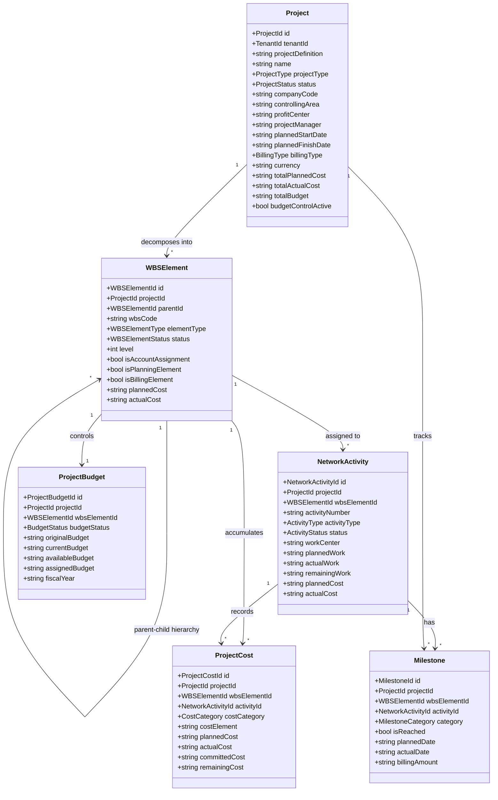
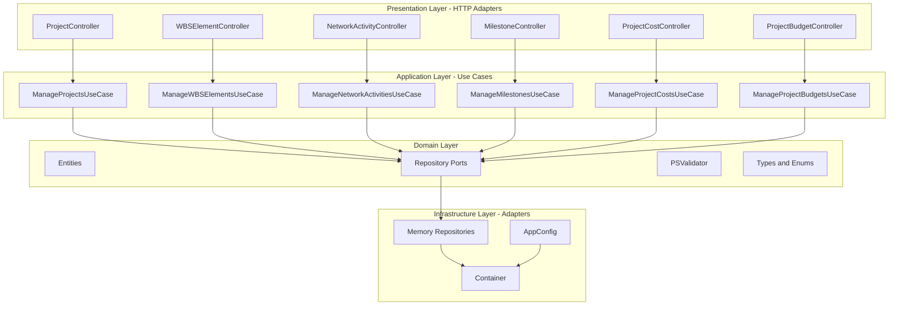
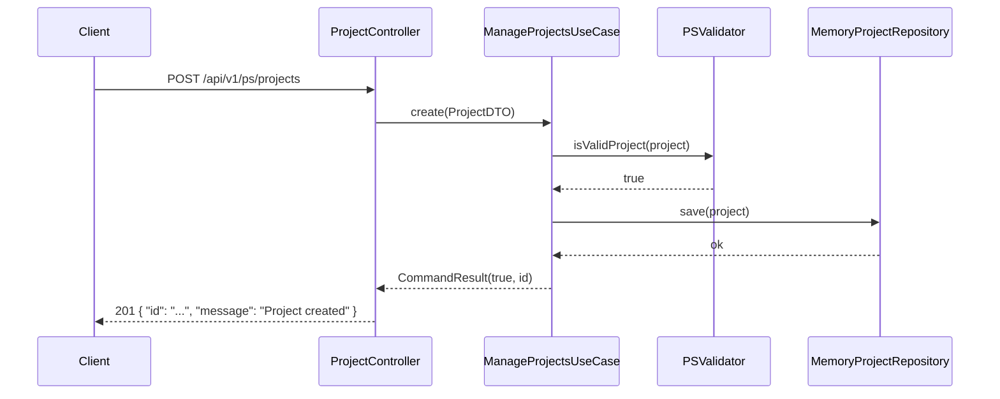
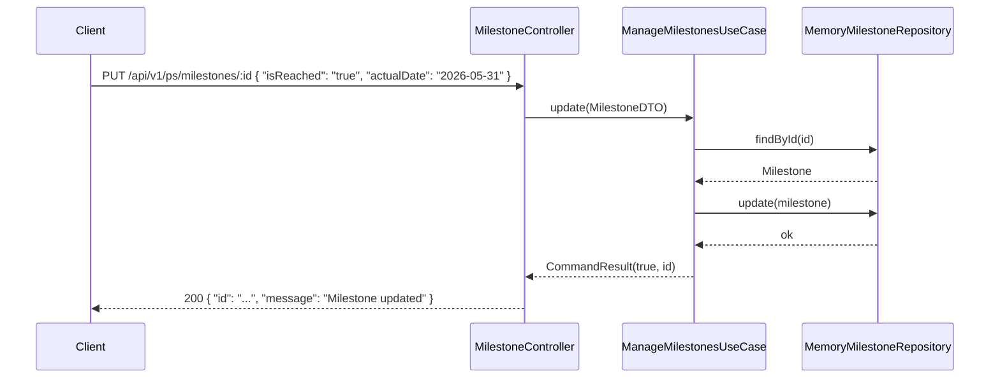

# UML Diagrams - Project System Service

## Domain Model

```mermaid
classDiagram
    direction TB

    class Project {
        +ProjectId id
        +TenantId tenantId
        +string projectDefinition
        +string name
        +ProjectType projectType
        +ProjectStatus status
        +string companyCode
        +string controllingArea
        +string profitCenter
        +string projectManager
        +string plannedStartDate
        +string plannedFinishDate
        +BillingType billingType
        +string currency
        +string totalPlannedCost
        +string totalActualCost
        +string totalBudget
        +bool budgetControlActive
    }

    class WBSElement {
        +WBSElementId id
        +ProjectId projectId
        +WBSElementId parentId
        +string wbsCode
        +WBSElementType elementType
        +WBSElementStatus status
        +int level
        +bool isAccountAssignment
        +bool isPlanningElement
        +bool isBillingElement
        +string plannedCost
        +string actualCost
    }

    class NetworkActivity {
        +NetworkActivityId id
        +ProjectId projectId
        +WBSElementId wbsElementId
        +string activityNumber
        +ActivityType activityType
        +ActivityStatus status
        +string workCenter
        +string plannedWork
        +string actualWork
        +string remainingWork
        +string plannedCost
        +string actualCost
    }

    class Milestone {
        +MilestoneId id
        +ProjectId projectId
        +WBSElementId wbsElementId
        +NetworkActivityId activityId
        +MilestoneCategory category
        +bool isReached
        +string plannedDate
        +string actualDate
        +string billingAmount
    }

    class ProjectCost {
        +ProjectCostId id
        +ProjectId projectId
        +WBSElementId wbsElementId
        +NetworkActivityId activityId
        +CostCategory costCategory
        +string costElement
        +string plannedCost
        +string actualCost
        +string committedCost
        +string remainingCost
    }

    class ProjectBudget {
        +ProjectBudgetId id
        +ProjectId projectId
        +WBSElementId wbsElementId
        +BudgetStatus budgetStatus
        +string originalBudget
        +string currentBudget
        +string availableBudget
        +string assignedBudget
        +string fiscalYear
    }

    Project "1" --> "*" WBSElement : decomposes into
    WBSElement "1" --> "*" WBSElement : parent-child hierarchy
    WBSElement "1" --> "*" NetworkActivity : assigned to
    NetworkActivity "1" --> "*" Milestone : has
    WBSElement "1" --> "*" ProjectCost : accumulates
    NetworkActivity "1" --> "*" ProjectCost : records
    WBSElement "1" --> "1" ProjectBudget : controls
    Project "1" --> "*" Milestone : tracks
```

## Hexagonal Architecture

```mermaid
graph TB
    subgraph Presentation [Presentation Layer - HTTP Adapters]
        PC[ProjectController]
        WC[WBSElementController]
        AC[NetworkActivityController]
        MC[MilestoneController]
        CC[ProjectCostController]
        BC[ProjectBudgetController]
    end

    subgraph Application [Application Layer - Use Cases]
        PU[ManageProjectsUseCase]
        WU[ManageWBSElementsUseCase]
        AU[ManageNetworkActivitiesUseCase]
        MU[ManageMilestonesUseCase]
        CU[ManageProjectCostsUseCase]
        BU[ManageProjectBudgetsUseCase]
    end

    subgraph Domain [Domain Layer]
        E[Entities]
        R[Repository Ports]
        V[PSValidator]
        T[Types and Enums]
    end

    subgraph Infrastructure [Infrastructure Layer - Adapters]
        MR[Memory Repositories]
        C[Container]
        CFG[AppConfig]
    end

    PC --> PU
    WC --> WU
    AC --> AU
    MC --> MU
    CC --> CU
    BC --> BU

    PU --> R
    WU --> R
    AU --> R
    MU --> R
    CU --> R
    BU --> R

    R --> MR
    MR --> C
    CFG --> C
```

## Sequence Diagram: Create Project with WBS

```mermaid
sequenceDiagram
    participant Client
    participant ProjectController
    participant ManageProjectsUseCase
    participant PSValidator
    participant MemoryProjectRepository

    Client->>ProjectController: POST /api/v1/ps/projects
    ProjectController->>ManageProjectsUseCase: create(ProjectDTO)
    ManageProjectsUseCase->>PSValidator: isValidProject(project)
    PSValidator-->>ManageProjectsUseCase: true
    ManageProjectsUseCase->>MemoryProjectRepository: save(project)
    MemoryProjectRepository-->>ManageProjectsUseCase: ok
    ManageProjectsUseCase-->>ProjectController: CommandResult(true, id)
    ProjectController-->>Client: 201 { "id": "...", "message": "Project created" }
```

## Sequence Diagram: Register Milestone Completion

```mermaid
sequenceDiagram
    participant Client
    participant MilestoneController
    participant ManageMilestonesUseCase
    participant MemoryMilestoneRepository

    Client->>MilestoneController: PUT /api/v1/ps/milestones/:id { "isReached": "true", "actualDate": "2026-05-31" }
    MilestoneController->>ManageMilestonesUseCase: update(MilestoneDTO)
    ManageMilestonesUseCase->>MemoryMilestoneRepository: findById(id)
    MemoryMilestoneRepository-->>ManageMilestonesUseCase: Milestone
    ManageMilestonesUseCase->>MemoryMilestoneRepository: update(milestone)
    MemoryMilestoneRepository-->>ManageMilestonesUseCase: ok
    ManageMilestonesUseCase-->>MilestoneController: CommandResult(true, id)
    MilestoneController-->>Client: 200 { "id": "...", "message": "Milestone updated" }
```
