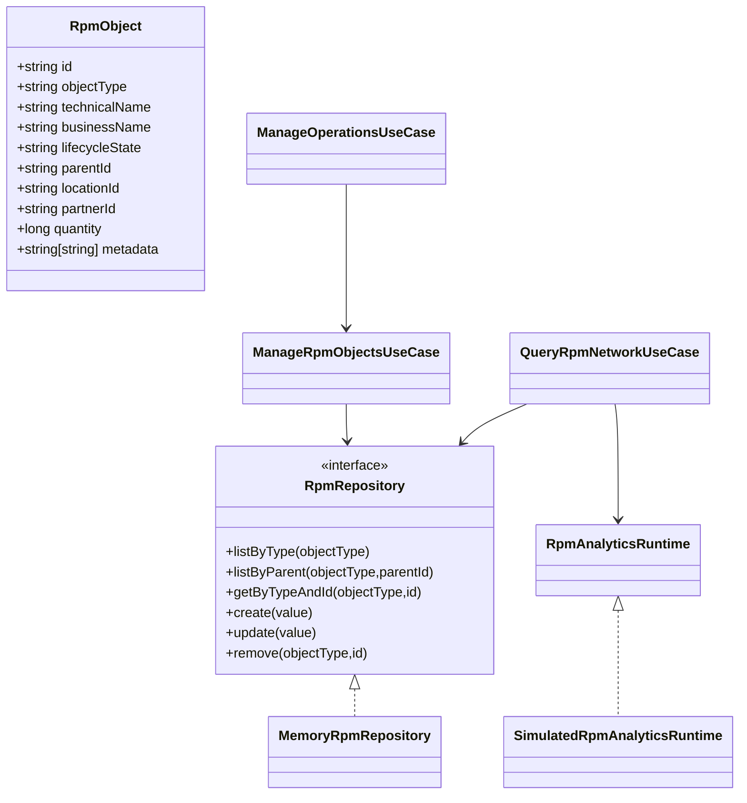
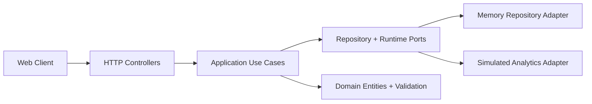

# UML Overview

```mermaid
classDiagram
    class RpmObject {
      +string id
      +string objectType
      +string technicalName
      +string businessName
      +string lifecycleState
      +string parentId
      +string locationId
      +string partnerId
      +long quantity
      +string[string] metadata
    }

    class RpmRepository {
      <<interface>>
      +listByType(objectType)
      +listByParent(objectType,parentId)
      +getByTypeAndId(objectType,id)
      +create(value)
      +update(value)
      +remove(objectType,id)
    }

    class ManageRpmObjectsUseCase
    class ManageOperationsUseCase
    class QueryRpmNetworkUseCase
    class MemoryRpmRepository
    class RpmAnalyticsRuntime
    class SimulatedRpmAnalyticsRuntime

    RpmRepository <|.. MemoryRpmRepository
    ManageRpmObjectsUseCase --> RpmRepository
    ManageOperationsUseCase --> ManageRpmObjectsUseCase
    QueryRpmNetworkUseCase --> RpmRepository
    QueryRpmNetworkUseCase --> RpmAnalyticsRuntime
    RpmAnalyticsRuntime <|.. SimulatedRpmAnalyticsRuntime
```

```mermaid
flowchart LR
    UI[Web Client] --> API[HTTP Controllers]
    API --> APP[Application Use Cases]
    APP --> PORTS[Repository + Runtime Ports]
    PORTS --> ADP1[Memory Repository Adapter]
    PORTS --> ADP2[Simulated Analytics Adapter]
    APP --> DOM[Domain Entities + Validation]
```
