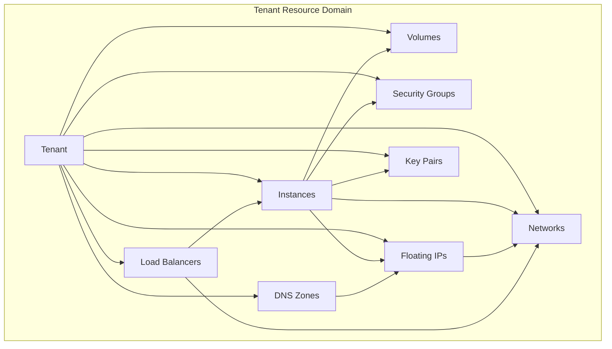
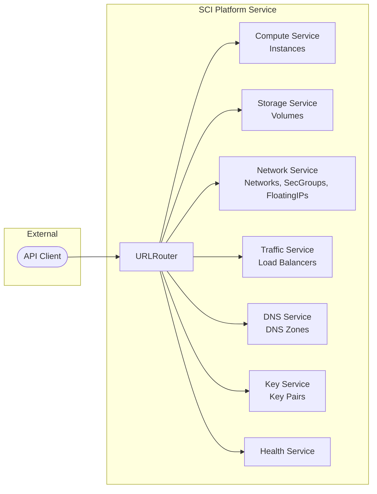

# NAF v4 Views - SAP Cloud Infrastructure Service

This document maps the SAP Cloud Infrastructure (SCI) service to NATO Architecture Framework version 4 viewpoints, providing strategic, operational, service, and logical perspectives on the cloud infrastructure platform.

---

## C1 - Capability Taxonomy

Defines the hierarchy of capabilities the SCI platform delivers.

```
Cloud Infrastructure Platform
├── Compute Management
│   ├── Instance Lifecycle (create, update, resize, delete)
│   ├── Power State Control (running, paused, stopped, suspended)
│   ├── Flavor/Sizing (general, compute, memory, storage, GPU, high-performance)
│   ├── Image Management (OS image references, snapshots)
│   └── Availability Zone Placement
├── Block Storage Management
│   ├── Volume Lifecycle (create, expand, clone, delete)
│   ├── Volume Types (standard, SSD, high-IOPS, archive)
│   ├── Volume Attachment (attach/detach to instances)
│   ├── Snapshot Management
│   └── Volume Encryption
├── Network Management
│   ├── Software-Defined Networking (SDN)
│   ├── Tenant Network Isolation
│   ├── Subnet and CIDR Configuration
│   ├── Router Management
│   └── DNS Nameserver Configuration
├── Security Management
│   ├── Security Group Rules (ingress/egress)
│   ├── Protocol Filtering (TCP, UDP, ICMP)
│   ├── Port Range Control
│   ├── Remote IP Prefix Matching
│   └── Default Security Policies
├── Public IP Management
│   ├── Floating IP Allocation
│   ├── IP-to-Instance Association
│   ├── IP-to-Router Association
│   └── Floating Network Selection
├── Traffic Distribution
│   ├── Load Balancer Lifecycle
│   ├── Algorithm Selection (round-robin, least-connections, source-IP)
│   ├── Health Monitor Configuration
│   └── Virtual IP (VIP) Management
├── DNS Management
│   ├── Zone Lifecycle (create, update, delete)
│   ├── Record Type Support (A, AAAA, CNAME, MX, TXT, NS, SRV, PTR)
│   ├── Zone Sharing and Transfer
│   └── TTL and Serial Management
└── Key Management
    ├── SSH Key Pair Generation
    ├── X.509 Certificate Management
    ├── Public Key Import
    └── Fingerprint Tracking
```

## C2 - Enterprise Vision

### Vision Statement

Provide a sovereign, self-service cloud infrastructure platform based on open-source technologies that enables organisations to manage virtual compute, storage, and networking resources through API-driven interfaces without dependency on hyperscaler providers.

### Strategic Goals

| Goal | Description |
|------|-------------|
| **Digital Sovereignty** | Operate infrastructure independently of hyperscaler dependencies, based on open-source frameworks (OpenStack, Kubernetes) |
| **Self-Service Operations** | Enable tenants to provision and manage resources through RESTful APIs and automated workflows |
| **Multi-Tenancy** | Provide isolated resource domains per tenant with shared infrastructure efficiency |
| **Operational Resilience** | Support availability zones, health monitoring, load balancing, and automated recovery |
| **Security by Design** | Enforce network isolation, security groups, encrypted storage, and key-based authentication |
| **Scalable Architecture** | Scale from single-node development to multi-region production deployments |

## L1 - Node Types

Defines the logical and physical node types in the SCI architecture.

| Node Type | Description | Role |
|-----------|-------------|------|
| **SCI Service** | vibe.d HTTP microservice | API gateway and resource management |
| **Compute Node** | Virtual machine host | Runs tenant instances with assigned flavors |
| **Storage Node** | Block storage backend | Provides persistent volumes to instances |
| **Network Node** | SDN controller | Manages tenant networks, routers, floating IPs |
| **Load Balancer Node** | Traffic distributor | Routes requests across backend instances |
| **DNS Node** | Authoritative DNS server | Resolves zone records for tenant domains |
| **Identity Node** | Key management service | Manages SSH/X.509 key pairs and access control |
| **Kubernetes Control Plane** | Container orchestrator | Manages SCI service deployment and scaling |

## L2 - Logical Scenario

### Instance Provisioning Scenario

```
1. Tenant authenticates and obtains tenant ID
2. Tenant selects OS image and flavor category
3. Tenant specifies network, security group, and key pair
4. SCI validates resource configuration (ResourceValidator)
5. Instance is created in target availability zone
6. Volume is provisioned and attached to instance
7. Network port is allocated on tenant network
8. Security group rules are applied
9. Optional: Floating IP is associated for public access
10. Optional: DNS record is created pointing to floating IP
11. Optional: Load balancer backend is updated with new instance
```

### Network Security Scenario

```
1. Tenant creates a private network with CIDR allocation
2. Security group is created with default deny-all rules
3. Ingress rules added for SSH (TCP/22) and HTTPS (TCP/443)
4. Egress rules configured for outbound access
5. Security group is associated with new instances
6. Floating IP assigned from external network pool
7. Traffic filtered through security group rules at network boundary
```

## L4 - Logical Activities

| Activity | Input | Process | Output |
|----------|-------|---------|--------|
| Provision Instance | InstanceDTO | Validate -> Create entity -> Save to repository -> Assign network | Instance with ID |
| Attach Volume | VolumeDTO + InstanceId | Validate -> Create volume -> Attach to instance | Volume attached |
| Configure Network | NetworkDTO | Validate -> Create SDN network -> Assign CIDR/gateway | Network with subnet |
| Apply Security Rules | SecurityGroupDTO | Validate -> Create rules -> Bind to instance | Security group active |
| Allocate Floating IP | FloatingIpDTO | Validate -> Allocate from pool -> Associate to instance | Public IP assigned |
| Create Load Balancer | LoadBalancerDTO | Validate -> Create LB -> Configure algorithm/monitors | LB distributing traffic |
| Manage DNS Zone | DnsZoneDTO | Validate -> Create zone -> Add records | DNS zone active |
| Register Key Pair | KeyPairDTO | Validate -> Generate/import keys -> Store fingerprint | Key pair available |

## P1 - Resource Types

| Resource Type | Attributes | Lifecycle |
|---------------|-----------|-----------|
| **Instance** | ID, name, image, flavor, vCPUs, memory, disk, AZ, status, power state | Created -> Running -> Stopped -> Deleted |
| **Volume** | ID, name, type, size, IOPS, encrypted, attached instance | Created -> Available -> In-Use -> Deleted |
| **Network** | ID, name, type, CIDR, gateway, external, shared | Created -> Active -> Deleted |
| **Security Group** | ID, name, direction, protocol, port range, remote prefix | Created -> Active -> Deleted |
| **Floating IP** | ID, floating address, fixed address, instance, router | Created -> Active -> Down -> Deleted |
| **Load Balancer** | ID, name, algorithm, VIP, listener port, health monitor | Created -> Active -> Degraded -> Deleted |
| **DNS Zone** | ID, name, zone type, record type, TTL, serial, email | Created -> Active -> Pending -> Deleted |
| **Key Pair** | ID, name, key type, public key, fingerprint | Created -> Active -> Deleted |

## P2 - Resource Structure



## S1 - Service Taxonomy

### Service Categories

| Category | Services | SCI Mapping |
|----------|----------|-------------|
| **Compute Services** | Virtual Machine Management, Flavor Provisioning, Image Management | InstanceController, ManageInstancesUseCase |
| **Storage Services** | Block Storage, Volume Snapshot, Volume Encryption | VolumeController, ManageVolumesUseCase |
| **Network Services** | SDN, Subnet Management, Router Management | NetworkController, ManageNetworksUseCase |
| **Security Services** | Security Groups, Firewall Rules, Access Control | SecurityGroupController, ManageSecurityGroupsUseCase |
| **IP Services** | Floating IP Allocation, IP Association | FloatingIpController, ManageFloatingIpsUseCase |
| **Traffic Services** | Load Balancing, Health Monitoring | LoadBalancerController, ManageLoadBalancersUseCase |
| **DNS Services** | Zone Management, Record Management | DnsZoneController, ManageDnsZonesUseCase |
| **Key Services** | Key Pair Management, Credential Lifecycle | KeyPairController, ManageKeyPairsUseCase |
| **Platform Services** | Health Check, Configuration, DI Container | HealthController, AppConfig, Container |

### Service Interfaces

All services are exposed through RESTful HTTP interfaces at `/api/v1/sci/` with:

- **JSON** request/response format
- **X-Tenant-Id** header for tenant isolation
- **CRUD** operations (GET, POST, PUT, DELETE)
- **Validation** via domain ResourceValidator
- **Error handling** with structured error responses

## S4 - Service Functions



---

*This NAFv4 mapping provides a structured view of the SCI platform aligned with NATO Architecture Framework v4 viewpoints, supporting enterprise architecture documentation, capability planning, and interoperability analysis.*
