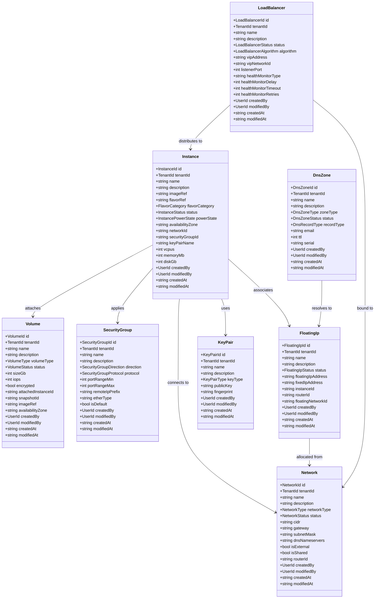
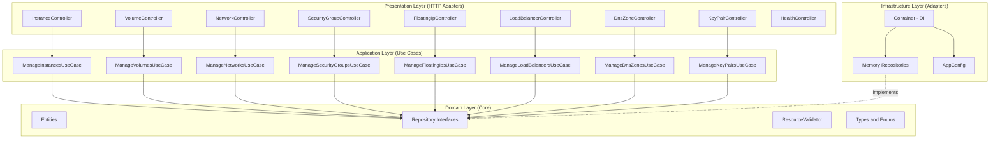
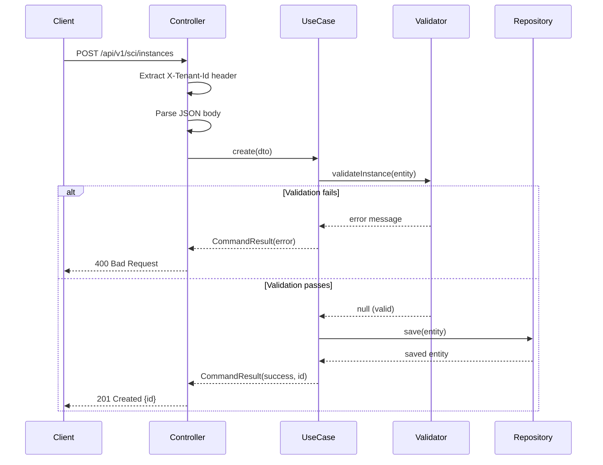
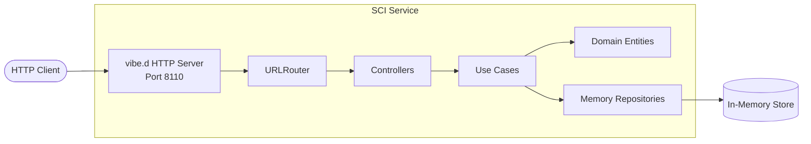
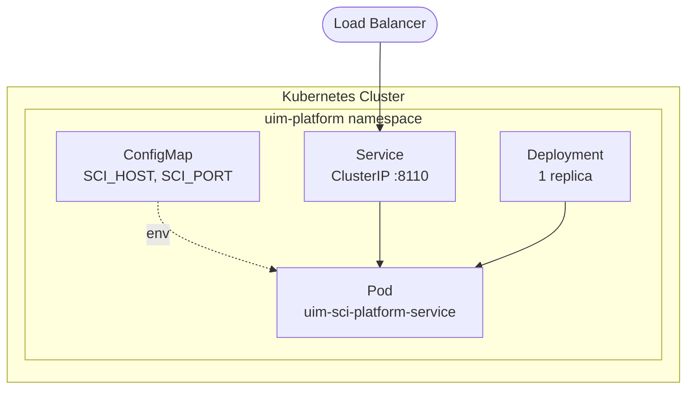

# UML Diagrams - SAP Cloud Infrastructure Service

## Domain Model

```mermaid
classDiagram
    direction TB

    class Instance {
        +InstanceId id
        +TenantId tenantId
        +string name
        +string description
        +string imageRef
        +string flavorRef
        +FlavorCategory flavorCategory
        +InstanceStatus status
        +InstancePowerState powerState
        +string availabilityZone
        +string networkId
        +string securityGroupId
        +string keyPairName
        +int vcpus
        +int memoryMb
        +int diskGb
        +UserId createdBy
        +UserId modifiedBy
        +string createdAt
        +string modifiedAt
    }

    class Volume {
        +VolumeId id
        +TenantId tenantId
        +string name
        +string description
        +VolumeType volumeType
        +VolumeStatus status
        +int sizeGb
        +int iops
        +bool encrypted
        +string attachedInstanceId
        +string snapshotId
        +string imageRef
        +string availabilityZone
        +UserId createdBy
        +UserId modifiedBy
        +string createdAt
        +string modifiedAt
    }

    class Network {
        +NetworkId id
        +TenantId tenantId
        +string name
        +string description
        +NetworkType networkType
        +NetworkStatus status
        +string cidr
        +string gateway
        +string subnetMask
        +string dnsNameservers
        +bool isExternal
        +bool isShared
        +string routerId
        +UserId createdBy
        +UserId modifiedBy
        +string createdAt
        +string modifiedAt
    }

    class SecurityGroup {
        +SecurityGroupId id
        +TenantId tenantId
        +string name
        +string description
        +SecurityGroupDirection direction
        +SecurityGroupProtocol protocol
        +int portRangeMin
        +int portRangeMax
        +string remoteIpPrefix
        +string etherType
        +bool isDefault
        +UserId createdBy
        +UserId modifiedBy
        +string createdAt
        +string modifiedAt
    }

    class FloatingIp {
        +FloatingIpId id
        +TenantId tenantId
        +string name
        +string description
        +FloatingIpStatus status
        +string floatingIpAddress
        +string fixedIpAddress
        +string instanceId
        +string routerId
        +string floatingNetworkId
        +UserId createdBy
        +UserId modifiedBy
        +string createdAt
        +string modifiedAt
    }

    class LoadBalancer {
        +LoadBalancerId id
        +TenantId tenantId
        +string name
        +string description
        +LoadBalancerStatus status
        +LoadBalancerAlgorithm algorithm
        +string vipAddress
        +string vipNetworkId
        +int listenerPort
        +string healthMonitorType
        +int healthMonitorDelay
        +int healthMonitorTimeout
        +int healthMonitorRetries
        +UserId createdBy
        +UserId modifiedBy
        +string createdAt
        +string modifiedAt
    }

    class DnsZone {
        +DnsZoneId id
        +TenantId tenantId
        +string name
        +string description
        +DnsZoneType zoneType
        +DnsZoneStatus status
        +DnsRecordType recordType
        +string email
        +int ttl
        +string serial
        +UserId createdBy
        +UserId modifiedBy
        +string createdAt
        +string modifiedAt
    }

    class KeyPair {
        +KeyPairId id
        +TenantId tenantId
        +string name
        +string description
        +KeyPairType keyType
        +string publicKey
        +string fingerprint
        +UserId createdBy
        +UserId modifiedBy
        +string createdAt
        +string modifiedAt
    }

    Instance --> Volume : attaches
    Instance --> Network : connects to
    Instance --> SecurityGroup : applies
    Instance --> FloatingIp : associates
    Instance --> KeyPair : uses
    FloatingIp --> Network : allocated from
    LoadBalancer --> Network : bound to
    LoadBalancer --> Instance : distributes to
    DnsZone --> FloatingIp : resolves to
```

## Hexagonal Architecture

```mermaid
graph TB
    subgraph Presentation ["Presentation Layer (HTTP Adapters)"]
        IC[InstanceController]
        VC[VolumeController]
        NC[NetworkController]
        SGC[SecurityGroupController]
        FIC[FloatingIpController]
        LBC[LoadBalancerController]
        DZC[DnsZoneController]
        KPC[KeyPairController]
        HC[HealthController]
    end

    subgraph Application ["Application Layer (Use Cases)"]
        IUC[ManageInstancesUseCase]
        VUC[ManageVolumesUseCase]
        NUC[ManageNetworksUseCase]
        SGUC[ManageSecurityGroupsUseCase]
        FIUC[ManageFloatingIpsUseCase]
        LBUC[ManageLoadBalancersUseCase]
        DZUC[ManageDnsZonesUseCase]
        KPUC[ManageKeyPairsUseCase]
    end

    subgraph Domain ["Domain Layer (Core)"]
        E[Entities]
        RI[Repository Interfaces]
        RV[ResourceValidator]
        T[Types and Enums]
    end

    subgraph Infrastructure ["Infrastructure Layer (Adapters)"]
        MR[Memory Repositories]
        CF[AppConfig]
        DI[Container - DI]
    end

    IC --> IUC
    VC --> VUC
    NC --> NUC
    SGC --> SGUC
    FIC --> FIUC
    LBC --> LBUC
    DZC --> DZUC
    KPC --> KPUC

    IUC --> RI
    VUC --> RI
    NUC --> RI
    SGUC --> RI
    FIUC --> RI
    LBUC --> RI
    DZUC --> RI
    KPUC --> RI

    MR -.implements.-> RI
    DI --> MR
    DI --> CF
```

## Use Case Flow

```mermaid
sequenceDiagram
    participant Client
    participant Controller
    participant UseCase
    participant Validator
    participant Repository

    Client->>Controller: POST /api/v1/sci/instances
    Controller->>Controller: Extract X-Tenant-Id header
    Controller->>Controller: Parse JSON body
    Controller->>UseCase: create(dto)
    UseCase->>Validator: validateInstance(entity)
    alt Validation fails
        Validator-->>UseCase: error message
        UseCase-->>Controller: CommandResult(error)
        Controller-->>Client: 400 Bad Request
    else Validation passes
        Validator-->>UseCase: null (valid)
        UseCase->>Repository: save(entity)
        Repository-->>UseCase: saved entity
        UseCase-->>Controller: CommandResult(success, id)
        Controller-->>Client: 201 Created {id}
    end
```

## Component Diagram

```mermaid
graph LR
    subgraph SCI Service
        direction TB
        A[vibe.d HTTP Server<br/>Port 8110]
        B[URLRouter]
        C[Controllers]
        D[Use Cases]
        E[Domain Entities]
        F[Memory Repositories]
    end

    Client([HTTP Client]) --> A
    A --> B
    B --> C
    C --> D
    D --> E
    D --> F
    F --> G[(In-Memory Store)]
```

## Deployment

```mermaid
graph TB
    subgraph Kubernetes Cluster
        subgraph uim-platform namespace
            CM[ConfigMap<br/>SCI_HOST, SCI_PORT]
            SVC[Service<br/>ClusterIP :8110]
            DEP[Deployment<br/>1 replica]
            POD[Pod<br/>uim-sci-platform-service]
        end
    end

    CM -.env.-> POD
    SVC --> POD
    DEP --> POD
    LB([Load Balancer]) --> SVC
```
