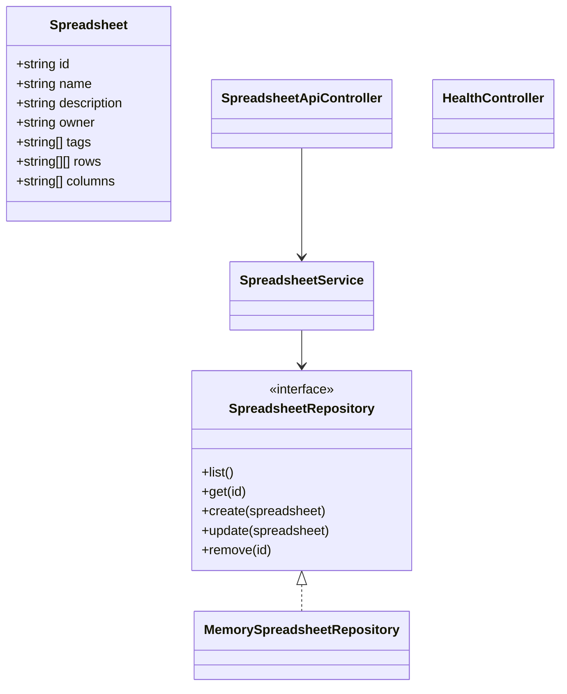

# UML

```mermaid
classDiagram
  class Spreadsheet {
    +string id
    +string name
    +string description
    +string owner
    +string[] tags
    +string[][] rows
    +string[] columns
  }

  class SpreadsheetRepository {
    <<interface>>
    +list()
    +get(id)
    +create(spreadsheet)
    +update(spreadsheet)
    +remove(id)
  }

  class MemorySpreadsheetRepository
  class SpreadsheetService
  class SpreadsheetApiController
  class HealthController

  SpreadsheetRepository <|.. MemorySpreadsheetRepository
  SpreadsheetService --> SpreadsheetRepository
  SpreadsheetApiController --> SpreadsheetService
```
