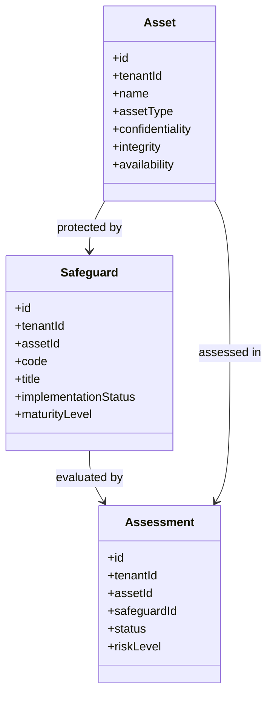
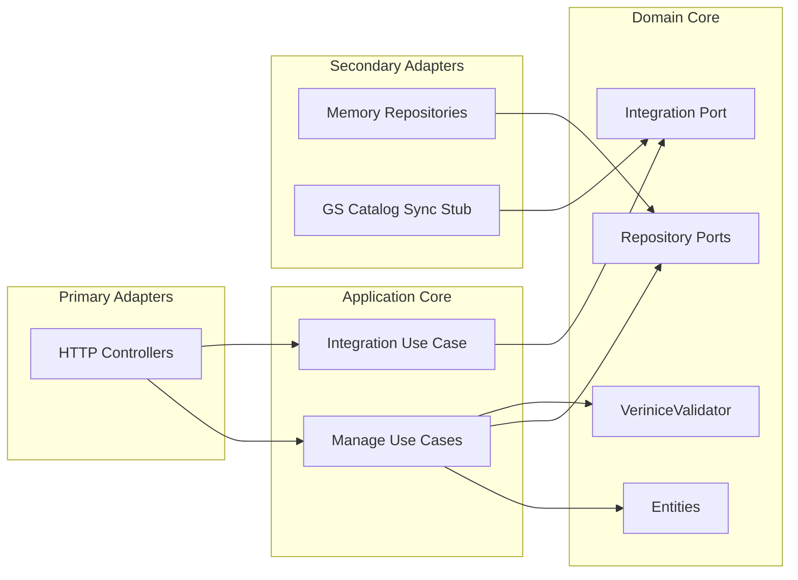

# Verinice IT-Grundschutz Service - UML

<!-- markdownlint-disable MD040 MD060 MD047 -->

## Package Overview

```text
uim.platform.verinice
├── domain
│   ├── types
│   ├── entities
│   │   ├── Asset
│   │   ├── Safeguard
│   │   └── Assessment
│   ├── integration
│   │   └── GsCatalogSyncGateway
│   ├── repositories
│   └── services
│       └── VeriniceValidator
├── application
│   ├── dto
│   ├── usecases.manage
│   └── usecases.integration
├── infrastructure
│   ├── config
│   ├── container
│   ├── integrations.verinice_cloud
│   └── persistence.repositories
└── presentation.http
    ├── controllers
    └── json_utils
```

## Domain Class Model



## Hexagonal View


