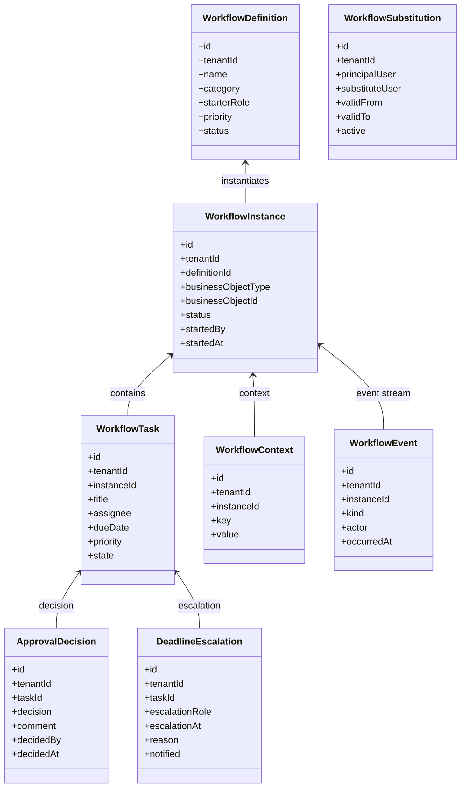
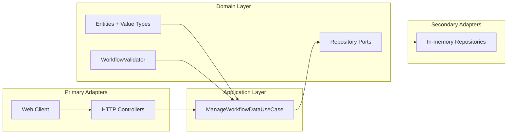

# UML Diagrams - Advanced Workflow

## Domain Class Diagram

```mermaid
classDiagram
    class WorkflowDefinition {
        +id
        +tenantId
        +name
        +category
        +starterRole
        +priority
        +status
    }

    class WorkflowInstance {
        +id
        +tenantId
        +definitionId
        +businessObjectType
        +businessObjectId
        +status
        +startedBy
        +startedAt
    }

    class WorkflowTask {
        +id
        +tenantId
        +instanceId
        +title
        +assignee
        +dueDate
        +priority
        +state
    }

    class ApprovalDecision {
        +id
        +tenantId
        +taskId
        +decision
        +comment
        +decidedBy
        +decidedAt
    }

    class DeadlineEscalation {
        +id
        +tenantId
        +taskId
        +escalationRole
        +escalationAt
        +reason
        +notified
    }

    class WorkflowSubstitution {
        +id
        +tenantId
        +principalUser
        +substituteUser
        +validFrom
        +validTo
        +active
    }

    class WorkflowContext {
        +id
        +tenantId
        +instanceId
        +key
        +value
    }

    class WorkflowEvent {
        +id
        +tenantId
        +instanceId
        +kind
        +actor
        +occurredAt
    }

    WorkflowDefinition <-- WorkflowInstance : instantiates
    WorkflowInstance <-- WorkflowTask : contains
    WorkflowTask <-- ApprovalDecision : decision
    WorkflowTask <-- DeadlineEscalation : escalation
    WorkflowInstance <-- WorkflowContext : context
    WorkflowInstance <-- WorkflowEvent : event stream
```

## Hexagonal View

```mermaid
graph LR
    subgraph Primary[Primary Adapters]
        HTTP[HTTP Controllers]
        WEB[Web Client]
    end

    subgraph Application[Application Layer]
        UC[ManageWorkflowDataUseCase]
    end

    subgraph Domain[Domain Layer]
        ENT[Entities + Value Types]
        PORTS[Repository Ports]
        VAL[WorkflowValidator]
    end

    subgraph Secondary[Secondary Adapters]
        MEM[In-memory Repositories]
    end

    HTTP --> UC
    WEB --> HTTP
    UC --> PORTS
    ENT --> UC
    VAL --> UC
    PORTS --> MEM
```
